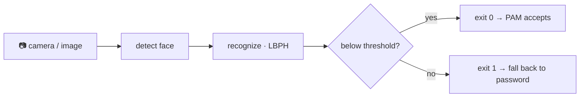

# 00 · Introduction

> **Level:** Beginner → Intermediate · **Prerequisites:** Linux terminal comfort; basic Python.
> **Time:** 20 min · **Verified:** 2026-07-22 (concepts; hands-on parts verified in later lessons)

Face unlock — glance at your laptop and you're in — feels like magic. On Linux you can have it in five minutes with **Howdy**. But this is a *learning* course: before we use the polished tool, we build the pieces ourselves, so you understand exactly what happens between "a camera sees your face" and "the system lets you in". Then we do it properly with Howdy.

---

## Why this matters

Biometric login is everywhere, and it's easy to treat it as strong security because it's convenient. Understanding how it actually works — and where it's weak — is the difference between using it wisely (a convenience layer over a password) and trusting it blindly (a printed photo unlocking your machine). By the end you'll have built the whole chain and know precisely how much to trust it.

> **Analogy — a bouncer with a memory.** Enrollment is showing the bouncer your face a few times so they remember you (a mental "template"). Verification is walking up later: they compare your face to the memory and decide *close enough?* A **threshold** sets how strict they are — too lax and lookalikes get in (false accept), too strict and you get turned away on a bad-hair day (false reject). A 2D webcam bouncer can also be fooled by a good photo — which is the whole security story in one sentence.

---

## What we'll build

A face authenticator, in two forms:

1. **From scratch** (Sections 02–05, the capstone): OpenCV captures a frame → a **Haar cascade** finds the face → **LBPH** turns it into a template and compares to your enrolled face → a CLI returns **exit 0 (accept)** or **exit 1 (reject)** → **PAM** uses that to let `sudo` through, with your password as fallback.
2. **The real tool** (Section 06): **Howdy**, which does the same job with dlib's far more accurate models and proper IR-camera support — the thing you'd actually run day to day.

---

## The honest security truth (read this now)

We'll repeat this, but set expectations up front:

- **2D webcam face unlock is spoofable.** A printed photo or a phone screen can fool a plain RGB camera. It is a **convenience**, not a high-security factor.
- **Never make it the only thing between an attacker and your account.** We always keep the password as a fallback — face auth is *sufficient*, never *required-and-sole*.
- **IR cameras (like Howdy targets) are meaningfully better** — they see depth/heat, so flat photos fail — but still not unspoofable.
- **PAM changes can lock you out.** From Section 05 on, you keep a root shell open and test in a sandbox first. This is not optional.

If that makes face unlock sound weak — good. Knowing the limits *is* the security lesson.

---

## What you need

- A Linux machine you control (Ubuntu/Debian primary; Arch/Fedora notes included).
- Python 3.10+ and, for the live parts, a **webcam** (`ls /dev/video*`).
- For Sections 02–03 you need **no camera at all** — bundled sample face images let the whole detect/enroll/verify pipeline (and its tests) run offline.

Setup is in [01-3 · Environment & safety](01_foundations/03_environment_and_safety.md).

---

## Recap & next

- ✅ We build face auth from scratch (OpenCV → detect → LBPH → verify → PAM), then use Howdy for real.
- ✅ The verifier's job is a yes/no; PAM turns that into "you're in" — with a password fallback.
- ✅ 2D face unlock is a **convenience, not a fortress**; PAM edits can lock you out (sandbox first).
- ✅ Self-check: in the diagram above, what happens when the face check fails — and why is that the *safe* default?

→ Next: **[01 · Foundations](01_foundations/README.md)**
