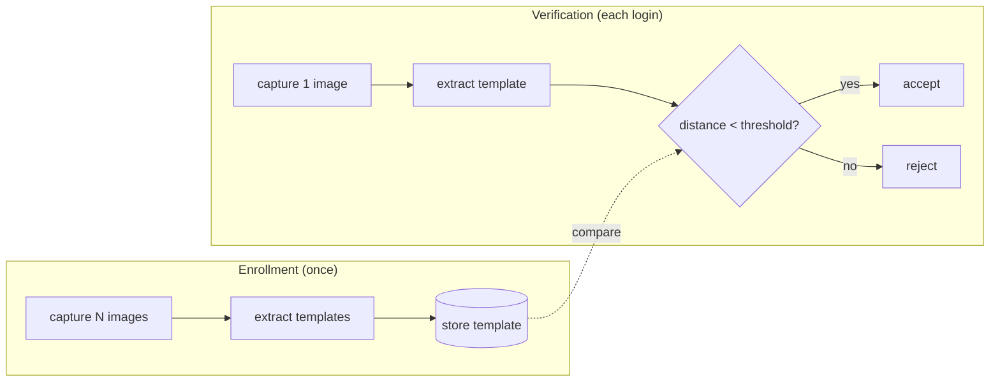

# 01-1 · How face authentication works

> **Level:** Beginner · **Prerequisites:** [00 · Introduction](../00_introduction.md)
> **Time:** 25 min · **Verified:** 2026-07-22 (concepts)

## Why this matters

Every face-unlock system — yours, your phone's, Howdy — is the same three steps: **enroll**, **template**, **verify**, with a **threshold** deciding "close enough". Understand these and you understand all of them; the rest is just better cameras and better math.

---

## The three steps

1. **Enroll** — show the system your face a few times; it stores a compact **template** (not the raw photos).
2. **Template** — a numeric summary of a face: a histogram (LBPH, what we build) or an "embedding" vector (dlib/Howdy). The point is that *similar faces produce similar templates*.
3. **Verify** — capture a new face, make its template, measure the **distance** to the enrolled one. Below the threshold → accept.

---

## The threshold is the whole game: FAR vs FRR

A threshold turns a distance into a yes/no, and it trades off two kinds of error:

| Error | Meaning | Caused by | Called |
|-------|---------|-----------|--------|
| **False Accept** | a *wrong* person gets in | threshold too **loose** | FAR (False Accept Rate) |
| **False Reject** | *you* get turned away | threshold too **strict** | FRR (False Reject Rate) |

You cannot minimize both at once — tightening one loosens the other. Security systems favor a **low FAR** (keep intruders out) at the cost of some FRR (occasionally retype your password). You'll *see* this trade-off directly in [03-3](../03_recognition_and_enrollment/03_verify_cli.md): our verifier scores the enrolled face at distance **47.8** and a different person at **87.8**, so a threshold of **70** cleanly accepts one and rejects the other — but move that number and the outcome flips.

> **Analogy — a height line at a fairground ride.** Set the "you must be this tall" line low and toddlers sneak on (false accepts); set it high and tall kids get refused (false rejects). There's no line that's perfect for everyone — you choose which mistake you can tolerate.

---

## 1:1 vs 1:N

- **1:1 verification** — "are you *this* enrolled user?" (login/unlock). One comparison. This is what we build.
- **1:N identification** — "*who* is this, out of N enrolled people?" (surveillance, multi-user). N comparisons, and FAR compounds with N.

Face *unlock* is almost always 1:1: the OS already knows which user is logging in and just needs to confirm it's them.

---

## Templates, not photos

Good systems store the **template**, not your images — smaller, and you can't trivially reconstruct the face from it. (Our teaching build trains an LBPH model file; Howdy stores dlib encodings.) Either way, treat the stored template as sensitive: it's a biometric, and unlike a password you can't change your face if it leaks.

---

## Recap & next

- ✅ Face auth = **enroll → template → verify**, with a **threshold** turning distance into yes/no.
- ✅ The threshold trades **FAR** (intruders in) against **FRR** (you locked out) — you can't win both.
- ✅ Unlock is **1:1** ("is it you?"), not 1:N ("who is it?").
- ✅ Store templates, not photos; treat them as unchangeable secrets.
- ✅ Self-check: if you *lower* the threshold, which error rate goes up?

→ Next: **[01-2 · The security reality](02_security_reality.md)**

## Exercises

1. Given enrolled-self distance 47.8 and impostor distance 87.8, which thresholds accept the impostor? Which reject the real user?

Solution

Any threshold **≥ 87.8** accepts the impostor (too loose → high FAR). Any threshold **≤ 47.8** rejects the real user (too strict → high FRR). Only thresholds in **(47.8, 87.8)** — e.g. 70 — separate them; that gap is why enrollment quality and lighting normalization matter.

