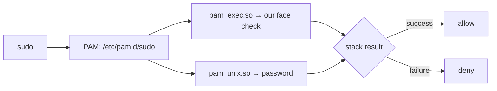

# 01-4 · PAM primer

> **Level:** Beginner → Intermediate · **Prerequisites:** [01-3 · Environment & safety](03_environment_and_safety.md)
> **Time:** 25 min · **Verified:** 2026-07-22 (Debian/Ubuntu PAM; `/etc/pam.d` layout)

## Why this matters

PAM (**Pluggable Authentication Modules**) is the layer that decides whether a login/`sudo`/screen-unlock succeeds. Face unlock on Linux *is* "add a module to PAM". You can't safely wire in face auth without reading a PAM config — and misreading one is how people lock themselves out. This lesson makes `/etc/pam.d` legible.

---

## What PAM is

Programs that authenticate (`login`, `sudo`, `sshd`, `gdm`) don't implement password checking themselves — they **ask PAM**. PAM runs a configurable **stack** of modules and returns success/failure. Swap or add modules and you change *how* auth works, without touching the program. That pluggability is exactly what lets us insert a face module.



---

## `/etc/pam.d/` and the four line types

Each service has a file in `/etc/pam.d/` (e.g. `/etc/pam.d/sudo`). Each line is:

```
<type>   <control>   <module>   [args]
```

**type** — which phase:

| type | Phase |
|------|-------|
| `auth` | prove identity (passwords, faces) — **what we add to** |
| `account` | is the account allowed/valid right now |
| `password` | changing credentials |
| `session` | set up/tear down the session |

**control** — how the line's result affects the stack (the part that bites people):

| control | Effect |
|---------|--------|
| `required` | must pass; failure fails the stack (but later modules still run) |
| `requisite` | must pass; failure fails **immediately** |
| `sufficient` | **pass = stack succeeds now** (skip the rest); failure is ignored, continue |
| `optional` | result usually doesn't matter |

**Face auth goes in as `auth sufficient`:** if the face matches, auth succeeds immediately; if it fails, PAM simply continues to the next line — your password. That single word is why a failed face check *falls through* instead of locking you out.

---

## A real `sudo` stack (Debian), annotated

```
#%PAM-1.0
@include common-auth        # pulls in pam_unix (password) etc.
@include common-account
@include common-session-noninteractive
```

To add face auth, we **prepend** one line so it runs first:

```
auth       sufficient   pam_exec.so quiet /opt/faceunlock/pam/faceunlock-pam.sh
@include common-auth        # ← still here: password fallback intact
```

Now `sudo` tries the face first (`sufficient` → success ends it); if that exits non-zero, `@include common-auth` asks for the password. Nothing was removed.

> **`pam_exec.so`** runs an external program and treats **exit 0 as success**. That's the bridge: our `verify.py` exits 0 (accept) or 1 (reject), and `pam_exec` turns that into PAM success/failure. It's the simplest *safe* way to add custom auth — no compiling a C module.

---

## Why it's dangerous — and `pamtester`

Order and control flags matter: a `required` line that always fails, or deleting `@include common-auth`, can make auth impossible — and you might only find out when you're locked out. So we **never** test on real `sudo`/login first. Instead:

> **`pamtester`** runs a PAM service's stack on demand, from a shell you're already in — so you can test a config **without** it guarding anything real:
> ```
> pamtester faceunlock-test "$USER" authenticate
> ```
> If that misbehaves, you just close the terminal. This is the sandbox from [05-1](../05_pam_integration/01_pam_sandbox.md), and the reason the safety rule works.

---

## Recap & next

- ✅ PAM is the pluggable auth layer; adding face unlock = adding a module to a `/etc/pam.d` stack.
- ✅ Lines are `type control module`; **`auth sufficient`** is what makes a failed face check fall through to the password.
- ✅ `pam_exec.so` bridges to our CLI via **exit codes** (0 = success).
- ✅ `pamtester` runs a stack safely, off the critical path — always test there first.
- ✅ Self-check: what would happen if we used `auth required` instead of `sufficient` for the face line?

→ Next: **[02 · Capturing & detecting](../02_capturing_and_detecting/README.md)**

## Exercises

1. Read your own `/etc/pam.d/sudo`. Identify the line(s) that bring in password auth (hint: `@include common-auth` → `/etc/pam.d/common-auth` → `pam_unix.so`).

<details>
<summary>Solution</summary>

On Debian/Ubuntu, `sudo` `@include common-auth`, and `common-auth` contains `auth ... pam_unix.so` (the password check) plus `pam_deny`/`pam_permit` bookends. That `pam_unix.so` line is the fallback we must never remove.
</details>
