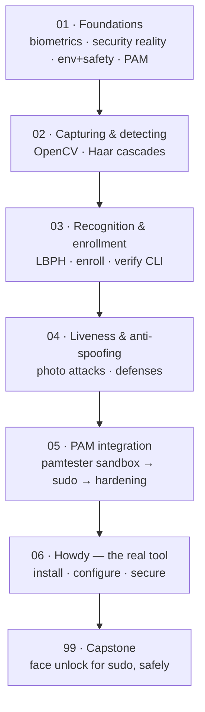

# 🙂 Face Unlock on Linux — biometrics, OpenCV & PAM

> **What you build:** a working face authenticator for Linux — from a from-scratch OpenCV pipeline (detect → recognize → enroll → verify) wired into **PAM** for `sudo`, to a hardened setup with **Howdy**, the standard tool. You'll understand *how* it works and *why it isn't as secure as it feels*.

> **Verified (partial — this is honest):** 2026-07-22 · Python 3.10 · **opencv-contrib-python 4.11.0.86** · numpy 2.2 · pillow 12 · Ubuntu/Debian. The **software** pipeline is fully reproducible and was actually run: Haar detection, LBPH enroll/verify on bundled sample faces (accept the enrolled identity, reject another), and `pytest` (**4 passed**) — all offline, no webcam. The **live-camera**, **`pamtester`**, **`sudo`-integration**, and **Howdy** steps need your own hardware and modify system auth, so they're *hardware-attested* — real commands, shown, but not reproducible in CI. Hence the `—` badge, not ✅.

> ⚠️ **SAFETY — read before Section 05.** This course modifies **PAM**, the system that authenticates you. A mistake in `/etc/pam.d/` can lock you out of your own machine. The one rule, repeated in every module that touches PAM: **keep a second terminal open with a live root shell (`sudo -i`), never remove password authentication, and test with `pamtester` on a throwaway service before touching `sudo`.** We only ever add face auth as an *optional* factor with a password fallback.

Face unlock feels like magic and takes five minutes with Howdy — but this is a *learning* course, so we build the pieces ourselves first: capture a frame, find the face, turn it into a template, enroll it, verify against it, and hand a yes/no to PAM. Then we do it properly with Howdy. Throughout, we're honest that **webcam face unlock is a convenience, not a fortress** — a printed photo can fool a 2D camera, so it complements a password, never replaces it.

## Who this is for

You're comfortable in a Linux terminal and can read basic Python. You do **not** need computer-vision, biometrics, or PAM background — all built from scratch. Some prior exposure to the [Ethical Hacking](../ethical_hacking/) or [Secure Code Audit](../secure_code_audit/) courses helps you think about threat models, but isn't required.

## What you'll be able to do

- Explain how biometric auth works: enroll → template → verify, and the **FAR/FRR** threshold trade-off.
- State the honest **threat model** of 2D face unlock and when (not) to trust it.
- Use **OpenCV** to capture, **detect** (Haar cascade), and **recognize** (LBPH) faces.
- Build an **enroll/verify CLI** that returns exit 0/1 — the contract PAM needs.
- Add liveness/anti-spoofing thinking (and know its limits).
- Wire face auth into **PAM safely** — `pamtester` sandbox first, then `sudo` with a password fallback.
- Install, configure, and **harden Howdy** for a real daily-driver.

## The stack we use (and why)

| Piece | We use | Why | Swap to (production) |
|---|---|---|---|
| Vision | **opencv-contrib-python 4.11** | Haar cascades **and** `cv2.face` LBPH ship with it; runs on static images (no webcam needed to learn) | `face_recognition`/dlib (more accurate) |
| Recognizer | **LBPH** (`cv2.face`) | Simple, fast, trains on a handful of images, easy to reason about | dlib CNN embeddings / Howdy |
| PAM glue | **`pam_exec`** | Calls our verify CLI — the simplest *safe* integration | a native PAM module |
| Real tool | **Howdy** | The established Windows-Hello-style face auth for Linux (dlib + IR) | — |
| Test data | **Olivetti faces** (bundled) | License-clean, offline; proves the pipeline with no camera | your own enrolled face |

> **Why LBPH and not a deep model?** Because you can *read the whole thing*. LBPH's "distance below a threshold = match" makes the FAR/FRR trade-off tangible. Howdy uses dlib's CNN embeddings for real accuracy — we point there once you understand the mechanics.

## Prerequisites

```bash
# Ubuntu/Debian
sudo apt update && sudo apt install -y python3-venv v4l-utils
python3 -m venv .venv && source .venv/bin/activate
pip install opencv-contrib-python==4.11.0.86 numpy pillow
ls /dev/video*          # confirm a webcam exists (needed only from Section 02's live parts on)
```

Arch: `pacman -S python-opencv v4l-utils` (or pip). Fedora: `dnf install python3-opencv v4l-utils` (or pip). Everything offline in Sections 02–03 works with **no** camera using the bundled sample images.

## Learning path



## Course map

| # | Section | Modules | You'll be able to… | Time |
|---|---------|---------|--------------------|------|
| 01 | [Foundations](01_foundations/) | 4 | Explain biometric auth, its security limits, set up safely, understand PAM | 90 min |
| 02 | [Capturing & detecting](02_capturing_and_detecting/) | 2 | Capture frames and detect faces with OpenCV | 45 min |
| 03 | [Recognition & enrollment](03_recognition_and_enrollment/) | 3 | Enroll a face and build a verify CLI returning exit 0/1 | 90 min |
| 04 | [Liveness & anti-spoofing](04_liveness_and_antispoofing/) | 2 | Demonstrate a photo attack and reason about defenses | 45 min |
| 05 | [PAM integration](05_pam_integration/) | 3 | Wire face auth into `sudo` **safely** (sandbox first) | 90 min |
| 06 | [Howdy — the real tool](06_howdy_the_real_tool/) | 3 | Install, configure, and harden Howdy | 60 min |
| 99 | [Capstone: face unlock for sudo](99_project_face_unlock/) | project | Ship a safe, tested face-unlock for `sudo` | 2–3 h |

**Total:** ~8–10 hours. Prerequisites: comfort in a Linux terminal + basic Python. Ubuntu/Debian primary; Arch/Fedora notes throughout.

## Related guides

- **[Ethical Hacking & Pentesting](../ethical_hacking/)** — threat modeling and the "test only what you own" mindset this course borrows.
- **[Secure Code Audit](../secure_code_audit/)** — thinking critically about where security controls actually hold.
- **[Python — From Scratch to FastAPI](../python_complete/)** — if the Python here feels shaky.

→ Start here: **[00 · Introduction](00_introduction.md)**
