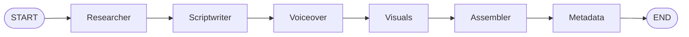

# 00 · Introduction

> **Level:** Beginner (some LangChain helps) · **Time:** 15 min

You're learning LangChain and heading into LangGraph. This course gives that
learning a concrete, motivating goal: **an agent that turns a topic into a
finished, upload-ready YouTube video** — the content engine behind a "faceless"
channel.

It's the perfect LangGraph project because a video pipeline is a **sequence of
specialist steps with a review loop** — exactly the shape LangGraph exists to
orchestrate.

---

## What you'll build

By the end you'll run this and get a real `.mp4`:

```bash
STUDIO_LLM=fake python -m faceless_studio.cli "Big-O notation for beginners"
```

```
🎬 Producing: 'Big-O notation for beginners'
────────────────────────────────────────────────────────────
✅ Pipeline path: researcher → scriptwriter → voiceover → visuals → assembler → metadata
🎞️  Video:    out/big-o-notation-for-beginners/video.mp4
📝 Title:    Why Your Code Slows Down (Big-O Explained in 3 Minutes)
🏷️  Tags:     big o, algorithms, time complexity, coding, computer science, programming
📄 Metadata: out/big-o-notation-for-beginners/metadata.json
```

> ☝️ **This is real output** from running the capstone in the course's verified
> environment. It produced a **23-second 1280×720 h264/aac** video with three
> timed slides and a narration track — with **no API key and nothing extra
> installed** beyond `ffmpeg` and `Pillow`.

Each stage is a **node** in a LangGraph graph:



---

## Why an *agent graph* and not one big script?

You could write one long Python function. But a graph gives you things that
matter the moment you go past a toy:

- **Separation of concerns** — each node has one job and one focused prompt.
  The scriptwriter doesn't know how ffmpeg works; the assembler doesn't know what
  an LLM is.
- **A review gate** — LangGraph can **pause before an expensive step** (rendering
  video) so a human approves the script first. That single feature is what keeps a
  faceless channel from becoming a spam factory.
- **Checkpointing & resume** — if the assembler crashes, you don't re-run the LLM.
- **Swap-ability** — change the voiceover from "silent placeholder" to ElevenLabs
  by editing *one node*; every other node is untouched.

These are the same reasons the [Proposal Agent](../langgraph_proposal_agent/) uses
a graph. You're learning a **reusable pattern**, not a one-off script.

---

## The honest version of "faceless YouTube"

Before you build a content machine, three facts worth internalising:

1. **You must disclose AI/synthetic content.** YouTube has a required label for
   "altered or synthetic" media, and audio that's fully AI-generated counts.
2. **Mass-produced, low-effort, repetitive content is not monetisable** and risks
   removal. The platform explicitly targets "inauthentic" content farms.
3. **Your judgement is the moat.** The agent does the grunt work — research
   scaffolding, first-draft script, timing, slides, SEO. *You* choose the topic,
   fact-check the script, and decide what ships. That's why this pipeline has a
   **human approval gate** and defaults uploads to **private**.

We treat automation as a **force multiplier for honest work**, not a way to flood
the platform. [05-2](05_quality_and_shipping/02_ethics_policy_and_scaling.md) goes
deeper.

---

## What you need

- **Python 3.10+** and comfort with functions, dicts, and `with` blocks.
- **ffmpeg** installed (`ffmpeg -version`) — the one system dependency.
- **Some LangChain** — prompts and chat models. If `ChatPromptTemplate` and
  `llm.invoke(...)` are new, do the [LangChain & RAG](../langchain_rag/) course first.
- **No API key required.** Optional: local [Ollama](https://ollama.com) for real
  local generation, or a hosted key later.

---

## How to use this course

1. Read in order — each module builds the next node of the same pipeline.
2. **Type and run the code.** The magic only lands when *your* machine spits out
   an `.mp4`.
3. Keep the [capstone](99_project_faceless_studio/) open — it's the finished
   version of everything you assemble.
4. Do the self-check and exercises before peeking at the solutions.

---

**Next → [01-1 · The pipeline & architecture](01_foundations/01_the_pipeline_and_architecture.md)**
