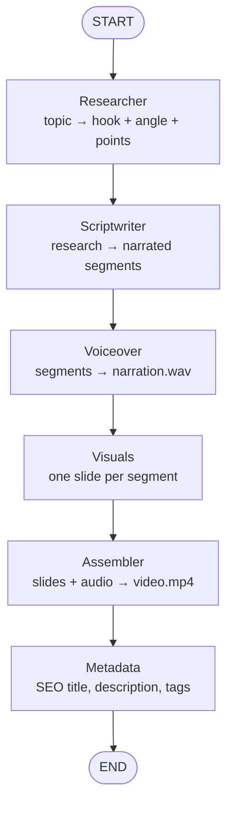
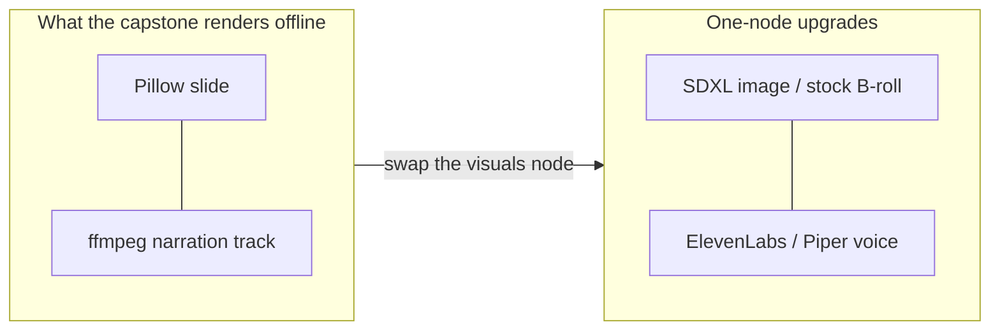

# 01-1 · The pipeline & architecture

> **Level:** Beginner · **Time:** 20 min

A faceless video is just **narration over visuals**. Producing one by hand is a
chain of chores: pick a topic, research it, write a script, record a voice, find
or make visuals, edit them together, then write a title/description/tags. Our
agent automates that chain — one node per chore.

---

## The chain, as a graph

Each box is a Python function that reads the **shared state**, does one thing, and
writes back only what it produced. That shared state is the single object that
flows top to bottom — you'll define it in [02-1](../02_building_the_nodes/01_shared_state.md).

---

## Why these exact boundaries?

Good node boundaries follow the **"one job, one input type, one output type"** rule:

| Node | Input | Output | Why it's its own node |
|---|---|---|---|
| Researcher | a bare topic string | structured research + a hook | Framing is a distinct creative task from writing |
| Scriptwriter | the research | a list of narrated **segments** | The segment is the unit everything else works on |
| Voiceover | each segment's narration | audio + measured duration | Timing is discovered here and nothing downstream can start without it |
| Visuals | each segment's heading/hint | one image per segment | Purely a rendering concern — no LLM |
| Assembler | images + durations + audio | one `.mp4` | Pure ffmpeg; the only node that touches video |
| Metadata | topic + research + durations | title/description/tags/chapters | SEO is independent of how the video was made |

The **segment** is the backbone: `{heading, narration, visual_hint}` produced by
the scriptwriter, then enriched with `audio_path`, `duration`, and `image_path` as
it flows down. Get the segment right and the rest is plumbing.

---

## The "faceless video" we actually generate

To stay 100% runnable with zero paid services, the capstone renders a **narrated
slideshow**: Pillow draws a clean title/subtitle slide per segment, the voiceover
node produces a narration track, and ffmpeg times each slide to its narration.

That is a *real, complete* video file — and it's the exact skeleton real faceless
channels use. Upgrading "slide" → "AI image or stock B-roll" and "silent
placeholder" → "neural voice" is a **per-node swap**, not a rewrite. That
swap-ability is the whole point of the graph.

---

## Where the human belongs

Fully automatic publishing is how channels get terminated. So the architecture
has a **deliberate pause point**: after the scriptwriter, before the (slow,
expensive) media nodes. A human reads the script, approves or edits, and only then
does the pipeline render and — separately — upload. LangGraph makes that pause a
one-line `interrupt_before=["voiceover"]`; you'll wire it in
[03-2](../03_assembling_the_graph/02_human_in_the_loop.md).

---

## Recap

- A faceless video pipeline is a **linear chain of specialist steps** — a natural
  fit for a graph.
- The **segment** (`heading` + `narration` + `visual_hint`) is the unit of work
  that flows through and gets enriched.
- Offline we render a **narrated slideshow**; every "cheap" node has a documented
  "real" upgrade that swaps in without touching its neighbours.
- A **human review gate** sits between writing and rendering by design.

## Self-check

1. Why is "voiceover" a separate node from "assembler" when both deal with media?
2. What single data structure carries a segment's growing set of artifacts
   (text → audio → image)?
3. Where in the pipeline does the human approval gate sit, and why there?

Answers

1. The voiceover **discovers the duration** of each segment (how long the narration
   takes). The assembler *consumes* those durations to time the slides. Different
   jobs, different inputs/outputs — and you might swap the TTS engine without
   touching assembly.
2. The **segment** dict — it starts as `{heading, narration, visual_hint}` and
   gains `audio_path`, `duration`, then `image_path`.
3. Between the **scriptwriter and voiceover** — after the cheap text step and
   before the slow/expensive media steps, so a human can catch problems before any
   compute is spent and nothing publishes unreviewed.

---

**Next → [01-2 · LangGraph vs Google ADK](02_langgraph_vs_google_adk.md)**
