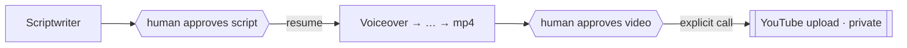

# 03-2 · Human-in-the-loop & checkpoints

> **Level:** Beginner · **Time:** 25 min

This is the most important module for doing faceless YouTube *responsibly*. You'll
make the pipeline **pause after the script, wait for a human to approve, then
resume** — so nothing gets rendered or published unreviewed.

---

## Why pause between script and media

Two reasons, one ethical and one practical:

- **Ethical/policy:** a human should read every script before it becomes a
  published video. This is your quality-and-accuracy gate.
- **Practical:** rendering audio + video is the slow part. Catching a bad script
  *before* that saves the compute.

So the gate goes right after `scriptwriter`, before `voiceover`.

---

## One argument turns it on

Because we compiled with a `MemorySaver` checkpointer, adding the gate is trivial:

```python
graph = build_graph(interrupt_before=["voiceover"])
```

Now `invoke` runs research + script, then **stops** before `voiceover` and saves
its state under the thread id.

---

## The pause / review / resume dance

```python
config = {"configurable": {"thread_id": "video-42"}}

# 1. run up to the gate
graph.invoke({"topic": "Big-O", "niche": "tech explainers"}, config)

# 2. inspect where it paused and what it produced
snapshot = graph.get_state(config)
print(snapshot.next)                    # ('voiceover',)  ← waiting here
for seg in snapshot.values["segments"]: # the human reads the script
    print(seg["heading"], "→", seg["narration"])

# 3. (optional) edit the script before continuing
graph.update_state(config, {"segments": edited_segments})

# 4. approve → resume from the gate
graph.invoke(None, config)              # invoke(None) = "continue this thread"
```

- **`get_state(config)`** returns a snapshot; `.next` is the tuple of nodes about
  to run, `.values` is the full state.
- **`update_state(config, {...})`** lets the human fix the script — merged with the
  same reducers as normal node output.
- **`invoke(None, config)`** resumes; passing `None` means "no new input, continue
  where this thread paused."

---

## It's verified by a test

`test_interrupt_before_voiceover_pauses` in
[`tests/test_graph.py`](../99_project_faceless_studio/tests/test_graph.py):

```python
graph = build_graph(llm, workdir=tmp_path, interrupt_before=["voiceover"])
config = {"configurable": {"thread_id": "gate"}}
graph.invoke(VideoState(topic="Big-O", niche="tech"), config=config)

snapshot = graph.get_state(config)
assert snapshot.next == ("voiceover",)          # paused at the gate
assert snapshot.values["segments"]              # script is ready
assert "video_path" not in snapshot.values      # nothing rendered yet
```

This passes offline — proof the gate actually holds before any media is produced.

---

## Where publishing fits

Note that **upload is not a node** in this graph. The graph's job ends at a
finished `.mp4` + metadata. Publishing is a *separate, explicit human action*
(the [upload module](../04_publishing_and_serving/01_youtube_upload.md)), and it
defaults to **private**. Two gates — approve the script, then approve the upload —
is the safe design.



---

## Recap

- A `MemorySaver` checkpointer + `interrupt_before=["voiceover"]` gives you a
  **script-approval gate** for one argument.
- `get_state` / `update_state` / `invoke(None)` = **inspect, edit, resume**.
- Upload is a **separate human action**, defaulting to private — two gates, not
  zero.

## Self-check

1. What does `invoke(None, config)` do, and why `None`?
2. Why put the interrupt before `voiceover` rather than before `metadata`?
3. Why isn't uploading a node in the graph?

<details>
<summary>Answers</summary>

1. It resumes the paused thread from the interrupted node using the saved (maybe
   edited) state. `None` signals "no new input — continue," as opposed to starting
   a fresh run.
2. To catch problems **before** the slow/expensive media steps and before anything
   is rendered — reviewing after rendering wastes the compute you were gating.
3. Publishing is an outward-facing, irreversible-ish action that should require a
   deliberate, separate human decision (and default to private) — not fire
   automatically at the end of a graph run.

</details>

---

**Next → [04-1 · Uploading to YouTube](../04_publishing_and_serving/01_youtube_upload.md)**
