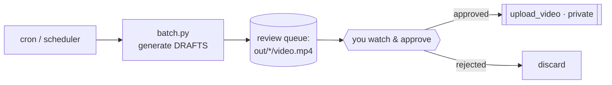

# 04-2 · CLI & scheduling a daily run

> **Level:** Beginner · **Time:** 20 min

You have a pipeline and an upload function. Now make it easy to run — from the
terminal and on a schedule — without dropping the human gate.

---

## The CLI

[`faceless_studio/cli.py`](../99_project_faceless_studio/faceless_studio/cli.py) is
a thin wrapper over `produce_video`:

```bash
STUDIO_LLM=fake   python -m faceless_studio.cli "Big-O notation for beginners"
STUDIO_LLM=ollama python -m faceless_studio.cli "Why RAM is faster than a hard disk" --niche "tech explainers"
```

It prints the pipeline path and paths to the video + `metadata.json`:

```
✅ Pipeline path: researcher → scriptwriter → voiceover → visuals → assembler → metadata
🎞️  Video:    out/big-o-notation-for-beginners/video.mp4
📄 Metadata: out/big-o-notation-for-beginners/metadata.json
```

```python
def main(argv=None):
    parser = argparse.ArgumentParser(description="Generate a faceless video from a topic.")
    parser.add_argument("topic")
    parser.add_argument("--niche", default="short educational explainers")
    parser.add_argument("--workdir", default="out")
    args = parser.parse_args(argv)

    state = produce_video(args.topic, niche=args.niche, workdir=args.workdir)
    # ... print summary, write metadata.json next to the video ...
```

---

## A batch runner over a topic list

You seeded [`data/topics/sample_topics.txt`](../99_project_faceless_studio/data/topics/sample_topics.txt).
Produce a draft for each — **all private, all awaiting review**:

```python
# batch.py
from pathlib import Path
from faceless_studio import produce_video

for topic in Path("data/topics/sample_topics.txt").read_text().splitlines():
    topic = topic.strip()
    if topic:
        state = produce_video(topic)
        print("drafted:", state["video_path"])
```

This produces *drafts*. Nothing uploads — that stays a manual, per-video decision.

---

## Scheduling (the responsible pattern)

The tempting design — "cron generates and auto-publishes 5 videos a day" — is
exactly what gets channels terminated for inauthentic content. The **responsible
pattern** separates generation from publishing:



- **Automate the grind** (research → draft video) on a schedule if you like.
- **Keep a human on publish.** Review the queue, then call `upload_video` for the
  ones that pass.

A minimal cron entry that only generates drafts:

```cron
# 6am daily: generate drafts into a dated folder for review
0 6 * * *  cd /path/to/99_project_faceless_studio && \
           STUDIO_LLM=ollama .venv/bin/python batch.py >> logs/drafts.log 2>&1
```

> If you use this collection's Claude Code environment, the `/schedule` skill can
> set up a recurring cloud run — but the same rule applies: **generate drafts,
> review before publishing.**

---

## Recap

- The **CLI** wraps `produce_video`; a **batch runner** drafts a whole topic list.
- Schedule the **generation**, never the **publishing** — keep a human on the
  upload step.
- The output of automation is a **review queue of private drafts**, not live videos.

## Exercise

Extend `batch.py` to skip topics whose slug folder already contains a `video.mp4`,
so re-runs don't regenerate finished drafts. Log what it skipped.

<details>
<summary>Hint</summary>

Compute the same slug the graph uses (or import `_slug` from `graph`), check
`Path(workdir)/slug/"video.mp4"`, and `continue` if it exists.

</details>

---

**Next → [05-1 · Cost, observability & quality gates](../05_quality_and_shipping/01_cost_observability_quality.md)**
