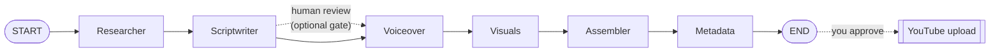

# Faceless YouTube Studio with LangGraph

> **What you build:** Hand the system a topic → agents research it, write a
> script, generate a voiceover, render slides, stitch a finished **`.mp4`**, and
> write an SEO title/description/tags — then (with your approval) upload it to
> YouTube. A complete faceless-video content pipeline, built as a **LangGraph
> state machine** you actually run.

> **Verified:** 2026-07-07 against **Python 3.10.12**, **langgraph 1.1.10**,
> **langchain-core 1.4.7**, **Pillow 12.0.0**, **ffmpeg 4.4.2**.
> The whole pipeline runs **offline with no API key**: the LLM falls back to a
> canned fake model (or your local **Ollama qwen2:7b**), the voiceover falls back
> to an ffmpeg-synthesised narration track when no TTS engine is installed, and
> slides are rendered with Pillow. The capstone was run in this environment and
> produced a real **23-second 1280×720 h264/aac** video; every sample output shown
> is real. Real TTS (Piper/edge-tts/ElevenLabs) and real YouTube upload are
> clearly labelled optional upgrades.

---

## Read this first: what "faceless YouTube automation" honestly is

A "faceless" channel just means no on-camera presenter — the video is narration
over slides, B-roll, or generated visuals. Automating it with agents is a great
way to **learn LangGraph on a project you care about**. But be clear-eyed:

- **YouTube requires you to label AI-generated / synthetic content**, and its
  monetisation rules exclude **mass-produced, repetitive, or low-effort** uploads.
  This course builds a tool that helps *you* produce videos faster — with a
  **human review gate before anything publishes** — not a spam cannon. We cover
  the policy reality in [05-2](05_quality_and_shipping/02_ethics_policy_and_scaling.md).
- **The value you add is editorial**: topic taste, accuracy, a real voice, good
  visuals. The agent removes the grind; it doesn't replace judgement.

Build it to *learn and to speed up honest work*, and you'll have a real portfolio
project and a genuinely useful tool.

---

## The pipeline at a glance



| Node | What it does | Offline default | Real upgrade |
|---|---|---|---|
| **Researcher** | Topic → hook + angle + key points | fake / Ollama | Claude, OpenAI |
| **Scriptwriter** | Research → narrated segments (JSON) | fake / Ollama | any LLM |
| **Voiceover** | Segments → narration `.wav` | ffmpeg silent track sized to reading time | Piper, edge-tts, ElevenLabs |
| **Visuals** | One rendered slide per segment | Pillow PNGs | AI images (SDXL), stock B-roll |
| **Assembler** | Slides + audio → `.mp4` | ffmpeg | same, at 1080p/4K |
| **Metadata** | SEO title, description + chapters, tags | fake / Ollama | any LLM |
| **Upload** | Publish to YouTube (after approval) | — (needs OAuth) | YouTube Data API v3 |

---

## Why LangGraph? (and where Google ADK fits)

You asked to compare **LangGraph** and **Google ADK** before committing. The full
side-by-side is [01-2](01_foundations/02_langgraph_vs_google_adk.md); the short
version:

| | **LangGraph** ✅ (this course) | **Google ADK** |
|---|---|---|
| Made by | LangChain team | Google |
| Model | Fully model-agnostic | Model-agnostic, **tuned for Gemini / Vertex AI** |
| Mental model | Explicit **graph**: state, nodes, edges | **Agents + workflow agents** (Sequential/Parallel/Loop) |
| Human-in-the-loop | First-class `interrupt` + checkpointers | Supported, less central |
| Community / tutorials | Largest in the space | Growing, newer (2025) |
| Best when | You want explicit control of a multi-step pipeline | You're all-in on Google Cloud + Gemini |

**We pick LangGraph** because you're already learning LangChain, a video pipeline
is a naturally explicit graph (fixed stages + a review loop), and its
checkpoint/human-in-the-loop story is exactly what a "review before publish" gate
needs. Everything you learn transfers — [01-2](01_foundations/02_langgraph_vs_google_adk.md)
shows the *same pipeline* sketched in ADK so the choice is informed, not blind.

---

## Course map

| # | Module | Time |
|---|---|---|
| 00 | [Introduction](00_introduction.md) | 15 min |
| **01** | **Foundations** | |
| 01-1 | [The pipeline & architecture](01_foundations/01_the_pipeline_and_architecture.md) | 20 min |
| 01-2 | [LangGraph vs Google ADK — pick your engine](01_foundations/02_langgraph_vs_google_adk.md) | 25 min |
| 01-3 | [Environment & providers](01_foundations/03_environment_and_providers.md) | 20 min |
| 01-4 | [LangGraph refresher](01_foundations/04_langgraph_refresher.md) | 25 min |
| **02** | **Building the nodes** | |
| 02-1 | [Shared state](02_building_the_nodes/01_shared_state.md) | 15 min |
| 02-2 | [Researcher](02_building_the_nodes/02_researcher.md) | 20 min |
| 02-3 | [Scriptwriter](02_building_the_nodes/03_scriptwriter.md) | 25 min |
| 02-4 | [Voiceover (TTS)](02_building_the_nodes/04_voiceover.md) | 25 min |
| 02-5 | [Visuals](02_building_the_nodes/05_visuals.md) | 25 min |
| 02-6 | [Assembler (ffmpeg)](02_building_the_nodes/06_assembler.md) | 25 min |
| 02-7 | [Metadata & SEO](02_building_the_nodes/07_metadata.md) | 15 min |
| **03** | **Assembling the graph** | |
| 03-1 | [Wiring the pipeline](03_assembling_the_graph/01_wiring_the_pipeline.md) | 20 min |
| 03-2 | [Human-in-the-loop & checkpoints](03_assembling_the_graph/02_human_in_the_loop.md) | 25 min |
| **04** | **Publishing & serving** | |
| 04-1 | [Uploading to YouTube](04_publishing_and_serving/01_youtube_upload.md) | 25 min |
| 04-2 | [CLI & scheduling a daily run](04_publishing_and_serving/02_cli_and_scheduling.md) | 20 min |
| **05** | **Quality & shipping** | |
| 05-1 | [Cost, observability & quality gates](05_quality_and_shipping/01_cost_observability_quality.md) | 20 min |
| 05-2 | [Ethics, policy & scaling responsibly](05_quality_and_shipping/02_ethics_policy_and_scaling.md) | 15 min |
| **99** | [Capstone: Faceless Studio](99_project_faceless_studio/README.md) | — |

**Total: ~6 hours** | Prerequisites: Python basics + some LangChain familiarity
(you've done the [LangChain & RAG](../langchain_rag/) course, or equivalent).

---

## Quick start (offline, zero API key)

```bash
cd 99_project_faceless_studio
python -m venv .venv && source .venv/bin/activate
pip install -r requirements.txt          # + system ffmpeg: sudo apt install ffmpeg

# offline demo — canned model + silent narration, still makes a real out/<slug>/video.mp4
STUDIO_LLM=fake python -m faceless_studio.cli "Big-O notation for beginners"

# run all tests (fully offline)
python -m pytest -q

# real local model (needs Ollama running: `ollama pull qwen2:7b`)
STUDIO_LLM=ollama python -m faceless_studio.cli "Why RAM is faster than a hard disk"
```

You get `out/<slug>/video.mp4` plus `metadata.json`. Real voice and real upload
are opt-in upgrades covered in Sections 02-4 and 04-1.

---

## Related guides in this collection

- [LangGraph core](../langgraph/) — state, nodes, edges, tools, memory (the deep-dive)
- [LangGraph Proposal Agent](../langgraph_proposal_agent/) — another multi-agent LangGraph project (the closest sibling)
- [LangChain & RAG](../langchain_rag/) — prompts, LCEL, retrieval — the prerequisite
- [FastAPI · Async · WebSockets](../fastapi_async_websockets/) — if you want to serve the pipeline as an API

→ Start here: **[00 · Introduction](00_introduction.md)**
