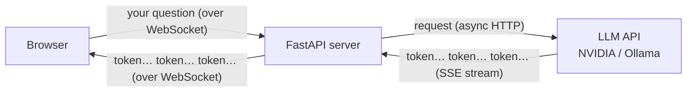

# 00: Introduction

> **Level:** Beginner (comfortable with Python) · **Prerequisites:** Python 3.10+, basic terminal use
> **Time:** ~20 min · **Verified:** 2026-06-03

## Welcome 👋

By the end of this course you'll have built a **real-time AI chat app**: you type a message in the browser, and the AI's reply appears word-by-word as it's generated — like ChatGPT's typing effect — flowing over a live connection your server keeps open.

To get there you need three skills, and we'll build them in order:

1. **Async Python** — how Python does many things "at once" without threads.
2. **FastAPI** — a modern Python framework for building web APIs.
3. **WebSockets** — a connection that stays open so the server and browser can talk back and forth in real time.

Then we combine all three to **stream an LLM's tokens** to the browser.

## Why these three, together?

An AI chat app has an awkward shape:

- The LLM takes **seconds** to answer, and produces text **gradually**.
- During those seconds your server is mostly **waiting** on the network — not computing.
- You want each token shown the instant it arrives, both directions staying live.

Each arrow maps to one skill:

| Need | Solved by | Taught in |
|------|-----------|-----------|
| Keep a live two-way link to the browser | **WebSockets** | Section 03 |
| Wait on the slow LLM without freezing other users | **Async** | Section 01 |
| Receive the answer gradually, not all at once | **Streaming (SSE) + async** | Section 04 |
| Tie it into a clean web server | **FastAPI** | Section 02 |

That's why we can't just "skip to the AI part" — the AI part *is* these pieces combined.

## What is each piece, in simple terms?

- **Async (asynchronous) programming:** a way to write code that, while waiting for something slow (a network reply, a file, a timer), lets *other* work run instead of sitting idle.
  - **Analogy:** a waiter taking orders. While the kitchen cooks table 1's food, the waiter doesn't stand frozen at the kitchen — they go take table 2's order. One waiter, many tables, no one waits longer than necessary.

- **FastAPI:** a Python library for building **web APIs** — programs other programs (or browsers) talk to over the internet using HTTP. It's fast, it's built around async, and it auto-generates interactive docs for your API.
  - **Analogy:** the restaurant's menu and ordering system — a clear, structured way for customers to ask for things and get answers.

- **WebSocket:** a kind of internet connection that, once opened, **stays open** so both sides can send messages anytime. Normal web requests are one-and-done ("ask, get answer, hang up"); a WebSocket is a phone call that stays connected.
  - **Analogy:** a phone call vs. sending letters. Letters (HTTP) = one message each way, then done. A call (WebSocket) = both people can talk whenever, line stays open.

- **Token streaming:** LLMs generate text in small pieces called **tokens** (roughly word-fragments). Streaming means sending each piece to the user as it's produced, instead of waiting for the whole answer.

> **Don't worry** if these are fuzzy right now — each gets its own module with runnable examples.

## Key terms (skim now, refer back later)

- **API (Application Programming Interface):** a defined way for programs to talk to each other. A *web* API does this over HTTP.
- **HTTP:** the request/response protocol of the web. Browser sends a *request*, server sends a *response*, done.
- **Endpoint / route:** a specific URL your API responds to, e.g. `/users` or `/chat`.
- **Server:** the program that waits for requests and answers them. **Client:** the program (browser, script) that sends requests.
- **ASGI:** the modern Python standard that lets web servers run async code. FastAPI is an ASGI framework; Uvicorn is an ASGI server that runs it. (More in Module 02.)
- **LLM (Large Language Model):** the AI text model (e.g. Kimi, Llama) that generates replies.
- **Token:** the small chunk of text an LLM emits at a time.
- **SSE (Server-Sent Events):** a simple one-way streaming format over HTTP — how the LLM API sends us tokens. (Module 04.)

## What you'll install (later, not now)

In Module 02 you'll create a virtual environment and install:

- `fastapi` — the framework
- `uvicorn` — the server that runs it
- `httpx` — an async HTTP client (to call the LLM API the async way)
- `websockets` — lets the server speak the WebSocket protocol

For the AI project you'll optionally use a **free NVIDIA API key** or a local **Ollama** install — but a no-key **mock** is provided so you can build and run everything without either.

## A note on how this course verifies code

Every code sample that doesn't need the internet was **actually run** in the verified environment, and you'll see its real output. Samples that hit the live AI API can't be run without your key, so they're clearly labelled — and each comes with a tested mock equivalent. You'll never be told "this works" about code that wasn't checked.

## Recap & next

- ✅ You learned **what** you're building and **why** it needs async + FastAPI + WebSockets together.
- ✅ You met the key vocabulary you'll see throughout.
- Self-check: can you explain, in one sentence each, what async, a WebSocket, and token streaming are?

→ Next: **[01 · Async Python](01_async_python/README.md)** — the foundation everything else stands on.
