# 01: Why async?

> **Level:** Beginner · **Prerequisites:** Section 00
> **Time:** ~1 hour · **Verified:** 2026-06-03 (Python 3.10.12)

## Why this matters

Your AI chat server will spend almost all its time **waiting** — waiting for the LLM to send the next token, waiting for the browser to send the next message. If your code *froze* during every wait, a single slow request would block every other user. Async is how one process serves many waiting users at once. This module explains the problem before we touch the syntax.

## Concept: I/O-bound vs CPU-bound work

Programs spend time in two very different ways:

- **CPU-bound:** the processor is busy *computing* — resizing an image, crunching numbers, training a model. The CPU is the bottleneck.
- **I/O-bound:** the program is *waiting* for something external — a network reply, a database, a disk read, a timer. The CPU is mostly **idle**, just waiting.

> **I/O** = Input/Output: anything that leaves your program to talk to the outside world (network, disk, etc.).

Web servers and AI apps are overwhelmingly **I/O-bound**. When you call an LLM API, your server sends a request and then waits — doing nothing — for maybe 5 seconds while the model thinks and types. **Async is built for exactly this case:** making good use of all that waiting time.

> ⚠️ Async does **not** make CPU-bound work faster. If you need to crunch numbers, async won't help — that needs threads, processes, or a faster algorithm. Async's superpower is *waiting efficiently*.

## Concept: blocking — the problem

A normal Python function is **blocking**: while it runs (or waits), nothing else in that thread can happen. Let's prove it with a kitchen analogy — making coffee and toast, each taking 2 seconds.

```python
# blocking_demo.py
import time

def make_coffee():
    print("Start coffee")
    time.sleep(2)            # pretend this is a slow wait (machine brewing)
    print("Coffee ready")

def make_toast():
    print("Start toast")
    time.sleep(2)            # another slow wait (toaster)
    print("Toast ready")

start = time.perf_counter()
make_coffee()                # we must fully finish coffee...
make_toast()                 # ...before we even START toast
print(f"Total: {time.perf_counter() - start:.1f}s")
```

`time.sleep(2)` simulates a 2-second wait. `time.perf_counter()` is a precise stopwatch (returns seconds as a float). Because each call **blocks**, the second can't start until the first is fully done.

**Real output:**

```
Start coffee
Coffee ready
Start toast
Toast ready
Total: 4.0s
```

Two 2-second waits run **one after another** = 4 seconds. But notice: during each `sleep`, the CPU did *nothing useful*. We wasted 2 seconds of pure waiting that we could have overlapped.

## Concept: concurrency — the fix

**Concurrency** means making progress on multiple tasks by **overlapping their waiting**. The coffee machine and the toaster can both run at the same time — *we* just need to not stand frozen in front of one of them.

Here's the same kitchen, async:

```python
# async_demo.py
import asyncio
import time

async def make_coffee():
    print("Start coffee")
    await asyncio.sleep(2)   # async wait: hands control back while waiting
    print("Coffee ready")

async def make_toast():
    print("Start toast")
    await asyncio.sleep(2)
    print("Toast ready")

async def main():
    start = time.perf_counter()
    # run both at once; await both to finish
    await asyncio.gather(make_coffee(), make_toast())
    print(f"Total: {time.perf_counter() - start:.1f}s")

asyncio.run(main())
```

Don't worry about the exact syntax yet (that's the next module) — focus on the **result**.

**Real output:**

```
Start coffee
Start toast
Coffee ready
Toast ready
Total: 2.0s
```

**4 seconds → 2 seconds.** Both started, both waited *at the same time*, both finished together. The difference is `await asyncio.sleep(2)` instead of `time.sleep(2)`: the async version **hands control back** during the wait, so the other task can start. The blocking version refuses to let go.

```mermaid
gantt
    dateFormat  s
    axisFormat %Ss
    title Blocking (4s total)
    Coffee wait   :a1, 0, 2s
    Toast wait    :a2, 2, 2s
```

```mermaid
gantt
    dateFormat  s
    axisFormat %Ss
    title Async / concurrent (2s total)
    Coffee wait   :b1, 0, 2s
    Toast wait    :b2, 0, 2s
```




## Concept: concurrency ≠ parallelism

These words get mixed up constantly. The difference matters:

- **Concurrency:** *dealing with* many things at once by interleaving them. One worker, switching between tasks whenever one is waiting. (One waiter, many tables.)
- **Parallelism:** *doing* many things at the literal same instant on multiple CPU cores. (Many waiters, one each.)

Python's async gives you **concurrency on a single thread** — one worker, very good at switching during waits. It does **not** give parallelism. That's perfect for I/O-bound work (lots of waiting, little computing), which is exactly what web servers and AI clients do.

| | Concurrency (async) | Parallelism (multiprocessing) |
|---|---|---|
| Workers | 1 thread | many cores |
| Great for | I/O-bound (waiting) | CPU-bound (computing) |
| How it speeds up | overlaps waiting | does work simultaneously |
| Our use case ✅ | calling LLMs, serving WebSockets | (not what we need) |

## Common mistakes

**Mistake: expecting async to speed up CPU work.**

```python
async def crunch():
    total = 0
    for i in range(100_000_000):   # pure CPU work, no awaiting
        total += i
    return total
```

Running two of these with `asyncio.gather` is **no faster** than running them one after another — there's no waiting to overlap, and there's only one thread. Async helps when you `await` something external. No `await` that yields = no benefit.

**Mistake: thinking async uses threads.** It doesn't (by default). It's a single thread cooperatively switching between tasks at `await` points. This is why it's lightweight enough to handle thousands of WebSocket connections at once.

## Practice

**Exercise 1:** Without running it, predict the output order and total time of this snippet. Then run it to check.

```python
import asyncio, time

async def task(name, seconds):
    print(f"{name} start")
    await asyncio.sleep(seconds)
    print(f"{name} done")

async def main():
    start = time.perf_counter()
    await asyncio.gather(task("A", 1), task("B", 3), task("C", 2))
    print(f"Total: {time.perf_counter() - start:.1f}s")

asyncio.run(main())
```

<details><summary>Solution</summary>

```
A start
B start
C start
A done      # after 1s
C done      # after 2s
B done      # after 3s
Total: 3.0s
```

All three start immediately. They finish in order of their sleep durations (1s, 2s, 3s), **not** the order written. Total is ~3.0s — the length of the *longest* task, because they overlap. (This is the verified, actual output.)
</details>

**Exercise 2:** A web server handles 100 requests, each waiting 1 second on a database. Roughly how long with blocking code that handles them one-by-one? Roughly how long if it handles them concurrently with async?

<details><summary>Solution</summary>

- **Blocking, one-by-one:** ~100 seconds (each request waits its turn).
- **Async, concurrent:** ~1 second (all 100 waits overlap — the server kicks off all the DB queries and waits for them together).

This is the entire reason async web frameworks exist.
</details>

## Recap & next

- ✅ **I/O-bound** work (waiting on network/disk) is what async optimizes; **CPU-bound** work is not.
- ✅ **Blocking** code freezes the thread during waits; **async** hands control back so other tasks run.
- ✅ **Concurrency** (overlapping waits on one thread) ≠ **parallelism** (many cores). Async gives concurrency.
- ✅ `await asyncio.sleep()` yields control; `time.sleep()` blocks.
- Self-check: can you explain why two `await asyncio.sleep(2)` calls via `gather` finish in 2s, but two `time.sleep(2)` calls take 4s?

→ Next: **[02 · async / await](02_async_await.md)** — the actual syntax and how the event loop works.
