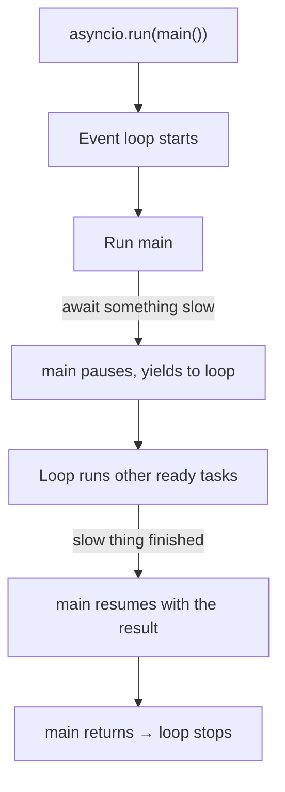

# 02: async / await

> **Level:** Beginner · **Prerequisites:** [01 · Why async?](01_why_async.md)
> **Time:** ~1.5 hours · **Verified:** 2026-06-03 (Python 3.10.12)

## Why this matters

Now you know *why* async exists. This module is the *how*: the four building blocks you'll use in every FastAPI handler — `async def`, `await`, the event loop, and running tasks concurrently. Master these and FastAPI's async code will read like plain Python.

## Concept: the coroutine (`async def`)

A function defined with `async def` is a **coroutine function**. Calling it does **not** run it — it returns a *coroutine object*, a "paused, ready-to-run" piece of work.

```python
import asyncio

async def greet():
    return "hello"

result = greet()          # does NOT print or run the body
print(result)             # <coroutine object greet at 0x...>
```

**Real output:**

```
<coroutine object greet at 0x7f...>
RuntimeWarning: coroutine 'greet' was never awaited
```

That warning is the #1 async beginner surprise: **calling a coroutine does nothing until you `await` it** (or schedule it on the event loop). It's like a recipe you've picked up but haven't started cooking.

## Concept: the event loop and `asyncio.run`

The **event loop** is the engine that actually runs coroutines. It keeps a list of tasks, runs one until it hits an `await` that needs to wait, then switches to another that's ready — over and over. It's the "waiter" from Module 01, made real.

You don't usually create the loop yourself. `asyncio.run(coro)` starts a loop, runs your coroutine to completion, and cleans up:

```python
import asyncio

async def greet():
    return "hello"

result = asyncio.run(greet())   # NOW it runs
print(result)
```

**Real output:**

```
hello
```

> **Rule:** `asyncio.run()` is the **entry point** from normal (synchronous) code into the async world. You call it **once**, at the top. Inside async code you use `await` instead. In FastAPI you won't even call `asyncio.run` — Uvicorn runs the loop for you. But for standalone scripts, it's how you start.

## Concept: `await`

`await` does two things:

1. Runs an *awaitable* (a coroutine or similar) and gives you its result.
2. If that awaitable needs to wait, it **yields control back to the event loop** so other tasks can run meanwhile.

```python
import asyncio

async def fetch_data():
    print("fetching...")
    await asyncio.sleep(1)      # yield control for 1s; loop can run others
    return {"value": 42}

async def main():
    data = await fetch_data()   # wait for it, get the return value
    print("got", data)

asyncio.run(main())
```

**Real output:**

```
fetching...
got {'value': 42}
```

**You can only use `await` inside an `async def` function.** Using it at the top level of a script is a `SyntaxError`. Think of `await` as "pause me here until this is done, and let others run while I wait."

## Concept: running things concurrently

So far everything ran sequentially. The payoff of async is running multiple coroutines **concurrently**. Three tools, from simplest to most flexible:

### 1. `asyncio.gather` — run several, wait for all

```python
# gather_demo.py
import asyncio, time

async def fetch(name, seconds):
    print(f"{name}: start")
    await asyncio.sleep(seconds)
    print(f"{name}: done")
    return f"{name}-result"

async def main():
    start = time.perf_counter()
    results = await asyncio.gather(   # start all, wait for all, collect returns
        fetch("api1", 2),
        fetch("api2", 1),
        fetch("api3", 3),
    )
    print("results:", results)
    print(f"Total: {time.perf_counter() - start:.1f}s")

asyncio.run(main())
```

**Real output:**

```
api1: start
api2: start
api3: start
api2: done
api1: done
api3: done
results: ['api1-result', 'api2-result', 'api3-result']
Total: 3.0s
```

Two things to notice:

- **Total is 3.0s** (the longest task), not 6s (the sum) — the waits overlapped.
- **`results` is in the order you passed them in** (`api1, api2, api3`), *not* the order they finished. `gather` preserves argument order, which makes it easy to match results to inputs.

### 2. `asyncio.create_task` — start now, await later

`gather` is great when you have all the coroutines up front. Sometimes you want to **start** something in the background and keep doing other work, then collect it later. That's a **Task**:

```python
# task_demo.py
import asyncio, time

async def slow_job():
    await asyncio.sleep(2)
    return "job done"

async def main():
    start = time.perf_counter()
    task = asyncio.create_task(slow_job())  # starts running immediately, in background
    print("task started, doing other work meanwhile...")
    await asyncio.sleep(1)                   # simulate other work for 1s
    print("other work done, now waiting for the job")
    result = await task                      # wait for the task's result
    print("result:", result)
    print(f"Total: {time.perf_counter() - start:.1f}s")

asyncio.run(main())
```

**Real output:**

```
task started, doing other work meanwhile...
other work done, now waiting for the job
result: job done
Total: 2.0s
```

The job's 2s and our 1s of "other work" overlapped, so total is 2.0s, not 3s. `create_task` is how you fire something off and let it run alongside you. **You'll use this in the WebSocket section** to listen for incoming messages while also pushing outgoing ones.

### 3. `async for` — iterating over a stream

You can loop over things that arrive **gradually** using `async for`. The producer is an **async generator** — a coroutine that `yield`s values over time:

```python
# async_for_demo.py
import asyncio

async def count_up(n):          # async generator: yields values over time
    for i in range(1, n + 1):
        await asyncio.sleep(0.5)  # pretend each value takes time to produce
        yield i

async def main():
    async for number in count_up(3):   # receives each value as it's produced
        print("got", number)

asyncio.run(main())
```

**Real output:**

```
got 1
got 2
got 3
```

Each number arrives 0.5s after the previous. **This is exactly how we'll stream LLM tokens** in Section 04 — an `async for` loop over tokens as the model produces them.

## Putting it together: a mental model



- `async def` defines a coroutine (a pausable function).
- `await` runs an awaitable and yields control while waiting.
- The event loop (started by `asyncio.run`, or by Uvicorn) switches between tasks at every `await`.
- `gather` / `create_task` / `async for` are how you get concurrency.

## Common mistakes

**Mistake: forgetting `await`.**

```python
async def main():
    asyncio.sleep(2)      # ❌ creates a coroutine, never runs it; returns instantly
    print("done")
```
```
done                      # printed immediately; the "sleep" never happened
RuntimeWarning: coroutine 'sleep' was never awaited
```
**Fix:** `await asyncio.sleep(2)`. If you see "coroutine was never awaited," you forgot an `await`.

**Mistake: blocking the event loop.**

```python
async def handler():
    time.sleep(5)         # ❌ blocking! freezes the WHOLE loop for 5s
```
While `time.sleep` runs, the single thread is stuck — **every** other task (every other user) is frozen. **Fix:** use `await asyncio.sleep(5)`, or for unavoidable blocking work use `await asyncio.to_thread(blocking_func)` to push it to a thread. This is the most damaging async bug in real servers: one blocking call and your whole server stalls.

**Mistake: sequential awaits when you wanted concurrency.**

```python
async def main():
    a = await fetch("x", 2)   # waits 2s...
    b = await fetch("y", 2)   # ...THEN waits another 2s = 4s total
```
Each `await` fully completes before the next line. For concurrency, start them together: `a, b = await asyncio.gather(fetch("x", 2), fetch("y", 2))` → 2s.

## Practice

**Exercise 1:** Rewrite this sequential code to run both fetches concurrently, and state the new total time.

```python
import asyncio
async def fetch(n): 
    await asyncio.sleep(n)
    return n
async def main():
    a = await fetch(2)
    b = await fetch(3)
    print(a + b)
asyncio.run(main())
```

<details><summary>Solution</summary>

```python
import asyncio
async def fetch(n):
    await asyncio.sleep(n)
    return n
async def main():
    a, b = await asyncio.gather(fetch(2), fetch(3))
    print(a + b)            # prints 5
asyncio.run(main())
```

Sequential = 2 + 3 = **5s**. Concurrent with `gather` = **3s** (the longer of the two). The printed result (5) is the same; only the time changes.
</details>

**Exercise 2:** Write an async generator `ticker(n)` that yields the strings `"tick 1"`, `"tick 2"`, … up to `n`, one every 0.3 seconds, and consume it with `async for`, printing each.

<details><summary>Solution</summary>

```python
import asyncio

async def ticker(n):
    for i in range(1, n + 1):
        await asyncio.sleep(0.3)
        yield f"tick {i}"

async def main():
    async for t in ticker(3):
        print(t)

asyncio.run(main())
```
Output:
```
tick 1
tick 2
tick 3
```
You've just written the core pattern of a streaming endpoint.
</details>

## Recap & next

- ✅ `async def` makes a **coroutine**; it runs only when **awaited** or scheduled.
- ✅ `asyncio.run()` is the entry point; **`await`** runs an awaitable and yields control while waiting.
- ✅ `asyncio.gather` runs many and returns results in argument order; `create_task` fires one off to run in the background; `async for` consumes a stream.
- ✅ Never call blocking functions (`time.sleep`, `requests.get`) in async code — they freeze the whole loop.
- Self-check: what's the difference between `asyncio.sleep(2)` and `await asyncio.sleep(2)`?

→ Next: **[03 · Real async I/O with httpx](03_async_io_httpx.md)** — awaiting the actual network.
