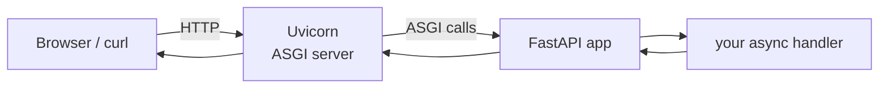

# 01: Your first FastAPI app

> **Level:** Beginner · **Prerequisites:** [Section 01](../01_async_python/README.md)
> **Time:** ~1 hour · **Verified:** 2026-06-03 (FastAPI 0.136.1, Uvicorn 0.46.0, Python 3.10.12)

## Why this matters

Everything else — WebSockets, the AI chat — lives inside a FastAPI app. This module gets you from an empty folder to a running server with live, auto-generated docs in about ten minutes, and explains the moving parts (ASGI, Uvicorn) so nothing feels like a black box.

## Setup: virtual environment + install

A **virtual environment** (`venv`) is an isolated folder of packages for one project, so your projects don't clash. Create and activate one, then install FastAPI:

```bash
# in your project folder
python3 -m venv .venv

# activate it (Linux/macOS)
source .venv/bin/activate
# Windows (PowerShell): .venv\Scripts\Activate.ps1

# install FastAPI plus the "standard" extras (includes Uvicorn, the fastapi CLI, httpx, websockets)
pip install "fastapi[standard]"
```

> `fastapi[standard]` pulls in the server (**Uvicorn**), the **`fastapi` command-line tool**, and useful extras. This course was verified against **FastAPI 0.136.1** and **Uvicorn 0.46.0**. To pin exactly: `pip install "fastapi[standard]==0.136.1"`.

Verify:

```bash
python -c "import fastapi; print(fastapi.__version__)"
```

## Concept: the minimal app

Create `main.py`:

```python
# main.py
from fastapi import FastAPI       # the framework's main class

app = FastAPI()                   # 'app' is your application object; the server looks for it


@app.get("/")                     # register: handle HTTP GET requests to the path "/"
async def root():                 # the handler — async, like everything in FastAPI
    return {"message": "Hello, World!"}   # a dict becomes a JSON response automatically
```

Line by line:

- **`from fastapi import FastAPI`** — `FastAPI` is the class that represents your whole application.
- **`app = FastAPI()`** — create the application instance. By convention it's called `app`; the server is told to run `main:app` (file `main`, variable `app`).
- **`@app.get("/")`** — a **decorator** that wires this function to a route. `.get` = the HTTP GET method; `"/"` = the URL path. This function now runs whenever someone GETs `http://yourserver/`.
- **`async def root()`** — the handler is a coroutine (Section 01!). FastAPI awaits it. You *can* use plain `def` too, but `async def` is what lets you `await` other async work (like the LLM).
- **`return {...}`** — return a Python dict (or list, Pydantic model, etc.) and FastAPI serializes it to JSON and sets the right headers for you.

> **HTTP methods quick reference:** `GET` = read data, `POST` = create/submit data, `PUT`/`PATCH` = update, `DELETE` = remove. FastAPI has `@app.get`, `@app.post`, etc., for each.

## Run it

```bash
fastapi dev main.py
```

`fastapi dev` is FastAPI's built-in development server (it runs Uvicorn with auto-reload — the server restarts when you edit the file). You'll see something like:

```
INFO     Uvicorn running on http://127.0.0.1:8000 (Press CTRL+C to quit)
```

> Equivalent classic command: `uvicorn main:app --reload`. Both run the same app; `fastapi dev` is the newer, friendlier wrapper.

Now visit:

- **http://127.0.0.1:8000/** → `{"message":"Hello, World!"}`
- **http://127.0.0.1:8000/docs** → **interactive API docs** (Swagger UI). You can call your endpoints from the browser here. This is auto-generated — you wrote zero doc code.
- **http://127.0.0.1:8000/openapi.json** → the machine-readable API description FastAPI built from your code.

Or from another terminal:

```bash
curl http://127.0.0.1:8000/
# {"message":"Hello, World!"}
```

## Concept: ASGI — what's actually running

You wrote `app`, but `app` doesn't open network sockets itself. The pieces:



- **ASGI (Asynchronous Server Gateway Interface)** is a standard contract between web servers and async Python apps. It's the async successor to WSGI (which powered Flask/Django classically but couldn't do async or WebSockets well).
- **Uvicorn** is an **ASGI server**: it listens on the network, speaks HTTP (and WebSocket!), and calls your app through the ASGI contract.
- **FastAPI** is an **ASGI application** (built on **Starlette**): it receives those calls and routes them to your handlers.

You'll rarely touch ASGI directly, but knowing this explains *why* FastAPI can do async and WebSockets natively: it's async all the way down. (Starlette is the lower-level toolkit FastAPI is built on; you'll occasionally import WebSocket classes from `fastapi` that come from Starlette.)

## Concept: testing without a browser — `TestClient`

For automated checks (and so this course can verify code), FastAPI provides `TestClient`. It calls your app in-process — no running server needed:

```python
# test_main.py
from fastapi.testclient import TestClient
from main import app

client = TestClient(app)

def test_root():
    response = client.get("/")
    assert response.status_code == 200
    assert response.json() == {"message": "Hello, World!"}
    print("OK:", response.json())
```

**Verified output** (running the assertions and the print):

```
OK: {'message': 'Hello, World!'}
```

> `TestClient` is synchronous and convenient for tests even though your handlers are async — it manages the event loop internally. Use it for testing; use `fastapi dev` / Uvicorn to actually serve traffic.

## Common mistakes

**Mistake: wrong `app` location in the run command.**

```bash
uvicorn app:app   # ❌ if your file is main.py, not app.py
```
```
ERROR: Error loading ASGI app. Could not import module "app".
```
**Fix:** it's `module:variable`. File `main.py`, variable `app` → `uvicorn main:app`. (`fastapi dev main.py` figures this out for you.)

**Mistake: forgetting to return something serializable.**

```python
@app.get("/bad")
async def bad():
    return MyCustomClass()    # ❌ FastAPI doesn't know how to JSON this
```
**Fix:** return a dict, list, or a Pydantic model (next module) — things FastAPI can serialize.

## Practice

**Exercise:** Add a second endpoint `GET /health` that returns `{"status": "ok"}`, and write a `TestClient` test asserting it returns status 200 and that exact body.

<details><summary>Solution</summary>

```python
# main.py (additions)
@app.get("/health")
async def health():
    return {"status": "ok"}
```
```python
# test
from fastapi.testclient import TestClient
from main import app
client = TestClient(app)

def test_health():
    r = client.get("/health")
    assert r.status_code == 200
    assert r.json() == {"status": "ok"}
```
A `/health` endpoint like this is standard in real services so load balancers can check the app is alive.
</details>

## Recap & next

- ✅ A FastAPI app is `app = FastAPI()` plus handlers decorated with `@app.get(...)`, `@app.post(...)`, etc.
- ✅ Run it with `fastapi dev main.py` (or `uvicorn main:app --reload`); get interactive docs at `/docs` for free.
- ✅ **Uvicorn** (ASGI server) speaks HTTP/WebSocket and calls your **FastAPI** (ASGI app) — async all the way down.
- ✅ Returned dicts become JSON; `TestClient` lets you test in-process.
- Self-check: what are the three layers between a browser request and your handler running?

→ Next: **[02 · Params & Pydantic models](02_params_and_models.md)** — accept input and validate it.
