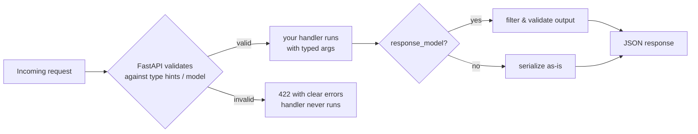

# 02: Params & Pydantic models

> **Level:** Beginner · **Prerequisites:** [01 · Your first FastAPI app](01_first_app.md)
> **Time:** ~1.5 hours · **Verified:** 2026-06-03 (FastAPI 0.136.1, Pydantic 2.12.3)

## Why this matters

A real API takes **input**: an item ID in the URL, a search term, a JSON body with a chat message. FastAPI's superpower is that you describe that input with ordinary **Python type hints**, and it automatically parses, validates, documents, and converts it — rejecting bad input with a clear error before your code runs. The chat app's `Message` model comes straight from this module.

## Concept: path parameters

Put a variable in the URL path with `{braces}` and declare it as a function argument with a type:

```python
from fastapi import FastAPI
app = FastAPI()

@app.get("/items/{item_id}")
async def read_item(item_id: int):     # the :int matters — see below
    return {"item_id": item_id, "type": str(type(item_id))}
```

The `: int` type hint tells FastAPI to **convert and validate**:

- `GET /items/42` → `item_id` becomes the integer `42`.
- `GET /items/abc` → FastAPI rejects it with a **422 Unprocessable Entity** error *before your function runs* — because `"abc"` isn't an int.

**Verified outputs (via TestClient):**

```
GET /items/42  -> 200 {'item_id': 42, 'type': "<class 'int'>"}
GET /items/abc -> 422 (validation error: "Input should be a valid integer")
```

Notice `item_id` arrived as a real `int`, not the string `"42"` — FastAPI converted it because you annotated the type.

## Concept: query parameters

Function arguments **not** in the path become **query parameters** (the `?key=value` part of a URL). Give them defaults to make them optional:

```python
@app.get("/search")
async def search(q: str, limit: int = 10):    # q required, limit optional (default 10)
    return {"query": q, "limit": limit}
```

- `GET /search?q=cats` → `{"query": "cats", "limit": 10}` (limit defaulted)
- `GET /search?q=cats&limit=5` → `{"query": "cats", "limit": 5}`
- `GET /search` → **422**, because `q` has no default, so it's required.

For an **optional** parameter that may be absent, use `| None` with a default of `None`:

```python
@app.get("/items/{item_id}")
async def read_item(item_id: int, q: str | None = None):
    result = {"item_id": item_id}
    if q is not None:
        result["q"] = q
    return result
```

> `str | None` is Python 3.10+ syntax meaning "a string or nothing." (Older code writes `Optional[str]` from `typing`.) It signals to FastAPI: this query param is optional.

**Verified outputs:**

```
GET /items/7        -> {'item_id': 7}
GET /items/7?q=hi   -> {'item_id': 7, 'q': 'hi'}
```

## Concept: request bodies with Pydantic models

For sending structured data (like a chat message) the client sends a **JSON body**, typically with `POST`. You describe the expected shape with a **Pydantic model** — a class inheriting `BaseModel` whose typed fields define the structure:

```python
from fastapi import FastAPI
from pydantic import BaseModel

app = FastAPI()


class Message(BaseModel):           # describes the JSON we expect
    role: str                       # required string
    content: str                    # required string
    temperature: float = 0.2        # optional, defaults to 0.2


@app.post("/echo")
async def echo(msg: Message):       # FastAPI sees the type and reads+validates the JSON body
    return {
        "you_said": msg.content,
        "as_role": msg.role,
        "temperature": msg.temperature,
    }
```

What FastAPI does automatically when a request hits `/echo`:

1. Reads the JSON request body.
2. Validates it against `Message` — right fields, right types.
3. If valid, gives you a typed `Message` object (`msg.content`, autocomplete and all).
4. If invalid, returns **422** with a precise list of what's wrong — your code never runs.
5. Adds the model's schema to `/docs` so the API is self-documenting.

**Verified outputs:**

```
POST /echo {"role":"user","content":"hi"}
  -> 200 {'you_said': 'hi', 'as_role': 'user', 'temperature': 0.2}

POST /echo {"role":"user"}              # missing required 'content'
  -> 422 (error: field 'content' — "Field required")

POST /echo {"role":"user","content":"hi","temperature":"hot"}   # bad type
  -> 422 (error: field 'temperature' — "Input should be a valid number")
```

This `Message` model is essentially what the chat app uses to receive what the user typed. You get validation for free.

## Concept: response models

You can also declare the **shape of the response** with `response_model`. FastAPI validates your output against it and — importantly — **filters out** any fields not in the model (handy for hiding internal data like password hashes):

```python
from pydantic import BaseModel

class UserOut(BaseModel):
    id: int
    name: str
    # note: no 'password' field

@app.get("/users/{user_id}", response_model=UserOut)
async def get_user(user_id: int):
    # pretend this came from a database, including a secret we must NOT leak
    return {"id": user_id, "name": "Ada", "password": "supersecret"}
```

**Verified output:**

```
GET /users/1 -> {'id': 1, 'name': 'Ada'}     # 'password' filtered out by response_model
```

Even though the handler returned `password`, the response model stripped it. Declaring inputs *and* outputs as models makes your API predictable and safe.

## Putting it together



## Common mistakes

**Mistake: expecting a body on a GET.** Browsers and many clients don't send bodies with GET. Use `POST` (or `PUT`/`PATCH`) when you accept a Pydantic body.

**Mistake: confusing path vs query vs body.**
- In the path string `{like_this}` → **path param**.
- A plain argument with a simple type and maybe a default → **query param**.
- An argument typed as a **Pydantic model** → **request body** (JSON).

**Mistake: treating a 422 as a server bug.** A 422 means *the client sent invalid data* and FastAPI caught it — that's the system working. Read the error detail; it names the offending field.

## Practice

**Exercise:** Define a Pydantic model `ChatRequest` with fields `message: str`, `model: str = "default"`, and `stream: bool = False`. Add `POST /chat` that accepts it and returns `{"echo": <message>, "model": <model>, "stream": <stream>}`. Then list what these requests return:
(a) `{"message": "hello"}` (b) `{"model": "x"}` (c) `{"message": "hi", "stream": "yes"}`

<details><summary>Solution</summary>

```python
from fastapi import FastAPI
from pydantic import BaseModel
app = FastAPI()

class ChatRequest(BaseModel):
    message: str
    model: str = "default"
    stream: bool = False

@app.post("/chat")
async def chat(req: ChatRequest):
    return {"echo": req.message, "model": req.model, "stream": req.stream}
```

- (a) `{"message":"hello"}` → `200 {'echo': 'hello', 'model': 'default', 'stream': False}` (defaults applied).
- (b) `{"model":"x"}` → **422**, `message` is required and missing.
- (c) `{"message":"hi","stream":"yes"}` → `200 {'echo': 'hi', 'model': 'default', 'stream': True}`. Pydantic v2 **does** coerce common bool-ish strings: `"yes"`, `"true"`, `"on"`, `"1"` all become `True`; `"no"`, `"false"`, `"off"`, `"0"` become `False`. A nonsense value like `"banana"` would be **422** "Input should be a valid boolean". (Both verified.)

This `ChatRequest` is very close to the real request model in the project.
</details>

## Recap & next

- ✅ Path params come from `{braces}` in the URL; query params are extra arguments; both are validated by their type hints.
- ✅ A **Pydantic `BaseModel`** argument = a validated JSON **request body**.
- ✅ Invalid input → automatic **422** with field-level detail; your handler only runs on valid input.
- ✅ `response_model=` validates and filters your output (hide secrets, guarantee shape).
- Self-check: how does FastAPI decide whether `q` is a query param or a request body?

→ Next: **[03 · Calling other APIs (async)](03_calling_apis_async.md)** — reach out to external services from a handler.
