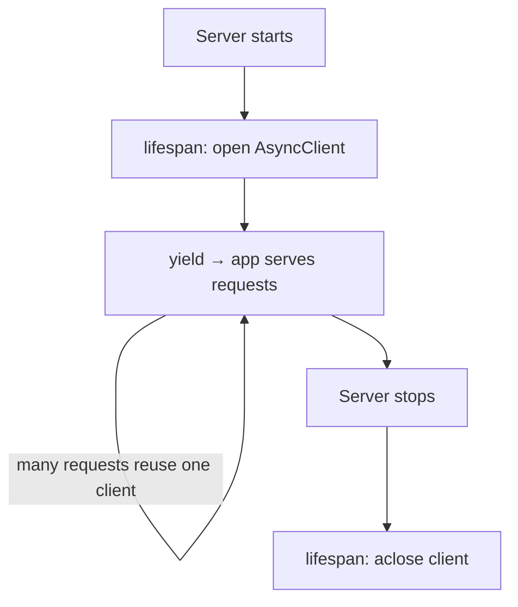

# 03: Calling other APIs (async)

> **Level:** Beginner → Intermediate · **Prerequisites:** [02 · Params & Pydantic](02_params_and_models.md), [Section 01.03 · httpx](../01_async_python/03_async_io_httpx.md)
> **Time:** ~1 hour · **Verified:** 2026-06-03 (FastAPI 0.136.1, httpx 0.28.1)

## Why this matters

Your AI server's main job is to **call another API** (the LLM) from inside a handler and relay the result. This module combines Section 01's `httpx.AsyncClient` with a FastAPI app the *right* way: one shared client created at startup and closed at shutdown, using FastAPI's **lifespan**. This is the exact backbone the chat project uses to reach the LLM.

## Concept: an async handler that calls out

Because handlers are `async def`, you can `await` an HTTP call right inside them — and while that call waits, FastAPI serves other requests:

```python
@app.get("/cat-fact")
async def cat_fact():
    r = await client.get("https://catfact.ninja/fact")   # await: server stays free meanwhile
    return r.json()
```

The open question is: where does `client` come from? Creating a new `AsyncClient` per request wastes connections (Section 01). We want **one** client for the whole app's life. That's what *lifespan* is for.

## Concept: the lifespan (startup/shutdown)

FastAPI's **lifespan** lets you run code once when the app **starts** and once when it **stops** — perfect for opening a shared resource (the client) and closing it cleanly. You write an async context manager and pass it to `FastAPI(lifespan=...)`:

```python
# main.py
from contextlib import asynccontextmanager
from fastapi import FastAPI
import httpx


@asynccontextmanager
async def lifespan(app: FastAPI):
    # --- startup: runs once before the app serves requests ---
    app.state.client = httpx.AsyncClient(timeout=10.0)
    print("HTTP client opened")
    yield                                  # app runs while we're paused here
    # --- shutdown: runs once when the app stops ---
    await app.state.client.aclose()
    print("HTTP client closed")


app = FastAPI(lifespan=lifespan)


@app.get("/cat-fact")
async def cat_fact():
    client: httpx.AsyncClient = app.state.client      # reuse the shared client
    r = await client.get("https://catfact.ninja/fact")
    r.raise_for_status()                              # turn HTTP 4xx/5xx into an exception
    return r.json()
```

The new pieces:

- **`@asynccontextmanager`** turns a function with one `yield` into an async context manager. Everything **before** `yield` is startup; everything **after** is shutdown.
- **`yield`** is where the application actually runs. Code resumes past it only when the server is shutting down.
- **`app.state`** is a simple place to stash app-wide objects. We attach the client there so every handler can reach it.
- **`r.raise_for_status()`** raises an exception if the response was an error status (404, 500, …), so failures are loud instead of silently returning error JSON.



> The live call above hits `catfact.ninja` and needs internet, so it's **not executed in this course's sandbox**. The structural pattern (lifespan + shared client + `await ... client.get`) *is* verified below against a local server.

## Verified: the whole pattern, offline

To prove the wiring works without internet, here the FastAPI app calls a tiny **local** server (started in a background thread, like Section 01.03), and we drive it with `TestClient`:

```python
# verify_calling_api.py
import threading
import time
from contextlib import asynccontextmanager
from http.server import ThreadingHTTPServer, BaseHTTPRequestHandler

import httpx
from fastapi import FastAPI
from fastapi.testclient import TestClient


# --- a local upstream service to call ---
class UpstreamHandler(BaseHTTPRequestHandler):
    def do_GET(self):
        self.send_response(200)
        self.send_header("Content-Type", "application/json")
        self.end_headers()
        self.wfile.write(b'{"fact": "Cats sleep 12-16 hours a day."}')

    def log_message(self, *args):
        pass


threading.Thread(
    target=lambda: ThreadingHTTPServer(("127.0.0.1", 8131), UpstreamHandler).serve_forever(),
    daemon=True,
).start()
time.sleep(0.3)


# --- the FastAPI app using lifespan + shared client ---
@asynccontextmanager
async def lifespan(app: FastAPI):
    app.state.client = httpx.AsyncClient(timeout=10.0)
    yield
    await app.state.client.aclose()


app = FastAPI(lifespan=lifespan)


@app.get("/cat-fact")
async def cat_fact():
    r = await app.state.client.get("http://127.0.0.1:8131/")
    r.raise_for_status()
    return r.json()


# --- drive it; the 'with' form makes lifespan startup/shutdown run ---
with TestClient(app) as client:          # entering the block runs the lifespan startup
    resp = client.get("/cat-fact")
    print(resp.status_code, resp.json())
# leaving the block runs the lifespan shutdown (client closed)
```

> ⚠️ **Important:** use `with TestClient(app) as client:` (the context-manager form) so the **lifespan runs**. A bare `TestClient(app)` without `with` skips startup/shutdown, and `app.state.client` won't exist.

**Verified output:**

```
200 {'fact': 'Cats sleep 12-16 hours a day.'}
```

The handler awaited an external service and returned its JSON — using the one shared client opened at startup and closed at shutdown. Swap the URL and headers for the LLM endpoint and you have the AI backbone.

## Concept: passing a JSON body to the upstream (POST)

The LLM API is a `POST` with a JSON body and an auth header. The httpx shape:

```python
# illustrative — the real LLM call (Section 04 builds this for real)
payload = {
    "model": "moonshotai/kimi-k2.6",
    "messages": [{"role": "user", "content": "Hello!"}],
    "max_tokens": 256,
}
headers = {"Authorization": f"Bearer {api_key}"}

r = await client.post(
    "https://integrate.api.nvidia.com/v1/chat/completions",
    json=payload,        # httpx serializes this dict to a JSON body + sets Content-Type
    headers=headers,
)
data = r.json()
```

`json=payload` tells httpx to send `payload` as a JSON body. `headers=` adds the bearer-token auth. You now know enough to call essentially any HTTP API from FastAPI.

## Common mistakes

**Mistake: creating the client inside every handler.** Defeats connection pooling and adds latency. Create it once in the lifespan; reuse `app.state.client`.

**Mistake: forgetting `with` on `TestClient` when using lifespan.** Startup never runs → `AttributeError: ... has no attribute 'client'`. Always `with TestClient(app) as client:`.

**Mistake: no timeout.** A hung upstream can block a request forever. Pass `timeout=` to the client (we used `10.0`). For streaming LLMs you'll use a longer/looser timeout — covered in Section 04.

**Mistake: ignoring upstream errors.** Without `raise_for_status()`, a 500 from the upstream gets returned to your user as if it were valid data. Raise and handle it.

## Practice

**Exercise:** Modify the verified app so `/cat-fact` accepts an optional query param `prefix: str | None = None` and, when given, returns `{"fact": "<prefix>: <original fact>"}`. Keep using the shared client.

<details><summary>Solution</summary>

```python
@app.get("/cat-fact")
async def cat_fact(prefix: str | None = None):
    r = await app.state.client.get("http://127.0.0.1:8131/")
    r.raise_for_status()
    data = r.json()
    if prefix:
        data["fact"] = f"{prefix}: {data['fact']}"
    return data
```

`GET /cat-fact?prefix=TIL` → `{'fact': 'TIL: Cats sleep 12-16 hours a day.'}`. You combined a query param (Module 02) with an awaited external call (this module).
</details>

## Recap & next

- ✅ Handlers can `await` outbound HTTP calls; the server stays responsive during the wait.
- ✅ Use **lifespan** (`@asynccontextmanager` + `FastAPI(lifespan=...)`) to open one shared `AsyncClient` at startup and `aclose()` it at shutdown; stash it on `app.state`.
- ✅ `await client.post(url, json=payload, headers=...)` is how you'll call the LLM.
- ✅ Always set a timeout, call `raise_for_status()`, and use `with TestClient(app)` so lifespan runs.
- Self-check: why create the HTTP client in the lifespan instead of inside the handler?

→ Next (AI-app track): **[Section 03 · WebSockets](../03_websockets/README.md)** — keep a live, two-way connection open.
→ Next (FastAPI-craftsmanship track): **[Section 05 · Production-grade FastAPI](../05_fastapi_production/README.md)** — structure, DI, config, errors, security, and testing.
