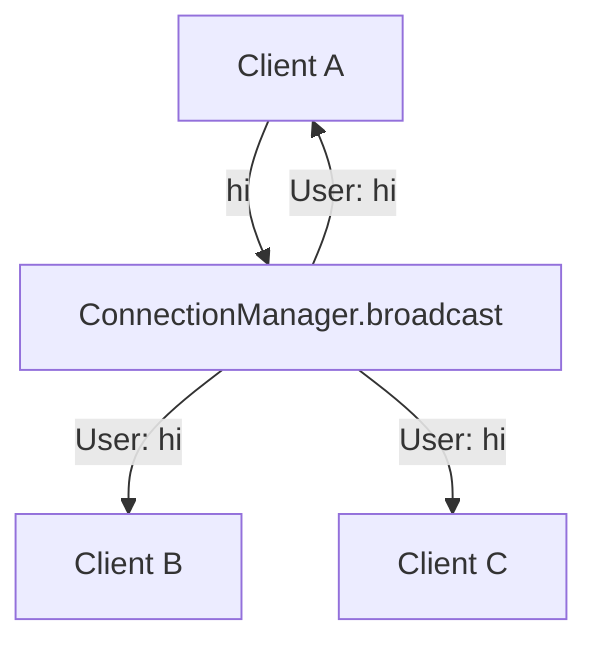

# 02: Connection manager

> **Level:** Intermediate · **Prerequisites:** [01 · WebSocket basics](01_websocket_basics.md)
> **Time:** ~1 hour · **Verified:** 2026-06-03 (FastAPI 0.136.1)

## Why this matters

One echo connection is easy. Real apps have **many** clients at once, and often need to send a message to *all* of them (a chat room, a live dashboard, "user X joined"). FastAPI gives you one `WebSocket` object per connection but no built-in registry — so you build a small **connection manager** to track who's connected and broadcast to them. It's a standard ~15-line pattern you'll reuse constantly.

## Concept: tracking connections

The idea: keep a list of active `WebSocket` objects. Add on connect, remove on disconnect, and to broadcast, loop over the list and send to each.

```python
# manager.py
from fastapi import WebSocket


class ConnectionManager:
    def __init__(self):
        self.active: list[WebSocket] = []        # everyone currently connected

    async def connect(self, websocket: WebSocket):
        await websocket.accept()                 # do the handshake...
        self.active.append(websocket)            # ...then remember this connection

    def disconnect(self, websocket: WebSocket):
        self.active.remove(websocket)            # forget it (note: not async — just a list op)

    async def broadcast(self, message: str):
        for connection in self.active:           # send to every connected client
            await connection.send_text(message)
```

Notes:

- `connect` does the `accept()` *and* registers the socket, so the endpoint doesn't have to remember both.
- `disconnect` is a plain (non-async) method — removing from a list isn't I/O, so there's nothing to await.
- `broadcast` awaits each send in turn. (For a handful of clients this is fine; we'll note the scaling caveat below.)

## Concept: using the manager in an endpoint

Create **one** manager for the app (shared across all connections) and use it in the WebSocket handler:

```python
# main.py
from fastapi import FastAPI, WebSocket, WebSocketDisconnect
from manager import ConnectionManager

app = FastAPI()
manager = ConnectionManager()          # ONE manager, shared by all connections


@app.websocket("/chat")
async def chat(websocket: WebSocket):
    await manager.connect(websocket)              # accept + register
    await manager.broadcast("📥 a user joined")
    try:
        while True:
            text = await websocket.receive_text()
            await manager.broadcast(f"User: {text}")   # relay to everyone
    except WebSocketDisconnect:
        manager.disconnect(websocket)             # unregister
        await manager.broadcast("📤 a user left")
```

Now every message one client sends is broadcast to **all** connected clients — a basic group chat. The join/leave notices use the same broadcast.



## Verified: two clients, one broadcast

We connect **two** test clients and confirm a message from one reaches both:

```python
# test_manager.py
from fastapi.testclient import TestClient
from main import app

client = TestClient(app)

def test_broadcast():
    with client.websocket_connect("/chat") as alice:
        # alice connecting broadcasts "a user joined" — alice receives it
        print("alice sees:", alice.receive_text())

        with client.websocket_connect("/chat") as bob:
            # bob joining broadcasts to BOTH alice and bob
            print("alice sees:", alice.receive_text())
            print("bob sees:  ", bob.receive_text())

            # alice sends a chat message -> both see it
            alice.send_text("hello room")
            print("alice sees:", alice.receive_text())
            print("bob sees:  ", bob.receive_text())

test_broadcast()
```

**Verified output:**

```
alice sees: 📥 a user joined
alice sees: 📥 a user joined
bob sees:   📥 a user joined
alice sees: User: hello room
bob sees:   User: hello room
```

Both clients received the broadcast from a single sender — the manager fanned it out. (The doubled "a user joined" is correct: alice sees her *own* join, then sees bob's join.)

## Concept: robust broadcasting (handling dead sockets)

There's a subtle bug in the naive `broadcast`: if a client dropped without a clean disconnect, `send_text` to it can raise mid-loop and skip the rest. A sturdier version collects failures and prunes them:

```python
async def broadcast(self, message: str):
    dead = []
    for connection in self.active:
        try:
            await connection.send_text(message)
        except Exception:
            dead.append(connection)        # this socket is broken; mark for removal
    for connection in dead:
        if connection in self.active:
            self.active.remove(connection)
```

This way one broken connection can't stop the others from receiving, and dead sockets get cleaned up. Use this version in anything real.

> **Scaling caveat (know it exists):** this in-memory list lives in **one** process. If you run multiple worker processes or servers, each has its own list, so a broadcast only reaches clients on the *same* worker. The standard fix is an external pub/sub layer (e.g. Redis) so all workers share messages. That's beyond this course, but `log()`-worthy to know before you deploy at scale. For a single-process dev server (and our project), the in-memory manager is exactly right.

## Common mistakes

**Mistake: creating the manager inside the handler.**

```python
@app.websocket("/chat")
async def chat(ws: WebSocket):
    manager = ConnectionManager()   # ❌ a brand-new empty manager per connection!
```
Each connection gets its own manager, so nobody can see anyone else. **Fix:** create one `manager` at module level, shared by all.

**Mistake: removing a socket that isn't in the list.** Calling `disconnect` twice (or on a socket that failed during `connect`) raises `ValueError: list.remove(x): x not in list`. Guard with `if websocket in self.active:` before removing, as the robust version does.

**Mistake: forgetting to unregister on disconnect.** If you don't `disconnect`, the list keeps dead sockets forever and every broadcast tries (and fails) to send to them. Always remove in the `except` block.

## Practice

**Exercise:** Add a `personal(message, websocket)` method to the manager that sends to **one** specific client, and use it in the endpoint to send a private `"welcome!"` only to the client that just connected (before the public broadcast).

<details><summary>Solution</summary>

```python
# in ConnectionManager
async def personal(self, message: str, websocket: WebSocket):
    await websocket.send_text(message)
```
```python
@app.websocket("/chat")
async def chat(websocket: WebSocket):
    await manager.connect(websocket)
    await manager.personal("welcome!", websocket)   # only this client
    await manager.broadcast("📥 a user joined")      # everyone
    try:
        while True:
            text = await websocket.receive_text()
            await manager.broadcast(f"User: {text}")
    except WebSocketDisconnect:
        manager.disconnect(websocket)
```
The newly connected client sees `welcome!` first, then the broadcast. (Verified: the connecting client receives `welcome!` followed by `📥 a user joined`.)
</details>

## Recap & next

- ✅ Keep **one** shared `ConnectionManager` holding a list of active sockets.
- ✅ `connect` = accept + register; `disconnect` = remove; `broadcast` = send to all.
- ✅ Make `broadcast` resilient: catch send errors and prune dead sockets.
- ✅ The in-memory list is per-process — fine for one server, needs Redis pub/sub to scale across workers.
- Self-check: why must the manager be created at module level rather than inside the handler?

→ Next: **[03 · Concurrent send & receive](03_concurrency_in_ws.md)** — push and listen at the same time.
