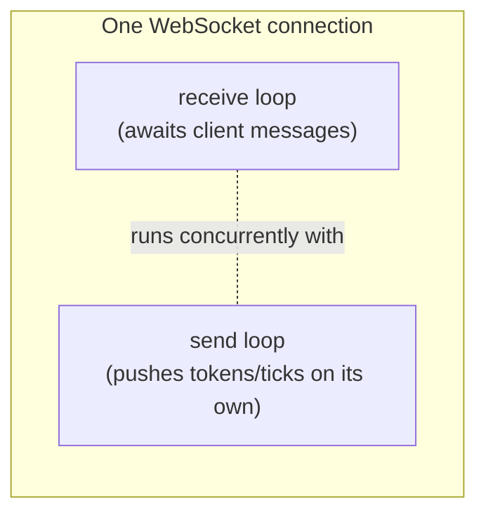

# 03: Concurrent send & receive

> **Level:** Intermediate · **Prerequisites:** [02 · Connection manager](02_connection_manager.md), [Section 01.02 · async/await](../01_async_python/02_async_await.md)
> **Time:** ~1.5 hours · **Verified:** 2026-06-03 (FastAPI 0.136.1)

## Why this matters

So far our handler loop has been **ping-pong**: receive a message, send a reply, repeat. But a streaming AI chat isn't ping-pong — the server needs to **push tokens whenever they arrive** *while also* staying ready for the user to send a new message or hit "stop." That means doing two things at once on one connection: **listening** and **sending**, independently. This module teaches that pattern — the last building block before the project.

## Concept: ping-pong is not enough

```python
# ping-pong: each send is triggered by a receive
while True:
    msg = await websocket.receive_text()   # blocked here until the client speaks
    await websocket.send_text(reply)        # one reply per message
```

While the handler sits on `await receive_text()`, it can do nothing else — it can't push a token, a heartbeat, or a notification. It's *stuck waiting for the client*. For streaming we need the **send** side to run on its own schedule, not gated by receives.

The fix is Section 01's concurrency: run a **receive loop** and a **send loop** as two concurrent tasks on the same WebSocket.



## Concept: push while listening

Here the server pushes a few "ticks" on its own schedule **and** echoes anything the client sends — at the same time. The pusher runs as a background task (Section 01.02's `create_task`) alongside the receive loop:

```python
# main.py
import asyncio
from fastapi import FastAPI, WebSocket, WebSocketDisconnect

app = FastAPI()


@app.websocket("/live")
async def live(websocket: WebSocket):
    await websocket.accept()

    async def pusher():                         # the "send on my own schedule" side
        for i in range(1, 4):
            await asyncio.sleep(0.05)
            await websocket.send_text(f"tick {i}")

    push_task = asyncio.create_task(pusher())   # start it running concurrently
    try:
        while True:                             # the "listen" side runs at the same time
            msg = await websocket.receive_text()
            await websocket.send_text(f"echo: {msg}")
    except WebSocketDisconnect:
        push_task.cancel()                      # client gone → stop the pusher too
```

`asyncio.create_task(pusher())` kicks off the pusher *without waiting for it*, so the `while True` receive loop runs concurrently. The pusher sends on its own timing; the receive loop reacts to the client. On disconnect we **cancel** the pusher so it doesn't linger.

### Verified: the client gets pushes it never asked for

```python
# test_live.py
from fastapi.testclient import TestClient
from main import app

client = TestClient(app)

def test_push_and_echo():
    with client.websocket_connect("/live") as ws:
        # the server pushes these WITHOUT us sending anything first:
        print(ws.receive_text())
        print(ws.receive_text())
        print(ws.receive_text())
        # now we send, and the concurrent receive loop echoes it:
        ws.send_text("hi")
        print(ws.receive_text())

test_push_and_echo()
```

**Verified output:**

```
tick 1
tick 2
tick 3
echo: hi
```

The client received three messages **before sending anything** — impossible with a ping-pong loop — and the echo still worked. Sending and receiving ran concurrently on one socket.

## Concept: "stop both when either finishes"

In the streaming project, two loops run together:
- the **send loop** ends when the LLM stream is complete, and
- the **receive loop** ends when the user disconnects or cancels.

When *either* ends, you usually want to stop the other and close cleanly. The canonical pattern uses `asyncio.wait(..., return_when=FIRST_COMPLETED)` then cancels whatever's still pending:

```python
# main.py
import asyncio
from fastapi import FastAPI, WebSocket, WebSocketDisconnect

app = FastAPI()


@app.websocket("/relay")
async def relay(websocket: WebSocket):
    await websocket.accept()

    async def receive_loop():
        try:
            while True:
                await websocket.receive_text()   # just drain client messages
        except WebSocketDisconnect:
            pass                                 # client left — this loop ends

    async def send_loop():
        for i in range(1, 4):
            await asyncio.sleep(0.05)
            await websocket.send_text(f"tick {i}")
        # loop ends naturally when there's nothing left to send

    receiver = asyncio.create_task(receive_loop())
    sender = asyncio.create_task(send_loop())

    # wake up as soon as EITHER task finishes
    done, pending = await asyncio.wait(
        {receiver, sender}, return_when=asyncio.FIRST_COMPLETED
    )
    for task in pending:        # cancel whichever is still running
        task.cancel()
    await websocket.close()     # explicitly close so the client gets a clean disconnect
```

`asyncio.wait` with `FIRST_COMPLETED` returns the moment one task finishes; `pending` holds the rest, which we cancel. Here the `send_loop` finishes after 3 ticks → we cancel the still-waiting `receiver` → we close the socket.

> ⚠️ **Why the explicit `await websocket.close()`?** After you *cancel* the task that was awaiting `receive_text()`, simply returning from the handler does **not** reliably send a close frame — the client would hang waiting for the next message forever. (Verified: omitting `close()` makes the test below hang.) Whenever you end a connection by cancelling its receive loop, close it explicitly.

### Verified: connection closes after the send loop finishes

```python
# test_relay.py
from fastapi.testclient import TestClient
from fastapi import WebSocketDisconnect
from main import app

client = TestClient(app)

def test_relay_closes():
    with client.websocket_connect("/relay") as ws:
        print(ws.receive_text())   # tick 1
        print(ws.receive_text())   # tick 2
        print(ws.receive_text())   # tick 3
        try:
            ws.receive_text()      # send loop finished -> server closed the socket
            print("still open?!")
        except WebSocketDisconnect:
            print("server closed the connection (as expected)")

test_relay_closes()
```

**Verified output:**

```
tick 1
tick 2
tick 3
server closed the connection (as expected)
```

After the send loop emitted its last tick, the handler cancelled the receiver and returned, closing the socket — the client sees a clean disconnect. **This is exactly the shape of the streaming chat:** stream tokens until done, then wrap up.

## Common mistakes

**Mistake: never cancelling the other task.** If you start a pusher with `create_task` and don't cancel it on disconnect, it keeps trying to `send_text` on a dead socket and raises errors in the background. Always cancel siblings when the connection ends.

**Mistake: assuming `asyncio.gather` cancels siblings on error.** It doesn't by default — if one coroutine raises, the others keep running. For "stop when either finishes," use `asyncio.wait(..., return_when=FIRST_COMPLETED)` and cancel `pending`, as above.

**Mistake: two tasks calling `receive_*` on the same socket.** Only run **one** receive loop per socket. Multiple concurrent `receive_text()` calls on the same WebSocket are not allowed and raise a runtime error. (Multiple are fine for `send`, but keep receiving in one place.)

## Practice

**Exercise:** Modify `/live` so that, instead of a fixed 3 ticks, the pusher sends the current count every 0.05s **forever**, and stops only when the client disconnects. Verify the client can read several ticks then close cleanly.

<details><summary>Solution</summary>

```python
@app.websocket("/live")
async def live(websocket: WebSocket):
    await websocket.accept()

    async def pusher():
        i = 0
        while True:                       # forever...
            i += 1
            await asyncio.sleep(0.05)
            await websocket.send_text(f"tick {i}")

    push_task = asyncio.create_task(pusher())
    try:
        while True:
            await websocket.receive_text()
    except WebSocketDisconnect:
        push_task.cancel()                # ...until the client leaves
```
```python
def test_forever():
    with client.websocket_connect("/live") as ws:
        for _ in range(5):
            print(ws.receive_text())      # tick 1..tick 5
    # leaving the 'with' disconnects; pusher is cancelled

# Verified: prints tick 1 ... tick 5, then disconnects cleanly with no errors.
```
The key is cancelling `push_task` in the `except` so the forever-loop actually stops.
</details>

## Recap & next

- ✅ Ping-pong (`receive` → `send`) can't push on its own; streaming needs **concurrent** send and receive.
- ✅ Use `asyncio.create_task` to run a send/push loop alongside the receive loop on one socket.
- ✅ "Stop both when either finishes": `asyncio.wait(..., return_when=FIRST_COMPLETED)`, then cancel `pending`.
- ✅ Always cancel sibling tasks on disconnect; run only **one** receive loop per socket.
- Self-check: why can't a single `while True: receive → send` loop stream LLM tokens as they arrive?

→ Next: **[Section 04 · Streaming AI](../04_streaming_ai/README.md)** — get tokens from the LLM and push them over the WebSocket.
