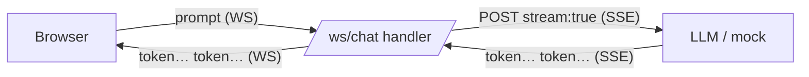

# 02: Bridge SSE → WebSocket

> **Level:** Intermediate · **Prerequisites:** [01 · Consume LLM token streams](01_llm_streaming_sse.md), [Section 03 · WebSockets](../03_websockets/README.md)
> **Time:** ~1.5 hours · **Verified:** 2026-06-03 (FastAPI 0.136.1, httpx 0.28.1; against a local mock SSE server)

## Why this matters

You can now (a) stream tokens *in* from the LLM (SSE) and (b) push messages *out* over a WebSocket. This module **joins them**: a WebSocket endpoint that takes the user's prompt, streams the LLM's reply, and forwards each token to the browser the instant it arrives. That bridge *is* the AI chat app — the project in Section 99 just adds a UI and the real backend around it.



## Concept: a message protocol for the socket

When the server sends more than plain text, give each message a **type** so the browser knows what it is. We'll send JSON objects:

| Server → client | Meaning |
|---|---|
| `{"type": "token", "content": "Hel"}` | one token to append to the current reply |
| `{"type": "end"}` | the reply is complete |
| `{"type": "error", "detail": "..."}` | something went wrong |

Client → server stays simple: the raw prompt text. A tiny, explicit protocol like this keeps the frontend logic trivial ("on `token`, append; on `end`, stop the spinner").

## Concept: the bridge handler

The handler loops: receive a prompt, stream the reply token-by-token, then signal `end`:

```python
# main.py
import json
from contextlib import asynccontextmanager

import httpx
from fastapi import FastAPI, WebSocket, WebSocketDisconnect

from llm import stream_tokens          # the async generator from Module 04.01


@asynccontextmanager
async def lifespan(app: FastAPI):
    app.state.client = httpx.AsyncClient(timeout=None)   # no timeout: streams can be long
    yield
    await app.state.client.aclose()


app = FastAPI(lifespan=lifespan)

LLM_URL = "http://127.0.0.1:8141/v1/chat/completions"    # swap for NVIDIA/Ollama
LLM_HEADERS: dict = {}                                    # add Bearer token for NVIDIA


@app.websocket("/ws/chat")
async def ws_chat(websocket: WebSocket):
    await websocket.accept()
    client: httpx.AsyncClient = app.state.client
    try:
        while True:
            prompt = await websocket.receive_text()        # 1. user's message
            payload = {
                "model": "mock",
                "messages": [{"role": "user", "content": prompt}],
                "stream": True,
            }
            # 2. stream the reply; forward each token as it arrives
            async for token in stream_tokens(client, LLM_URL, payload, LLM_HEADERS):
                await websocket.send_json({"type": "token", "content": token})
            # 3. tell the client this reply is finished
            await websocket.send_json({"type": "end"})
    except WebSocketDisconnect:
        pass                                               # client closed; nothing to clean up
```

Walk through it:

1. **`receive_text()`** waits for the user's prompt (one message = one question).
2. The **`async for`** consumes `stream_tokens` (Module 04.01) and, for each token, **immediately** `send_json`s it over the socket. Because both the SSE read and the WS send are awaited, the server stays responsive throughout.
3. After the generator finishes (it hit `[DONE]`), we send `{"type": "end"}` so the browser knows the reply is complete. Then the loop waits for the next prompt — the connection stays open for a whole conversation.

> **`timeout=None`** on the client: a streamed answer can take many seconds. A normal read timeout would cut it off mid-reply. For streaming, disable the read timeout (or set a generous one).

## Verified: end-to-end with a mock LLM

Here's the whole bridge, verified against the **same local mock SSE server** from Module 04.01 — no API key, no internet — driven by a `TestClient` WebSocket:

```python
# bridge_demo.py
import asyncio
import json
import threading
import time
from contextlib import asynccontextmanager
from http.server import ThreadingHTTPServer, BaseHTTPRequestHandler

import httpx
from fastapi import FastAPI, WebSocket, WebSocketDisconnect
from fastapi.testclient import TestClient


# --- mock LLM: streams SSE tokens spelling out a reply ---
class MockSSEHandler(BaseHTTPRequestHandler):
    def do_POST(self):
        self.send_response(200)
        self.send_header("Content-Type", "text/event-stream")
        self.end_headers()
        for piece in ["The", " answer", " is", " 42", "."]:
            event = {"choices": [{"delta": {"content": piece}}]}
            self.wfile.write(f"data: {json.dumps(event)}\n\n".encode())
            self.wfile.flush()
            time.sleep(0.02)
        self.wfile.write(b"data: [DONE]\n\n")
        self.wfile.flush()

    def log_message(self, *a):
        pass


threading.Thread(
    target=lambda: ThreadingHTTPServer(("127.0.0.1", 8142), MockSSEHandler).serve_forever(),
    daemon=True,
).start()
time.sleep(0.3)


# --- the token generator (from Module 04.01) ---
async def stream_tokens(client, url, payload, headers):
    async with client.stream("POST", url, json=payload, headers=headers) as response:
        response.raise_for_status()
        async for line in response.aiter_lines():
            if not line.startswith("data: "):
                continue
            data = line[len("data: "):]
            if data == "[DONE]":
                break
            token = json.loads(data)["choices"][0]["delta"].get("content")
            if token:
                yield token


# --- the FastAPI bridge ---
@asynccontextmanager
async def lifespan(app: FastAPI):
    app.state.client = httpx.AsyncClient(timeout=None)
    yield
    await app.state.client.aclose()


app = FastAPI(lifespan=lifespan)
LLM_URL = "http://127.0.0.1:8142/v1/chat/completions"


@app.websocket("/ws/chat")
async def ws_chat(websocket: WebSocket):
    await websocket.accept()
    client = app.state.client
    try:
        while True:
            prompt = await websocket.receive_text()
            payload = {"model": "mock", "messages": [{"role": "user", "content": prompt}], "stream": True}
            async for token in stream_tokens(client, LLM_URL, payload, {}):
                await websocket.send_json({"type": "token", "content": token})
            await websocket.send_json({"type": "end"})
    except WebSocketDisconnect:
        pass


# --- drive it like a browser would ---
with TestClient(app) as client:
    with client.websocket_connect("/ws/chat") as ws:
        ws.send_text("What is the answer?")
        reply = ""
        while True:
            msg = ws.receive_json()
            if msg["type"] == "token":
                reply += msg["content"]
                print(f"  token -> {msg['content']!r}")
            elif msg["type"] == "end":
                print("  [end]")
                break
        print("assembled reply:", repr(reply))
```

**Verified output:**

```
  token -> 'The'
  token -> ' answer'
  token -> ' is'
  token -> ' 42'
  token -> '.'
  [end]
assembled reply: 'The answer is 42.'
```

The browser side received each token as a separate `token` message, appended them, and stopped on `end`. Swap the mock URL for NVIDIA/Ollama (plus the auth header) and this streams a *real* AI reply — the project does exactly that.

## Concept: letting the user stop a reply (advanced)

The loop above can't be interrupted mid-reply — while streaming, it isn't reading from the client, so a "stop" message would sit unread until the reply finishes. To support **stop**, run the stream and a listen-for-stop loop **concurrently** using the Section 03.03 pattern (`asyncio.wait(..., FIRST_COMPLETED)` + cancel the other). The full project in Section 99 implements and verifies this; the core idea:

```python
# sketch — full version in the project
stream_task = asyncio.create_task(forward_reply(websocket, client, prompt))
stop_task = asyncio.create_task(websocket.receive_text())   # waits for a "stop" message
done, pending = await asyncio.wait({stream_task, stop_task}, return_when=asyncio.FIRST_COMPLETED)
for t in pending:
    t.cancel()                                              # cancel whichever didn't finish
```

If the reply finishes first, we cancel the stop-listener; if the user sends "stop" first, we cancel the stream. This is the concurrent send/receive skill from Section 03.03, applied to streaming.

## Common mistakes

**Mistake: collecting all tokens, then sending once.**

```python
reply = ""
async for token in stream_tokens(...):
    reply += token                     # ❌ accumulating, not forwarding
await websocket.send_text(reply)       # sends the whole thing at the end — no streaming!
```
This throws away the streaming benefit — the user waits and then gets everything at once. **Send each token inside the loop.**

**Mistake: a read timeout that kills long replies.** A default `AsyncClient` timeout can abort a slow stream partway. Use `timeout=None` (or a large read timeout) for streaming clients.

**Mistake: no `end` signal.** Without an explicit `{"type": "end"}`, the browser can't tell whether more tokens are coming, so the "typing" indicator never stops. Always signal completion.

**Mistake: not handling `WebSocketDisconnect` around the stream.** If the user closes the tab mid-reply, `send_json` raises. Wrap the loop in `try/except WebSocketDisconnect` (and, in the concurrent version, cancel the stream task).

## Practice

**Exercise:** Add error handling so that if `stream_tokens` raises (e.g. the LLM endpoint is down), the handler sends `{"type": "error", "detail": <message>}` over the socket instead of crashing, then keeps the connection open for the next prompt.

<details><summary>Solution</summary>

```python
@app.websocket("/ws/chat")
async def ws_chat(websocket: WebSocket):
    await websocket.accept()
    client = app.state.client
    try:
        while True:
            prompt = await websocket.receive_text()
            payload = {"model": "mock", "messages": [{"role": "user", "content": prompt}], "stream": True}
            try:
                async for token in stream_tokens(client, LLM_URL, payload, {}):
                    await websocket.send_json({"type": "token", "content": token})
                await websocket.send_json({"type": "end"})
            except httpx.HTTPError as e:
                # network/HTTP problem talking to the LLM — report, but keep the socket open
                await websocket.send_json({"type": "error", "detail": str(e)})
    except WebSocketDisconnect:
        pass
```

The inner `try` catches problems with the LLM call so one failed reply doesn't kill the whole conversation; the outer `try` still handles the client disconnecting. (Verified: pointing `LLM_URL` at a closed port makes the client receive an `error` message, then the socket stays open for another prompt.)
</details>

## Recap & next

- ✅ The bridge handler: **receive prompt → `async for` over `stream_tokens` → `send_json` each token → signal `end`**.
- ✅ Use a small typed protocol (`token` / `end` / `error`) so the frontend logic is trivial.
- ✅ Send each token *inside* the loop (don't accumulate); use `timeout=None` for streaming; handle `WebSocketDisconnect`.
- ✅ For a stop button, run the stream and a stop-listener concurrently (`asyncio.wait`, FIRST_COMPLETED) — built fully in the project.
- Self-check: what breaks if you accumulate tokens into a string and send it once after the loop?

→ Next: **[99 · Project: streaming AI chat](../99_project_streaming_chat.md)** — assemble the full app, UI and all.
