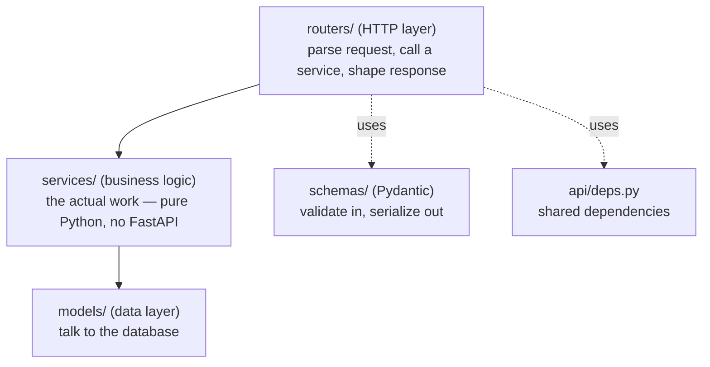

# 01: Project structure & routers

> **Level:** Intermediate · **Prerequisites:** [Section 02 · FastAPI basics](../02_fastapi_basics/README.md)
> **Time:** ~1.5 hours · **Verified:** 2026-06-03 (FastAPI 0.136.1)

## Why this matters

One `main.py` is fine for a demo. The moment you have a dozen endpoints, auth, and a database, a single file becomes unnavigable and unmergeable (everyone edits the same file → constant conflicts). Professionals split a FastAPI app into **routers** and **layers**. This module shows the standard layout and the `APIRouter` tool that makes it possible — the foundation everything else in this section builds on.

## Concept: `APIRouter` — routes in separate files

`APIRouter` is a "mini FastAPI app" you define in its own module, then plug into the main app. Same decorators (`.get`, `.post`, `.websocket`), but on a router:

```python
# app/api/items.py
from fastapi import APIRouter

router = APIRouter(prefix="/items", tags=["items"])   # prefix + docs grouping


@router.get("")                       # full path becomes /items
async def list_items():
    return [{"id": 1, "name": "apple"}]


@router.get("/{item_id}")             # full path becomes /items/{item_id}
async def get_item(item_id: int):
    return {"id": item_id, "name": "apple"}
```

```python
# app/main.py
from fastapi import FastAPI
from app.api import items, users

app = FastAPI()
app.include_router(items.router)      # mount all of items' routes
app.include_router(users.router)      # ...and users'
```

The new tools:

- **`APIRouter(prefix="/items")`** — every route on this router is automatically prefixed, so you write `@router.get("/{item_id}")` and get `/items/{item_id}`. Change the prefix in one place to move the whole group.
- **`tags=["items"]`** — groups these endpoints under an "items" heading in the `/docs` UI. Pure documentation nicety, but expected in real APIs.
- **`app.include_router(...)`** — mounts a router's routes onto the app. This is the seam that lets each feature live in its own file.

## Concept: the standard project layout

A widely-used, scalable layout separates code by **responsibility**. Here's a battle-tested shape (the names vary between teams, the *separation* doesn't):

```
myapp/
├── app/
│   ├── __init__.py
│   ├── main.py              # create the app, include routers, wire middleware
│   ├── core/
│   │   ├── config.py        # settings (Module 03)
│   │   └── security.py      # auth helpers (Module 05)
│   ├── api/
│   │   ├── deps.py          # shared dependencies (Module 02)
│   │   └── routers/
│   │       ├── items.py     # HTTP layer: endpoints for "items"
│   │       └── users.py
│   ├── schemas/             # Pydantic models = the API's data shapes (request/response)
│   │   ├── item.py
│   │   └── user.py
│   ├── services/            # business logic (no FastAPI imports here)
│   │   └── item_service.py
│   └── models/              # database models (SQLAlchemy/SQLModel), if any
│       └── item.py
├── tests/                   # pytest suite (Module 06)
├── .env                     # local config, NEVER committed
├── pyproject.toml           # deps & tooling
└── README.md
```

The key idea is **layers**, each with one job:



Why bother with the separation:

- **Routers** stay thin — they translate HTTP to/from function calls and nothing more.
- **Services** hold the logic and have **no FastAPI imports**, so you can unit-test them without HTTP and reuse them from a CLI, a worker, or a WebSocket handler.
- **Schemas** (Pydantic) define the *contract*; **models** define *storage*. Keeping them separate stops database details from leaking into your API.

> **Rule of thumb:** if a router function is more than a few lines of logic, that logic probably belongs in a service. Routers route; services do.

## Concept: the app factory

A function that builds and returns the app — `create_app()` — is the idiomatic way to assemble everything. It makes configuration explicit and lets tests build a fresh app with overrides:

```python
# app/main.py
from fastapi import FastAPI

from app.api.routers import items, users


def create_app() -> FastAPI:
    app = FastAPI(title="My API", version="1.0.0")
    # register routers
    app.include_router(items.router)
    app.include_router(users.router)
    # (middleware, exception handlers, lifespan get wired here too — later modules)
    return app


app = create_app()        # the object Uvicorn runs: `uvicorn app.main:app`
```

`title` and `version` show up in `/docs` and the OpenAPI schema — set them.

## Verified: a multi-router app

A self-contained app with two routers, each prefixed and tagged, exercised with `TestClient`:

```python
# structure_demo.py
from fastapi import APIRouter, FastAPI
from fastapi.testclient import TestClient

# --- "items" router (would live in app/api/routers/items.py) ---
items_router = APIRouter(prefix="/items", tags=["items"])

@items_router.get("")
async def list_items():
    return [{"id": 1, "name": "apple"}]

@items_router.get("/{item_id}")
async def get_item(item_id: int):
    return {"id": item_id, "name": "apple"}

# --- "users" router (would live in app/api/routers/users.py) ---
users_router = APIRouter(prefix="/users", tags=["users"])

@users_router.get("/{user_id}")
async def get_user(user_id: int):
    return {"id": user_id, "name": "Ada"}

# --- app factory (app/main.py) ---
def create_app() -> FastAPI:
    app = FastAPI(title="My API", version="1.0.0")
    app.include_router(items_router)
    app.include_router(users_router)
    return app

app = create_app()

client = TestClient(app)
print("GET /items     ->", client.get("/items").json())
print("GET /items/5   ->", client.get("/items/5").json())
print("GET /users/9   ->", client.get("/users/9").json())
# the OpenAPI schema lists every route, grouped by tag:
paths = sorted(client.get("/openapi.json").json()["paths"].keys())
print("registered paths ->", paths)
```

**Verified output:**

```
GET /items     -> [{'id': 1, 'name': 'apple'}]
GET /items/5   -> {'id': 5, 'name': 'apple'}
GET /users/9   -> {'id': 9, 'name': 'Ada'}
registered paths -> ['/items', '/items/{item_id}', '/users/{user_id}']
```

Two independent routers, each in its own logical file, mounted by the factory — and FastAPI assembled them into one documented API.

## Common mistakes

**Mistake: putting business logic in the router.** A 60-line endpoint that queries the DB, transforms data, calls an external API, and formats a response is impossible to unit-test and reuse. Move the work into a `service` function the router calls.

**Mistake: circular imports.** `main.py` imports routers; routers must **not** import `main.py`. Shared things (settings, dependencies) live in their own modules (`core/`, `deps.py`) that both can import. Keep the dependency direction one-way: `main → routers → services → models`.

**Mistake: a `prefix` with a trailing slash or on the route too.** `APIRouter(prefix="/items/")` (trailing slash) plus `@router.get("/")` yields `/items//` — a 404 trap. Convention: prefix has **no** trailing slash; the collection route uses `@router.get("")`.

**Mistake: one giant `schemas.py` / `models.py`.** Fine at first; split per-domain (`schemas/item.py`) as it grows, mirroring your routers.

## Practice

**Exercise:** Add a third router for `health` with a single `GET /health` returning `{"status": "ok"}`, give it the tag `"system"`, mount it in `create_app()`, and confirm via the OpenAPI paths that `/health` is registered.

<details><summary>Solution</summary>

```python
health_router = APIRouter(tags=["system"])   # no prefix; it's a single top-level route

@health_router.get("/health")
async def health():
    return {"status": "ok"}

def create_app() -> FastAPI:
    app = FastAPI(title="My API", version="1.0.0")
    app.include_router(items_router)
    app.include_router(users_router)
    app.include_router(health_router)
    return app
```

`GET /health` → `{'status': 'ok'}`, and `/health` appears in the OpenAPI paths under the "system" tag. (Verified.) A no-prefix router is the norm for top-level utility routes like health checks.
</details>

## Recap & next

- ✅ Split routes into **`APIRouter`** modules with a `prefix` and `tags`; mount them with `app.include_router(...)`.
- ✅ Organize by **layer**: routers (HTTP) → services (logic, no FastAPI) → models (DB); schemas define the API contract.
- ✅ Use a **`create_app()` factory** so assembly is explicit and testable; set `title`/`version`.
- ✅ Keep imports one-directional to avoid cycles; keep routers thin.
- Self-check: why should business logic live in a service rather than the router function?

→ Next: **[02 · Dependency injection](02_dependency_injection.md)** — how routers share resources cleanly.
