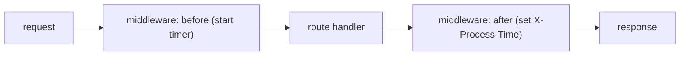

# 05: Security & middleware

> **Level:** Intermediate → Advanced · **Prerequisites:** [02 · Dependency injection](02_dependency_injection.md), [04 · Errors](04_errors_and_responses.md)
> **Time:** ~1.5 hours · **Verified:** 2026-06-03 (FastAPI 0.136.1)

## Why this matters

Two cross-cutting concerns every real API needs: **authentication** (who is calling, and are they allowed?) and **middleware** (logic that runs on *every* request — CORS, request logging, timing, request IDs). FastAPI handles auth elegantly through dependency injection (Module 02) and ships standard middleware. This module shows the idiomatic, secure-by-default patterns.

## Concept: authentication as a dependency

You already have the tool: a **dependency** that extracts a credential, verifies it, and either returns the caller or raises `401`/`403`. FastAPI's `fastapi.security` helpers extract the credential *and* document the scheme in `/docs`.

### Pattern A — API key in a header

Simplest scheme, common for service-to-service APIs:

```python
from typing import Annotated
from fastapi import Depends, HTTPException, status
from fastapi.security import APIKeyHeader

api_key_scheme = APIKeyHeader(name="X-API-Key")     # read the X-API-Key header (+ shows in docs)

def require_api_key(key: Annotated[str, Depends(api_key_scheme)]) -> None:
    if key != "expected-secret-key":                # in real life: compare against settings/DB
        raise HTTPException(status.HTTP_401_UNAUTHORIZED, detail="Invalid API key")
```

### Pattern B — bearer token → current user

The OAuth2/JWT-style scheme: clients send `Authorization: Bearer <token>`. `HTTPBearer` extracts it; your dependency verifies it and returns the user:

```python
from fastapi.security import HTTPBearer, HTTPAuthorizationCredentials

bearer_scheme = HTTPBearer()     # extracts "Authorization: Bearer <token>"; 401 if absent

# pretend token store (real apps decode a JWT or look the token up)
_TOKENS = {"token-ada": {"username": "ada", "role": "admin"}}

def get_current_user(
    creds: Annotated[HTTPAuthorizationCredentials, Depends(bearer_scheme)],
) -> dict:
    user = _TOKENS.get(creds.credentials)
    if user is None:
        raise HTTPException(status.HTTP_401_UNAUTHORIZED, detail="Invalid token")
    return user

CurrentUser = Annotated[dict, Depends(get_current_user)]
```

Then protecting an endpoint is just asking for the user:

```python
@app.get("/me")
async def me(user: CurrentUser):
    return {"username": user["username"], "role": user["role"]}
```

### Authorization (roles/permissions) — build on authentication

Authentication says *who*; authorization says *allowed to do what*. Layer a dependency on top:

```python
def require_admin(user: CurrentUser) -> dict:
    if user["role"] != "admin":
        raise HTTPException(status.HTTP_403_FORBIDDEN, detail="Admins only")
    return user

AdminUser = Annotated[dict, Depends(require_admin)]

@app.delete("/items/{item_id}")
async def delete_item(item_id: int, admin: AdminUser):   # 401 if no/invalid token, 403 if not admin
    return {"deleted": item_id, "by": admin["username"]}
```

> **401 vs 403:** `401 Unauthorized` = we don't know who you are (bad/missing credential). `403 Forbidden` = we know you, but you're not allowed. Use them correctly — clients and audits depend on the distinction.

To require auth on an **entire router**, use the router-level dependency from Module 02:

```python
admin_router = APIRouter(prefix="/admin", dependencies=[Depends(require_admin)])
```

## Concept: middleware — logic on every request

**Middleware** wraps every request/response: it runs before the route, can modify the request, runs after, and can modify the response. Use it for cross-cutting concerns (timing, logging, request IDs, headers). The simplest form:

```python
import time
from fastapi import Request

@app.middleware("http")
async def add_process_time_header(request: Request, call_next):
    start = time.perf_counter()
    response = await call_next(request)               # run the rest of the app
    response.headers["X-Process-Time"] = f"{time.perf_counter() - start:.4f}"
    return response
```

- `call_next(request)` runs the route (and any inner middleware) and gives you the response.
- Code **before** it runs on the way in; code **after** runs on the way out.
- Here we measure how long the request took and attach it as a header — the basis of request timing/observability.



> **Middleware vs dependency:** middleware runs on **every** request (even 404s) and works at the raw request/response level — good for logging, timing, headers. **Dependencies** are per-route, typed, and injectable — good for auth, DB sessions, validation. Use each for what it's best at.

## Concept: CORS — let browsers call your API

If a web page on `https://app.example.com` calls your API on a different origin, the **browser** blocks it unless your API sends CORS headers permitting that origin. FastAPI ships `CORSMiddleware`:

```python
from fastapi.middleware.cors import CORSMiddleware

app.add_middleware(
    CORSMiddleware,
    allow_origins=["https://app.example.com"],   # exact origins you trust (from settings!)
    allow_methods=["*"],                          # or ["GET", "POST", ...]
    allow_headers=["*"],
    allow_credentials=True,                       # allow cookies/Authorization across origins
)
```

> ⚠️ **Don't ship `allow_origins=["*"]` with `allow_credentials=True`** — it's insecure (and the spec forbids the combination). List the exact origins, ideally from your settings (`cors_origins`, Module 03). `["*"]` is fine only for fully public, credential-free APIs.

## Verified: API key, bearer auth, roles, middleware, and CORS

```python
# security_demo.py
import time
from typing import Annotated

from fastapi import Depends, FastAPI, HTTPException, Request, status
from fastapi.middleware.cors import CORSMiddleware
from fastapi.security import APIKeyHeader, HTTPBearer, HTTPAuthorizationCredentials
from fastapi.testclient import TestClient

app = FastAPI()

# --- middleware: timing header on every response ---
@app.middleware("http")
async def add_process_time_header(request: Request, call_next):
    start = time.perf_counter()
    response = await call_next(request)
    response.headers["X-Process-Time"] = f"{time.perf_counter() - start:.4f}"
    return response

# --- CORS ---
app.add_middleware(
    CORSMiddleware,
    allow_origins=["https://app.example.com"],
    allow_methods=["*"],
    allow_headers=["*"],
)

# --- API key auth ---
api_key_scheme = APIKeyHeader(name="X-API-Key")
def require_api_key(key: Annotated[str, Depends(api_key_scheme)]) -> None:
    if key != "expected-secret-key":
        raise HTTPException(status.HTTP_401_UNAUTHORIZED, detail="Invalid API key")

# --- bearer token -> user, plus admin check ---
bearer_scheme = HTTPBearer(auto_error=True)
_TOKENS = {"token-ada": {"username": "ada", "role": "admin"},
           "token-bob": {"username": "bob", "role": "user"}}

def get_current_user(creds: Annotated[HTTPAuthorizationCredentials, Depends(bearer_scheme)]) -> dict:
    user = _TOKENS.get(creds.credentials)
    if user is None:
        raise HTTPException(status.HTTP_401_UNAUTHORIZED, detail="Invalid token")
    return user

CurrentUser = Annotated[dict, Depends(get_current_user)]

def require_admin(user: CurrentUser) -> dict:
    if user["role"] != "admin":
        raise HTTPException(status.HTTP_403_FORBIDDEN, detail="Admins only")
    return user

AdminUser = Annotated[dict, Depends(require_admin)]

@app.get("/public")
async def public():
    return {"ok": True}

@app.get("/keyed", dependencies=[Depends(require_api_key)])
async def keyed():
    return {"data": "secret"}

@app.get("/me")
async def me(user: CurrentUser):
    return {"username": user["username"], "role": user["role"]}

@app.delete("/items/{item_id}")
async def delete_item(item_id: int, admin: AdminUser):
    return {"deleted": item_id, "by": admin["username"]}

c = TestClient(app)

print("public (+timing header) ->", c.get("/public").status_code,
      "X-Process-Time" in c.get("/public").headers)
print("keyed: no key   ->", c.get("/keyed").status_code)
print("keyed: bad key  ->", c.get("/keyed", headers={"X-API-Key": "wrong"}).status_code)
print("keyed: good key ->", c.get("/keyed", headers={"X-API-Key": "expected-secret-key"}).json())
print("me: no token    ->", c.get("/me").status_code)
print("me: ada token   ->", c.get("/me", headers={"Authorization": "Bearer token-ada"}).json())
print("delete as bob   ->", c.delete("/items/1", headers={"Authorization": "Bearer token-bob"}).status_code)
print("delete as ada   ->", c.delete("/items/1", headers={"Authorization": "Bearer token-ada"}).json())
# CORS: a request with an allowed Origin gets the allow-origin header echoed back
cors = c.get("/public", headers={"Origin": "https://app.example.com"})
print("CORS allow-origin ->", cors.headers.get("access-control-allow-origin"))
```

**Verified output:**

```
public (+timing header) -> 200 True
keyed: no key   -> 401
keyed: bad key  -> 401
keyed: good key -> {'data': 'secret'}
me: no token    -> 401
me: ada token   -> {'username': 'ada', 'role': 'admin'}
delete as bob   -> 403
delete as ada   -> {'deleted': 1, 'by': 'ada'}
CORS allow-origin -> https://app.example.com
```

Everything behaves correctly: the timing middleware tagged every response; a missing or invalid credential gives `401` (unauthenticated); bearer auth resolves the user; the admin check — *authorization*, not authentication — blocks bob with `403` (forbidden) but lets ada through; and CORS echoes the allowed origin.

> **Version note on "missing credential" status:** in this version (FastAPI 0.136 / Starlette 1.0) the security schemes return **401** when the credential header is entirely absent. *Older* FastAPI versions returned **403** for a missing header — a long-standing quirk that has since been aligned to 401. Either way, you can fully control it: set `auto_error=False` on the scheme and handle the `None` yourself to return exactly the status you want.

## Concept: real tokens use JWT (production note)

The `_TOKENS` dict is a stand-in. In production, the bearer token is typically a **JWT** (JSON Web Token): a signed, self-contained token your server *verifies* without a lookup. The shape (not executed here — needs `pip install pyjwt`):

```python
# illustrative — requires PyJWT; NOT executed in this course
import jwt   # PyJWT
from datetime import datetime, timedelta, timezone

SECRET = settings.jwt_secret.get_secret_value()   # from Settings (Module 03)

def create_access_token(username: str) -> str:
    payload = {"sub": username, "exp": datetime.now(timezone.utc) + timedelta(hours=1)}
    return jwt.encode(payload, SECRET, algorithm="HS256")

def get_current_user(creds: Annotated[HTTPAuthorizationCredentials, Depends(bearer_scheme)]) -> dict:
    try:
        payload = jwt.decode(creds.credentials, SECRET, algorithms=["HS256"])
    except jwt.PyJWTError:
        raise HTTPException(401, "Invalid or expired token")
    return {"username": payload["sub"]}
```

The dependency interface is identical — only the verification changes from a dict lookup to `jwt.decode`. For full login flows (issuing tokens from username/password), FastAPI's `OAuth2PasswordBearer` + `OAuth2PasswordRequestForm` are the standard tools (the form needs `pip install python-multipart`). The [official security docs](https://fastapi.tiangolo.com/tutorial/security/) walk through the complete OAuth2-password-+-JWT flow.

## Common mistakes

**Mistake: `allow_origins=["*"]` with credentials.** Insecure and spec-forbidden. List exact trusted origins (from settings).

**Mistake: putting auth logic in every handler.** Don't re-check tokens inside each route. Express it once as a dependency and inject it (or attach to the router).

**Mistake: secrets/keys hardcoded.** Compare against values from `Settings` (Module 03), not string literals in code.

**Mistake: confusing 401 and 403.** 401 = unauthenticated (who are you?); 403 = authenticated but forbidden. Returning 403 for a missing login confuses clients.

**Mistake: heavy work in middleware.** Middleware runs on every request — keep it light and async. No blocking calls (it freezes the loop for *all* requests, [01.03](../01_async_python/03_async_io_httpx.md)).

## Practice

**Exercise:** Add a middleware that assigns each request a random `request_id`, stores it on `request.state.request_id`, and returns it in an `X-Request-ID` response header. (Hint: `import uuid; uuid.uuid4().hex`.)

<details><summary>Solution</summary>

```python
import uuid

@app.middleware("http")
async def add_request_id(request: Request, call_next):
    request_id = uuid.uuid4().hex
    request.state.request_id = request_id     # available to routes/deps via request.state
    response = await call_next(request)
    response.headers["X-Request-ID"] = request_id
    return response
```

Every response now carries a unique `X-Request-ID`, and handlers can read `request.state.request_id` to include it in logs — the foundation of request tracing across services. (Verified: each response has a distinct `X-Request-ID` header.)
</details>

## Recap & next

- ✅ Express **authentication** as a dependency using `fastapi.security` schemes (`APIKeyHeader`, `HTTPBearer`); return the user or raise `401`.
- ✅ Layer **authorization** (roles) on top (`require_admin` → `403`); apply to whole routers with `dependencies=[...]`.
- ✅ **Middleware** (`@app.middleware("http")`) runs on every request — use it for timing, request IDs, logging; keep it light and async.
- ✅ Configure **CORS** with exact trusted origins (never `*` + credentials).
- ✅ Real bearer tokens are usually **JWTs** verified in the same dependency; secrets come from `Settings`.
- Self-check: when should a request get `401` vs `403`?

→ Next: **[06 · Testing, logging & background tasks](06_testing_logging_background.md)** — prove it works and run it well.
