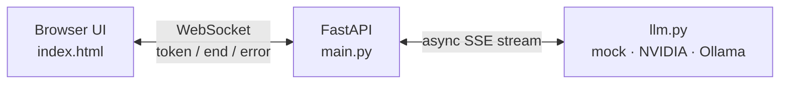

# 99: Project — Real-time streaming AI chat

> **Time:** ~3–4 hours · **Prerequisites:** Sections 00–04
> **Verified:** 2026-06-03 (FastAPI 0.136.1, httpx 0.28.1, websockets 16.0, Python 3.10.12). Backend logic verified in **mock mode** via `TestClient`; the browser UI is a manual check; the real NVIDIA/Ollama calls reuse the verified streaming code (only URL/headers/model differ).

## What you'll build

A complete chat app: a browser page where you type a message and the AI's reply **streams back token-by-token** with a live typing cursor, over a WebSocket. It remembers the conversation, lets you **stop** a reply mid-stream, and runs three ways:

- **mock** (default) — no API key, no internet; a canned reply streamed word-by-word so you can run it *right now*.
- **NVIDIA** — the free hosted API (`moonshotai/kimi-k2.6` etc.) with your API key.
- **Ollama** — a local model, no key.



The complete, runnable code lives next to this guide in **[`99_project_app/`](99_project_app/)** — [`main.py`](99_project_app/main.py), [`llm.py`](99_project_app/llm.py), [`index.html`](99_project_app/index.html), [`requirements.txt`](99_project_app/requirements.txt). This guide explains how it's built; you can read along with the files.

## Requirements → where each idea came from

| Feature | Concept | From |
|---|---|---|
| Async server that doesn't freeze while the LLM thinks | `async`/`await`, event loop | [01.01](01_async_python/01_why_async.md), [01.02](01_async_python/02_async_await.md) |
| Calling the LLM the async way, one shared client | `httpx.AsyncClient`, lifespan | [01.03](01_async_python/03_async_io_httpx.md), [02.03](02_fastapi_basics/03_calling_apis_async.md) |
| Serving the UI + WebSocket route | FastAPI app, `@app.get`, `@app.websocket` | [02.01](02_fastapi_basics/01_first_app.md), [03.01](03_websockets/01_websocket_basics.md) |
| Live two-way link to the browser | WebSocket lifecycle | [03.01](03_websockets/01_websocket_basics.md) |
| Streaming the LLM's reply | SSE + async generator | [04.01](04_streaming_ai/01_llm_streaming_sse.md) |
| Forwarding tokens to the browser | bridge SSE → WS | [04.02](04_streaming_ai/02_bridge_sse_to_ws.md) |
| Stop button mid-reply | concurrent send/receive | [03.03](03_websockets/03_concurrency_in_ws.md) |
| Conversation memory | per-connection state | this module |

Every feature is something you already learned — the project is the assembly.

## Build it in phases

### Phase 1 — the backend abstraction ([`llm.py`](99_project_app/llm.py))

Start with the piece that produces tokens, hiding *which* backend is used behind one async generator. The default `mock` backend means the app runs with zero setup.

```python
# llm.py (core)
BACKEND = os.environ.get("LLM_BACKEND", "mock").lower()

async def stream_reply(client, messages):
    """Yield the assistant's reply tokens for a conversation (OpenAI-style messages)."""
    if BACKEND == "mock":
        async for token in _mock_stream(messages):
            yield token
        return

    url, headers = _endpoint()                      # nvidia or ollama
    payload = {"model": MODEL, "messages": messages, "stream": True,
               "temperature": 0.2, "max_tokens": 1024}
    async with client.stream("POST", url, json=payload, headers=headers) as response:
        response.raise_for_status()
        async for line in response.aiter_lines():
            if not line.startswith("data: "):
                continue
            data = line[len("data: "):]
            if data == "[DONE]":
                break
            token = json.loads(data)["choices"][0]["delta"].get("content")
            if token:
                yield token
```

This is the **verified `stream_tokens` from [04.01](04_streaming_ai/01_llm_streaming_sse.md)**, plus a `mock` branch and backend selection. The `_mock_stream` helper just splits a canned sentence into words and `yield`s them 0.05s apart — same async-generator shape as the real thing, so the rest of the app can't tell the difference. See the full file for `_endpoint()` and `_mock_stream()`.

### Phase 2 — the server and the bridge ([`main.py`](99_project_app/main.py))

The app: a shared client in the **lifespan** ([02.03](02_fastapi_basics/03_calling_apis_async.md)), a route serving the HTML, and the WebSocket route that bridges tokens to the browser ([04.02](04_streaming_ai/02_bridge_sse_to_ws.md)).

```python
# main.py (essentials)
@asynccontextmanager
async def lifespan(app: FastAPI):
    app.state.client = httpx.AsyncClient(timeout=None)   # no read timeout: streams are long
    yield
    await app.state.client.aclose()

app = FastAPI(lifespan=lifespan)

@app.get("/")
async def index() -> HTMLResponse:
    return HTMLResponse(INDEX_HTML)                       # serve the chat page

@app.websocket("/ws/chat")
async def ws_chat(websocket: WebSocket) -> None:
    await websocket.accept()
    client = app.state.client
    history = [SYSTEM_PROMPT]                             # per-connection memory
    try:
        while True:
            prompt = await websocket.receive_text()
            if prompt == STOP_SIGNAL:
                continue
            history.append({"role": "user", "content": prompt})
            reply = await stream_one_reply(websocket, client, history)
            if reply:
                history.append({"role": "assistant", "content": reply})
    except WebSocketDisconnect:
        pass
```

Two design choices worth calling out:

- **Serving the HTML from FastAPI** (the `/` route) means the page and the WebSocket share an origin, so `ws://<same-host>/ws/chat` just works — no CORS hassle ([03.01](03_websockets/01_websocket_basics.md)).
- **`history` lives per connection** — it's a local variable in the handler, so each open socket has its own conversation. We append the user's message before streaming and the assistant's full reply after, so the model sees the whole context each turn.

### Phase 3 — the stop button (concurrent send/receive)

A reply can be long; users want to interrupt. As we saw in [04.02](04_streaming_ai/02_bridge_sse_to_ws.md), a plain stream loop can't hear the client mid-reply. The fix is the **concurrent pattern from [03.03](03_websockets/03_concurrency_in_ws.md)**: run the streaming and a stop-listener together, and cancel the loser.

```python
# main.py — stream one reply, interruptible
async def stream_one_reply(websocket, client, history) -> str:
    collected = []

    async def do_stream():
        async for token in llm.stream_reply(client, history):
            collected.append(token)
            await websocket.send_json({"type": "token", "content": token})

    async def listen_for_stop():
        while True:
            if await websocket.receive_text() == STOP_SIGNAL:
                return True

    stream_task = asyncio.create_task(do_stream())
    stop_task = asyncio.create_task(listen_for_stop())
    done, pending = await asyncio.wait(
        {stream_task, stop_task}, return_when=asyncio.FIRST_COMPLETED
    )
    for task in pending:
        task.cancel()                                   # whichever didn't finish

    for task in done:                                   # surface disconnect / errors
        exc = task.exception()
        if isinstance(exc, WebSocketDisconnect):
            raise exc
        if exc is not None:
            await websocket.send_json({"type": "error", "detail": str(exc)})
            return "".join(collected)

    stopped = stop_task in done and stop_task.result() is True
    await websocket.send_json({"type": "end", "stopped": stopped})
    return "".join(collected)
```

If the reply finishes first, the stop-listener is cancelled. If the user clicks **Stop** (the browser sends `"__stop__"`), the stream task is cancelled and we report `"end"` with `stopped: true`, returning whatever was collected so far. Note only `listen_for_stop` reads the socket during a reply, so we never have two concurrent receives ([03.03](03_websockets/03_concurrency_in_ws.md)'s rule).

### Phase 4 — the browser UI ([`index.html`](99_project_app/index.html))

A single HTML file: a message list, an input, Send and Stop buttons, and a `WebSocket`. The JavaScript mirrors the server protocol — on `token` it appends to the current bubble, on `end` it finalizes, on `error` it shows the message:

```javascript
// index.html (the core of the client logic)
const wsProto = location.protocol === "https:" ? "wss:" : "ws:";
const ws = new WebSocket(`${wsProto}//${location.host}/ws/chat`);

ws.onmessage = (event) => {
  const msg = JSON.parse(event.data);
  if (msg.type === "token") {
    if (!currentBot) currentBot = addBubble("bot streaming");
    currentBot.textContent += msg.content;        // grow the reply, token by token
  } else if (msg.type === "end") {
    currentBot?.classList.remove("streaming");     // stop the blinking cursor
    currentBot = null; setStreaming(false);
  } else if (msg.type === "error") {
    addBubble("bot").textContent = "⚠️ " + msg.detail;
  }
};

function send() {
  const text = input.value.trim();
  if (!text || streaming) return;
  addBubble("user").textContent = text;
  ws.send(text);                                   // send the prompt
  setStreaming(true);
}
stopBtn.onclick = () => { if (streaming) ws.send("__stop__"); };  // interrupt
```

The CSS gives a dark chat look with a blinking `▋` cursor on the streaming bubble. Building the URL from `location.host` means the same file works whether you run on `localhost:8000` or deploy it somewhere. (This UI is verified manually in a browser; the server protocol it relies on is verified below.)

## How to run it

```bash
cd 99_project_app
python3 -m venv .venv && source .venv/bin/activate
pip install -r requirements.txt

# 1) Mock — runs immediately, no key, no internet:
fastapi dev main.py
#   then open http://127.0.0.1:8000  and chat

# 2) NVIDIA (free hosted) — get a key at build.nvidia.com:
LLM_BACKEND=nvidia NVIDIA_API_KEY=nvapi-xxxxx fastapi dev main.py

# 3) Ollama (local) — install Ollama, then `ollama pull llama3.2`:
LLM_BACKEND=ollama LLM_MODEL=llama3.2 fastapi dev main.py
```

Open `http://127.0.0.1:8000`, type a message, and watch the reply stream in. Click **Stop** mid-reply to interrupt.

## Verified behavior (mock backend, via TestClient)

The backend was exercised end-to-end without a browser. Real, captured output:

```
GET / -> 200 text/html; charset=utf-8 len 4772
turn1: 37 tokens, stopped=False
turn1 reply starts: "You said: 'Hello there'. This is a mock "
turn2 stopped= False reply starts: "You said: 'And again'. This is"
stop test: received 0 tokens before end, stopped=True
ALL PROJECT TESTS DONE
```

What this confirms:

- **`/` serves the chat HTML** (status 200, `text/html`).
- **Turn 1** streamed 37 separate token messages, then a clean `end` with `stopped=False`, assembling the mock reply.
- **Turn 2** worked on the *same* connection — conversation memory persists.
- **Stop** worked: after sending `__stop__` the reply ended early with `stopped=True`. (How many tokens slip through before the stop lands depends on timing — here the stop beat the very first token, so 0; a slower model would show a partial reply.)

> The test harness used is the same `TestClient` WebSocket approach from Section 03 — see the project README for how to run it yourself.

## Extend it

Graded ideas, easiest first, and what each teaches:

1. **Show a token/sec counter.** *Easy.* Count tokens and time in the handler; send a final `{"type":"stats",...}`. (Reinforces the streaming loop.)
2. **"Clear conversation" button.** *Easy.* Add a control message `"__reset__"` that resets `history` to just the system prompt. (Per-connection state.)
3. **Stream the model's *thinking* separately.** *Medium.* For thinking models, also read `delta.get("reasoning_content")` and send it as `{"type":"thinking",...}`, shown greyed-out. (SSE detail from [04.01](04_streaming_ai/01_llm_streaming_sse.md).)
4. **Multi-room chat with broadcast.** *Medium.* Add the `ConnectionManager` from [03.02](03_websockets/02_connection_manager.md) so several users share a room and see each other's messages.
5. **Persist conversations.** *Harder.* Save history to SQLite (use an async driver, or `asyncio.to_thread` for a sync one — [01.03](01_async_python/03_async_io_httpx.md)) and reload by conversation id.
6. **Scale across workers with Redis.** *Hard.* Replace the in-memory room with Redis pub/sub so broadcasts reach clients on any worker (the scaling caveat from [03.02](03_websockets/02_connection_manager.md)).

## 🎉 You did it

You can now: write async Python, build FastAPI apps with validated input, call external APIs without blocking, hold live WebSocket connections, manage many clients, run send/receive concurrently, consume an LLM's SSE token stream, and bridge it all into a real-time AI chat — running on a mock, NVIDIA, or Ollama backend.

**Suggested next topics:** authentication (JWT/OAuth) for your API and WebSockets; deploying FastAPI (Uvicorn workers behind Nginx, or a container); background jobs with `BackgroundTasks`/`asyncio`; databases with async ORMs (SQLModel, SQLAlchemy async); rate limiting and observability; and the [official FastAPI docs](https://fastapi.tiangolo.com/) for everything in depth.

← Back to the [course index](README.md).
