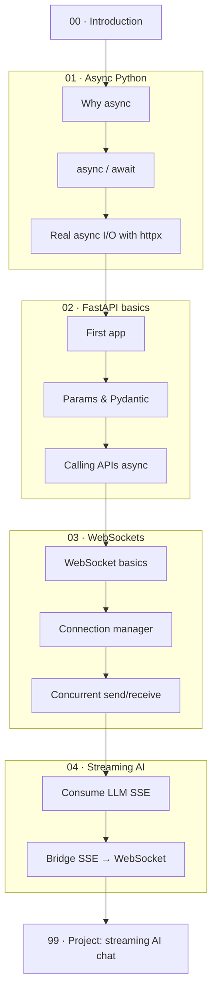

# FastAPI with Async & WebSockets — from zero to a streaming AI chat app

> **Verified:** 2026-06-03 against **FastAPI 0.136.1**, **Uvicorn 0.46.0**, **Starlette 1.0.0**, **httpx 0.28.1**, **Pydantic 2.12.3**, **websockets 16.0**, **Python 3.10.12**.
> All non-network code in this course was executed in that environment and the real output is shown. Code that calls the live NVIDIA API is marked **untested (needs API key)**; a fully-tested mock is always provided alongside it.

This is a hands-on course. You'll start by understanding what "async" actually *is* in Python, build real HTTP APIs with FastAPI, learn WebSockets for live two-way communication, and finish by building a **real-time AI chatbot** that streams an LLM's answer token-by-token over a WebSocket — using a free NVIDIA endpoint (or local Ollama), with a no-API-key mock so you can run it today.

## Who this is for

You're **comfortable with Python** (functions, classes, dicts, list comprehensions, `with` blocks) but **new to async and web development**. This course teaches async, FastAPI, and WebSockets from scratch. It does *not* re-explain core Python.

## Prerequisites

- Python **3.10+** installed (`python3 --version`).
- A terminal and a code editor.
- Basic command-line comfort (running a command, `cd`, environment variables).
- **No** prior web, async, or networking knowledge required.

You'll install everything else (FastAPI, Uvicorn, httpx, websockets) in Module 02.

## The learning path

| # | Section | Modules | You'll be able to… | Time |
|---|---------|---------|--------------------|------|
| 00 | [Introduction](00_introduction.md) | — | Explain what you're building and why async matters | ~20 min |
| 01 | [Async Python](01_async_python/README.md) | 3 | Read and write `async`/`await` code and run concurrent I/O | ~3–4 h |
| 02 | [FastAPI basics](02_fastapi_basics/README.md) | 3 | Build async HTTP APIs with validation, call other APIs | ~3–4 h |
| 03 | [WebSockets](03_websockets/README.md) | 3 | Build live two-way connections and manage many clients | ~3–4 h |
| 04 | [Streaming AI](04_streaming_ai/README.md) | 2 | Stream LLM tokens from an API and relay them over WS | ~2–3 h |
| 99 | [Project: streaming AI chat](99_project_streaming_chat.md) | — | Build the complete app end-to-end | ~3–4 h |
| 05 | [Production-grade FastAPI](05_fastapi_production/README.md) ⭐ | 6 | Structure, DI, config, errors, security, testing — industry best practices | ~6–8 h |

**Total:** ~21–26 hours. Each module ends with a recap, a self-check, and exercises with collapsible solutions.

### Two tracks

- **Build-the-AI-app track:** `00 → 01 → 02 → 03 → 04 → 99`. The cohesive path to the streaming chatbot.
- **FastAPI-craftsmanship track:** `00 → 01 → 02 → 05`. If your main goal is writing professional FastAPI APIs, Section **05** is the deep-dive on real-world structure, dependency injection, configuration, error handling, security, and testing. It only needs Sections 01–02, so you can take it right after the basics or after finishing the project.

## How to use this course

1. Go in order — each module assumes the previous ones.
2. **Type the code yourself** and run it. Don't just read.
3. Do the exercises before opening the solution.
4. Keep one terminal open for running the server and another for clients/`curl`.

→ Start here: **[00 · Introduction](00_introduction.md)**
