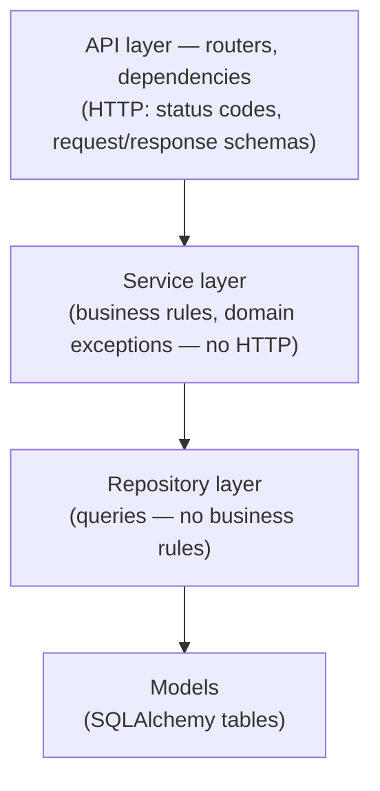

# 00 · Introduction

> **Level:** Beginner · **Prerequisites:** Python functions/classes, comfort with a terminal.
> **Time:** 20 min · **Verified:** 2026-08-07 (course conventions; the stack is verified per lesson)

A FastAPI "hello world" is 10 lines. The thing a company pays you to build — structured, database-backed, authenticated, cached, tested, containerized, observable — is a different discipline entirely. This course teaches that discipline from zero, and it is opinionated on purpose: everything in it is how production FastAPI services are built in 2026, and nothing in it is a deprecated pattern you'll have to unlearn.

---

## The contract: gates

Each section ends with two things:

- **Mini-project** — you *build* the section's concepts into a running app. Reading is not learning; typing is.
- **Test task (gate)** — a bug-hunt, security audit, refactor challenge, or extension with explicit pass criteria.

The gates are the course. A section's gate is calibrated to what interviews and code reviews actually probe: *can you find the seeded vulnerability, explain the flaky test, justify the layer boundary?* If you can't pass a gate, the next section will compound the gap — go back, don't push through.

---

## One app, grown across the course: linkbox

From Section 02 onward you build **linkbox**, a URL shortener, and never throw it away (Section 03 is the one side-quest — **dropdoc**, a small upload-and-parse service, because files deserve their own sandbox before touching your main app):

| Section | What happens |
|---------|--------------|
| 02 | linkbox born: validated endpoints, in-memory storage, settings, lifespan |
| 03 | side quest — **dropdoc**: forms, multipart uploads, image validation, PDF/DOCX text extraction |
| 04 | linkbox restructured: app factory, routers, storage behind a dependency |
| 05 | Persisted: PostgreSQL, SQLAlchemy 2.0 models, Alembic migrations |
| 06 | Layered: routers → services → repositories, domain exceptions |
| 07 | Secured: users, Argon2, JWT + refresh rotation, ownership, RBAC |
| 08 | Accelerated: Redis cache, rate limits, Arq background jobs |
| 09 | Proven: full pytest suite, rollback fixtures, ≥80% coverage |
| 10 | Hardened: problem-details errors, request-ID logging, OpenAPI polish |
| 11 | Shipped: Docker multi-stage, compose stack, GitHub Actions CI |

A URL shortener is deliberately mundane — the *engineering* is the star. You'll feel each addition as a refactor of real code, which is what the job is: nobody hands you a greenfield twice a year.

---

## The architecture you're heading toward

The single most important idea in this course is **separation into layers**, each with one job:

Why bother? Because each layer is **testable and swappable in isolation**: services unit-test without an HTTP client, the API contract can change without touching queries, and the same service that answers REST today can serve a background job tomorrow. Section 06 earns this properly — with equal attention to when a layer is ceremony you should *not* add.

---

## House rules (2026 standards)

These hold in every lesson, and violating them in your own code should now trigger an alarm:

| ✅ Use | ❌ Never (and why) |
|-------|-------------------|
| `lifespan=` context manager | `@app.on_event` — deprecated, unpaired setup/teardown |
| Pydantic v2: `ConfigDict`, `@field_validator`, `model_dump()` | v1 syntax (`class Config`, `@validator`) — silently misbehaves under v2 |
| SQLAlchemy 2.0: `Mapped[...]`, `mapped_column`, `select()` | `Column`, `declarative_base()`, `session.query()` — legacy API |
| `Annotated[X, Depends(...)]` aliases | repeating `= Depends(...)` defaults everywhere |
| **PyJWT** | `python-jose` — unmaintained |
| **pwdlib** (Argon2) | `passlib` — unmaintained |
| `redis.asyncio` (redis-py) | `aioredis` — dead, merged into redis-py |
| httpx `AsyncClient` + `ASGITransport` in tests | sync-only test flows for an async app |
| **uv** + **ruff** | pip freeze guesswork, four separate lint tools |

When you find a tutorial using the right-hand column, close the tab — that's a 2021 tutorial wearing a 2026 date.

---

## How to work

1. **Type the code.** Don't paste. The friction is the learning.
2. **Run everything.** Every lesson's snippets are meant to execute. When output surprises you, that's the lesson.
3. **Keep linkbox under git from Section 02.** Commit at every gate — you'll want the history when refactors go sideways.
4. **Do the exercises before opening the solutions.** They're collapsed for a reason.
5. **Budget honestly.** ~55 hours guided + 30–40 for the capstone. Two focused sections a week is a strong pace; job-ready in roughly two months.

---

## Where this ends

Section 99 is a **specification** for **DevBoard** — a multi-tenant project-management API with orgs, roles, invitations, tasks, comments, caching, rate limits, background digests, ≥85% test coverage, Docker, and CI. No walkthrough, no reference code: you build it from the spec in a fresh repo, the way you'd receive work from a tech lead. That repo — with its commit history, tests, and README — is the portfolio artifact this course exists to produce.

→ Start: **[Section 01 · Modern Python baseline](01_modern_python_async/README.md)**
