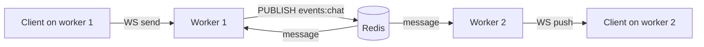

# 08-4 · Pub/sub & cross-worker real-time

> **Level:** Intermediate · **Prerequisites:** [08-3 · Background jobs with Arq](03_background_jobs_arq.md)
> **Time:** ~35–45 min · **Verified:** 2026-08-07 (redis-py asyncio · Redis 7)

## Why this matters

The moment you run more than one worker process — which is every real deployment — your in-process state stops being shared. A WebSocket message received by worker 1 can't reach a client connected to worker 3, because each process has its own memory. **Redis pub/sub** is the standard fix: workers publish events to a channel and every worker subscribed to it receives them, so a broadcast reaches *all* clients regardless of which process holds their connection. It's also how you fan out cache-invalidation signals, live dashboard updates, and "user X did Y" notifications across a fleet.

---

## Pub/sub vs the job queue you just built

You've now seen two Redis messaging patterns — don't confuse them:

| | **Pub/sub** (this lesson) | **Queue** (Arq, 08-3) |
|---|---|---|
| Delivery | to **every** current subscriber | to **one** worker |
| Persistence | **none** — miss it while offline, miss it forever | durable until a worker processes it |
| Reply | fire-and-forget | job runs to completion, retries |
| Use it for | "notify everyone *now*" — broadcasts, live updates | "this work must get done" — email, webhooks |

Rule of thumb: **notify many, right now → pub/sub. Get one job done reliably → queue.** If you need broadcast *and* durability (every subscriber, but replayable), that's **Redis Streams**, not pub/sub — noted at the end.

---

## The one client you already have

Pub/sub uses the same `RedisDep` client from 08-1 to **publish** — a publish is just a fire-and-forget command:

```python
# Publishing is a one-liner from any endpoint. Payload is a string —
# serialize structured data with Pydantic, exactly like cache values.
@router.post("/links", status_code=201)
async def create_link(payload: LinkCreate, redis: RedisDep, db: DbSession, user: CurrentUser):
    link = await link_service.create(db, payload, owner_id=user.id)
    await redis.publish("events:links", LinkEvent(action="created", slug=link.slug).model_dump_json())
    return link
```

`publish` returns the number of subscribers that received it (0 is normal and fine — no one is obligated to listen). The publisher never blocks and never knows who's on the other end. That decoupling is the whole point: you add or remove subscribers without touching this endpoint.

---

## Subscribing: a long-lived listener in lifespan

**Subscribing** is different from every command so far — it's not request-scoped. A subscriber holds a connection open and loops *forever*, waiting for messages. That belongs in a **lifespan-managed background task**, not an endpoint (an endpoint must return; a subscriber never does):

```python
import asyncio
from contextlib import asynccontextmanager
from redis.asyncio import Redis

async def _consume_events(redis: Redis) -> None:
    # A dedicated pubsub connection — you cannot run normal commands on it while subscribed.
    async with redis.pubsub() as pubsub:
        await pubsub.subscribe("events:links")
        async for message in pubsub.listen():          # loops until cancelled
            if message["type"] != "message":           # skip subscribe/unsubscribe acks
                continue
            event = LinkEvent.model_validate_json(message["data"])
            await _handle(event)                        # e.g. push to local WebSockets

@asynccontextmanager
async def lifespan(app):
    app.state.redis = Redis.from_url(settings.redis_url, decode_responses=True)
    # Start the listener as a background task; keep the handle so we can cancel it.
    task = asyncio.create_task(_consume_events(app.state.redis))
    yield
    task.cancel()                                       # stop listening on shutdown
    await app.state.redis.aclose()
```

Three things this gets right:

- **A separate pubsub connection.** A connection in subscribe mode can't run `GET`/`SET` — that's why `redis.pubsub()` gives you a dedicated one, leaving your `RedisDep` client free for normal work.
- **The listener is a task, not a request.** It's owned by the app's lifespan: started on boot, cancelled on shutdown. No endpoint waits on it.
- **`decode_responses=True`** (set back in 08-1) means `message["data"]` is already a `str` you can hand straight to `model_validate_json`.

---

## The payoff: cross-worker WebSocket broadcast

This closes the gap the WebSockets material flagged and left open: an **in-memory** connection manager only reaches clients on *its own* process. Put Redis in the middle and every worker's clients get every message:



The handler ties the two halves together — publish on receive, and let the subscriber fan out locally:

```python
# On a WS message: publish to Redis (reaches ALL workers), don't broadcast locally —
# the subscriber below will deliver it to this worker's clients too, avoiding double-send.
async def on_ws_message(text: str, redis: Redis) -> None:
    await redis.publish("events:chat", text)

async def _handle(event) -> None:        # called by _consume_events on every worker
    await manager.broadcast(event)        # manager = your in-process WebSocket registry
```

Now scaling from one worker to ten is a config change, not a rewrite — the fan-out layer is Redis, and each worker only owns the sockets it holds.

---

## The catch: pub/sub drops what you're not there for

Pub/sub is **at-most-once**. If a subscriber is down, restarting, or briefly disconnected when a message is published, it never sees it — there's no queue, no replay, no ack. That's fine for live chat and dashboards (a missed "user is typing" is harmless), and wrong for anything that must not be lost.

When you need broadcast *and* durability — every consumer, but replayable after a reconnect, with acknowledgements — reach for **Redis Streams** (`XADD`/`XREADGROUP`) or a real broker (Kafka, RabbitMQ). Don't build it here; just know the ceiling: *pub/sub trades delivery guarantees for simplicity and speed.*

---

## Recap & next

- ✅ Pub/sub broadcasts to **every** subscriber with **no persistence** — the opposite of a job queue's deliver-once-durably. Notify-many-now → pub/sub; get-one-job-done → Arq.
- ✅ **Publish** is a one-line fire-and-forget command on your existing `RedisDep` client; the return value is just the subscriber count.
- ✅ **Subscribe** holds a connection open forever, so it lives in a **lifespan background task** on a dedicated `redis.pubsub()` connection — cancelled on shutdown.
- ✅ It's the standard fix for **cross-worker** fan-out (WebSocket broadcast, live invalidation) that in-memory state can't do past one process.
- ✅ Pub/sub is **at-most-once** — for durable broadcast use Redis Streams or a broker.
- ✅ Self-check: you publish an event but a subscribing worker is mid-restart and misses it. Under pub/sub, is that message recoverable — and if the answer must be yes, what do you switch to?

→ Next: **[09 · Testing](../09_testing/README.md)**

## Exercises

1. Two terminals, one `redis-cli` each: `SUBSCRIBE events:links` in one, `PUBLISH events:links hello` in the other. Then publish *before* subscribing in a fresh terminal — what does the late subscriber receive, and why does that prove the "at-most-once" property?

<details>
<summary>Solution</summary>

The subscriber that was listening prints the `hello` message; `PUBLISH` also returns `(integer) 1` — one subscriber received it. The late subscriber that connected *after* the publish receives **nothing** for that message: pub/sub delivers only to subscribers present at publish time. There's no backlog to catch up on — which is exactly why anything that must survive a subscriber being offline needs Streams or a queue, not pub/sub.
</details>

2. Why must the subscriber run on a connection from `redis.pubsub()` rather than reusing the injected `RedisDep` client? What breaks if you try to `GET` a key on a connection that's in subscribe mode?

<details>
<summary>Solution</summary>

A Redis connection in subscribe mode only accepts subscribe/unsubscribe/ping commands — issuing a `GET` on it is an error. `redis.pubsub()` hands you a *separate* connection dedicated to the subscription, leaving the shared `RedisDep` client free for normal caching/rate-limit commands. Reusing one connection for both would either error or force you to serialize all Redis work behind the blocking listener loop — you want them independent.
</details>
