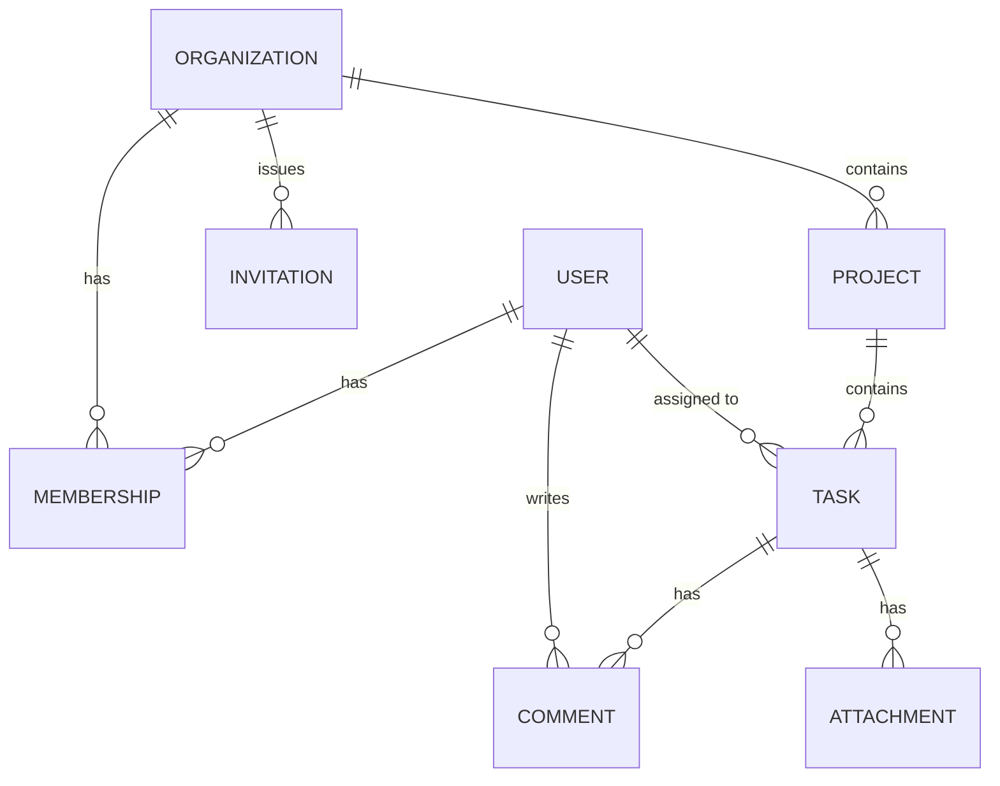

# 99 · Capstone: DevBoard — the portfolio project

> **Level:** Advanced · **Prerequisites:** [Section 11 · Production](11_production_docker_cicd/README.md) — all gates passed.
> **Time:** ~30–40 h · **Format:** specification only. No walkthrough, no reference code. You build it.

This is the artifact the course exists to produce. **DevBoard** is a multi-tenant project & task management API. You receive this document the way you'd receive work from a tech lead: a domain model, functional requirements, non-functional requirements, and acceptance criteria. Every technology in the course is *required*: FastAPI, PostgreSQL + Alembic, Redis, JWT auth with RBAC, Arq, and a comprehensive pytest suite. The rules of engagement:

- **Fresh repository.** Not a fork of linkbox. Patterns transfer; code is retyped.
- **Real commit history.** Small commits, imperative messages, one concern each. Reviewers read history.
- **Milestones in order.** Each has acceptance criteria; a milestone isn't done until every box checks.
- **When the spec is silent, you decide — and document it.** A `DECISIONS.md` with one paragraph per judgment call is worth more to interviewers than any single feature.

---

## The product

Teams ("organizations") manage projects and tasks. A user belongs to multiple orgs with a per-org role. Members create tasks in projects, assign them, discuss in comments. Admins invite new members by email. Every org is fully isolated from every other: **cross-tenant data leakage is an automatic capstone failure.**

---

## Domain model

| Entity | Fields (minimum) | Notes |
|--------|------------------|-------|
| `User` | id, email (unique), hashed_password, display_name, is_active, created_at | Argon2 via pwdlib |
| `Organization` | id, name, slug (unique), created_at | |
| `Membership` | user_id, org_id, role, joined_at | role ∈ {owner, admin, member}; unique (user_id, org_id) |
| `Invitation` | id, org_id, email, role, token_hash, expires_at, accepted_at | store the token **hashed**, never raw |
| `Project` | id, org_id, name, description, is_archived, created_at | |
| `Task` | id, project_id, title, description, status, priority, assignee_id?, due_date?, created_by, created_at, updated_at | status ∈ {todo, in_progress, done, cancelled} |
| `Comment` | id, task_id, author_id, body, created_at | |
| `Attachment` | id, task_id, uploader_id, original_name, stored_name (uuid), content_type, size_bytes, kind, extracted_text?, created_at | kind ∈ {image, document}; stored on disk under a uuid, never the client filename |

Plus whatever auth infrastructure you need server-side (refresh-token store or jti denylist — your Section 07/08 patterns).

---

## Functional requirements

### Auth (Section 07 patterns, all of them)
- Register, login (OAuth2 password form → access + refresh JWT), refresh **with rotation and reuse detection**, logout (server-side revocation via Redis).
- Access tokens ≤ 15 min; refresh ≤ 7 days. `alg` pinned, `exp`/`iat`/`jti` always set.
- Invitation acceptance: `POST /invitations/{token}/accept` — creates the membership (and the account, if the email is new).

### Organizations & membership
- Create org → creator becomes `owner`. Rename/delete: owner only. Delete cascades sanely (decide and document).
- Invite by email (admin+): creates `Invitation`, enqueues an Arq job that "sends" the email (structured log is fine; the job must be retried on failure and be idempotent).
- Change member role / remove member (admin+; nobody can demote or remove the last owner — enforce it in the service, test it).

### Projects & tasks
- Project CRUD within an org (create/update: member+; archive/delete: admin+). Archived projects reject new tasks.
- Task CRUD (member+), assignment (assignee must be an org member — validate it), status transitions: `done`/`cancelled` tasks are immutable except reopening (`→ todo`, admin+).
- Task list: filter by status/assignee/priority/due-before, sort by created/due/priority, **paginated envelope** (`items`, `total`, `limit`, `offset`) on every collection endpoint.

### Comments
- Create/list on a task (member+). Authors edit/delete their own; admins delete any.

### Attachments (Section 03 patterns, all of them)
- Upload to a task (member+): images (jpg/png/webp) and documents (pdf/docx). Size limit from settings → 413 past it, enforced while reading chunks (never trust `Content-Length`).
- Images: magic-byte check + Pillow **re-encode** (decompression-bomb limits set), thumbnail generated by an **Arq job**.
- Documents: text extracted (pypdf/python-docx) by an **Arq job** — never on the event loop; `extracted_text` queryable via `GET /tasks/{id}/attachments/{id}/text`.
- Download serves correct `Content-Type` + sanitized `Content-Disposition`; a fake "image/png" that isn't a decodable image → 415.
- Tenant isolation applies: attachments are reachable only through their org.

### RBAC matrix (enforce in services, prove in tests)

| Action | member | admin | owner |
|--------|:------:|:-----:|:-----:|
| Read org data / create & edit tasks / comment | ✅ | ✅ | ✅ |
| Create project | ✅ | ✅ | ✅ |
| Archive/delete project, invite, manage roles | — | ✅ | ✅ |
| Rename/delete org, transfer ownership | — | — | ✅ |

Ownership checks live in the **service layer** (never in routers, never client-supplied). A non-member gets **404, not 403**, for org resources — don't leak existence. Document this choice in `DECISIONS.md`.

---

## Non-functional requirements

| Area | Requirement |
|------|-------------|
| Architecture | Routers → services → repositories. Services: zero `fastapi` imports. One commit point (session dependency). |
| Errors | RFC 9457 problem+json for **every** failure path; validation errors reshaped to match; 500s never leak internals. |
| Caching | Redis cache-aside on task lists and org membership lookups, **invalidated on every relevant write**. TTL from settings. |
| Rate limiting | Login: 5/min per IP. Writes: 60/min per user. 429 + `Retry-After`. |
| Background jobs | Arq worker: invitation email job (retries, idempotent) + a daily digest cron ("N tasks due tomorrow" per user, logged). |
| Observability | structlog JSON logs; every request log line carries `request_id` (and `user_id` when authed). |
| Migrations | Alembic only — no `create_all` outside tests. ≥3 revisions, at least one hand-written with a data-migration step, all downgrades work. |
| Docs | OpenAPI: tags, summaries, examples, documented error responses; auth flows usable from `/docs`. |
| Config | pydantic-settings; `.env.example` committed; secrets never in the image or repo. |

---

## Testing requirements (the bar is high on purpose)

- **≥85% line coverage**, enforced in CI (`--cov-fail-under=85`). Coverage is the floor, not the goal — the scenarios below are the goal.
- Per-test **transaction rollback** fixtures against real PostgreSQL (Section 09 pattern). fakeredis for Redis paths. Suite green under `pytest-randomly`.
- Must-have scenarios (non-exhaustive):
  - Full auth loop: register → login → me → refresh → old refresh token rejected (rotation) → logout → access token revoked.
  - **Tenant isolation:** user in org A requests org B's project → 404. This test is sacred.
  - RBAC: each row of the matrix has at least one allow and one deny test.
  - Last-owner protection: demoting/removing the sole owner → 409/422 with a problem body.
  - Immutable done-task rule; archived-project rejects task creation.
  - Cache invalidation: update task → list reflects it immediately (no stale read).
  - Rate limit: 6th login attempt in a minute → 429 with `Retry-After`.
  - Invitation job enqueued on invite; job function unit-tested directly, idempotency proven (run twice, one membership).
  - Upload hardening: path-traversal filename rejected; polyglot file (HTML uploaded as image/png) → 415; oversized upload → 413.
  - Extraction job: text extracted for a real small PDF fixture; job idempotent (run twice, one result).

---

## Delivery

- **Docker:** multi-stage uv build, non-root; `docker compose up` from a clean clone yields a working stack (api + worker + postgres + redis + one-shot migrate). `/healthz` + `/readyz`.
- **CI (GitHub Actions):** lint (ruff) → typecheck (mypy) → test (Postgres/Redis services, migrations applied, coverage gate) → image build. Green on main.
- **README:** what it is, architecture sketch, run/test instructions that *work*, and honest "what I'd do next".
- `DECISIONS.md` as described above.

---

## Milestones

| # | Milestone | Acceptance criteria (all required) |
|---|-----------|-----------------------------------|
| M0 | Skeleton | Factory app, settings, healthz, Docker + compose (api+db+redis), CI running lint+placeholder test — **ship the pipeline first** |
| M1 | Auth | Register/login/refresh-rotation/logout with Redis revocation; auth test loop green |
| M2 | Orgs & membership | Org CRUD, roles, invitations (+ Arq email job), last-owner rule; RBAC + isolation tests green |
| M3 | Projects & tasks | Full CRUD, transitions, assignment validation, filtered/paginated lists; migrations ≥3 |
| M4 | Comments, attachments + hardening | Comments; validated uploads with thumbnail + text-extraction Arq jobs; problem+json everywhere; request-ID logging; rate limits |
| M5 | Performance layer | Caching with proven invalidation; daily digest cron |
| M6 | Ship | Coverage ≥85% in CI; compose stack verified from clean clone; README + DECISIONS complete |

---

## Grading rubric (self-assess, honestly)

| Dimension | Job-ready looks like |
|-----------|---------------------|
| Architecture | Layers hold under pressure; no HTTP in services; adding "labels on tasks" would touch predictable files |
| Correctness | Business rules enforced server-side, atomically; no half-written state on failure |
| Security | All Section 07 controls present; tenant isolation airtight; nothing sensitive in logs, images, or history |
| Tests | Fast, isolated, order-independent; failures point at causes; scenarios above all present |
| Operations | Clean clone → running stack in one command; CI trustworthy; logs debuggable at 3am |

**Stretch goals** (each one is an interview story): WebSocket activity feed per project · keyset pagination on task lists · OpenTelemetry tracing · attachment storage on an S3-compatible object store with presigned download URLs · OCR for scanned PDFs (pytesseract) · optimistic locking on task updates (`version` column, 409 on conflict).

---

*Done? Put the repo link at the top of your CV. You didn't follow a tutorial — you shipped a spec. That's the job.*
