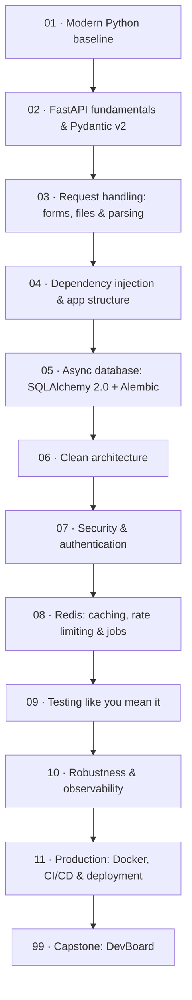

# 🎓 FastAPI Complete — beginner to job-ready backend engineer

> **What this is:** the full path from "I know some Python" to **shipping a production-grade FastAPI backend** — async fundamentals, **Pydantic v2**, forms & **validated file/image uploads**, document parsing (**Pillow**, **pypdf**), dependency injection, **async SQLAlchemy 2.0 + Alembic** on PostgreSQL, clean architecture (routers → services → repositories), **JWT/OAuth2 auth with RBAC**, **Redis** caching/rate-limiting/sessions, **Arq** background jobs, a rigorous **pytest** suite with transaction-rollback fixtures, structured logging, problem-details errors, **Docker Compose**, and **GitHub Actions CI**. It ends with a portfolio-grade capstone you build solo.

> **Written:** 2026-08-07 · Targets Python 3.12+ · FastAPI 0.116 · Pydantic 2.x · SQLAlchemy 2.0 · Alembic · PostgreSQL 16 · PyJWT · pwdlib (Argon2) · redis-py (asyncio) · Arq · pytest/pytest-asyncio/httpx · uv + ruff · Docker · GitHub Actions. **No deprecated patterns**: no `@app.on_event`, no Pydantic v1 syntax, no `passlib`/`python-jose`, no legacy `Query`/`Column` SQLAlchemy.

## How this course works (read this)

Three rules make this course different from tutorial-hopping:

1. **One app, grown section by section.** You build **linkbox** (a URL shortener) in Section 02 and *keep upgrading the same codebase* through Section 11 — database, layers, auth, Redis, tests, Docker, CI. You experience refactoring, not just greenfield typing.
2. **Every section ends with a gate.** Each section has a **mini-project** (build it) and a **test task** (a bug-hunt, audit, or extension with explicit pass criteria). Do not advance until you pass the gate — the next section assumes you did.
3. **The capstone is yours alone.** Section 99 is a *specification*, not a walkthrough. You build **DevBoard** from scratch in a fresh repo. That repo is your portfolio piece.

## Who this is for

You can write Python functions, classes, and use a terminal. **No prior FastAPI, SQL, Docker, or async experience required** — Section 01 builds the modern-Python baseline first. If you're already comfortable with FastAPI basics, skim Sections 01–02 and take their gates to confirm.

## What you'll be able to do

- Explain and *use* async correctly — and know when `def` beats `async def`.
- Handle every request shape — headers, cookies, forms, **multipart file uploads** — and validate images (magic bytes, Pillow re-encoding) and parse documents (**pypdf**, **python-docx**) without freezing the event loop.
- Model data with typed **async SQLAlchemy 2.0**, evolve schemas safely with **Alembic**.
- Structure a service in **layers** whose business logic is testable without HTTP.
- Build **JWT/OAuth2** auth with refresh rotation, revocation, and **RBAC** — and name the attack each control stops.
- Use **Redis** for distributed caching (with correct invalidation), rate limiting, sessions, and **Arq** job queues.
- Write a test suite that runs in seconds: httpx ASGI transport, per-test **transaction rollback**, fakes over mocks.
- Ship it: structured JSON logs with request IDs, RFC 9457 error responses, multi-stage Docker builds, compose stacks, and a CI pipeline that gates merges.

## The stack (and why)

| Concern | We use | Why |
|---------|--------|-----|
| Language/tooling | **Python 3.12+ · uv · ruff** | fast, reproducible envs; one linter/formatter |
| Framework | **FastAPI** | async, typed, OpenAPI from type hints |
| Validation/config | **Pydantic v2 · pydantic-settings** | one modeling language for API + config |
| Uploads & parsing | **python-multipart · Pillow · pypdf · python-docx** | safe multipart uploads; image re-encoding; text out of PDFs/DOCX |
| ORM | **SQLAlchemy 2.0 (async)** | the industry standard; typed `Mapped[...]` |
| Migrations | **Alembic** | schema changes as reviewed, versioned code |
| Database | **PostgreSQL 16** | what jobs run; tests run against it too |
| Auth | **PyJWT · pwdlib (Argon2)** | maintained libs; `python-jose`/`passlib` are not |
| Cache/limits/jobs | **redis-py (asyncio) · Arq** | shared state across replicas; async-native queue |
| Logging | **structlog** | JSON logs with request-scoped context |
| Testing | **pytest · pytest-asyncio · httpx** | async tests through ASGI, no server needed |
| Ship | **Docker · docker compose · GitHub Actions** | same artifact everywhere; merges gated by CI |

## Prerequisites (machine setup)

```bash
# uv — installs Python too
curl -LsSf https://astral.sh/uv/install.sh | sh
# Docker — for PostgreSQL, Redis, and shipping
docker run --rm hello-world
```

## Learning path



## Course map

| # | Section | Lessons | You'll be able to… | Time |
|---|---------|---------|--------------------|------|
| 01 | [Modern Python baseline](01_modern_python_async/) | 3 | uv/ruff tooling, load-bearing type hints, async/await mechanics | ~4 h |
| 02 | [FastAPI fundamentals & Pydantic v2](02_fastapi_fundamentals_pydantic/) | 3 | Routes, params, Pydantic v2 validation, settings, lifespan | ~5 h |
| 03 | [Request handling: forms, files & parsing](03_request_handling_files_parsing/) | 4 | Headers/cookies, multipart uploads, image validation (Pillow), PDF/DOCX text extraction | ~5 h |
| 04 | [Dependency injection & app structure](04_dependency_injection_app_structure/) | 3 | `Depends` deep-dive, yield deps, app factory, routers | ~4 h |
| 05 | [Async database: SQLAlchemy 2.0 + Alembic](05_async_database_sqlalchemy_alembic/) | 4 | Typed models, async sessions, 2.0 queries, migrations | ~6 h |
| 06 | [Clean architecture](06_clean_architecture/) | 2 | Routers → services → repositories, transaction ownership | ~4 h |
| 07 | [Security & authentication](07_security_auth/) | 4 | Argon2, JWT/OAuth2, refresh rotation, RBAC, sessions & hardening | ~6 h |
| 08 | [Redis: caching, rate limiting & jobs](08_redis_caching_jobs/) | 4 | Cache-aside + invalidation, rate limits, sessions, Arq workers, pub/sub | ~5 h |
| 09 | [Testing like you mean it](09_testing/) | 3 | Async fixtures, transaction rollback, fakes/mocks, coverage | ~5 h |
| 10 | [Robustness & observability](10_robustness_observability/) | 3 | RFC 9457 errors, middleware, structlog, OpenAPI polish | ~5 h |
| 11 | [Production: Docker, CI/CD & deployment](11_production_docker_cicd/) | 4 | Multi-stage builds, compose stacks, GitHub Actions pipeline, Gunicorn + Nginx | ~6 h |
| 99 | [Capstone: DevBoard](99_capstone_devboard.md) | spec | The portfolio project — built solo from a spec | ~30–40 h |

**Total:** ~55 h of guided work + the capstone. Every section gates the next — budget time for the test tasks; they *are* the course.

## Related guides in this repo

- **[Production FastAPI Backend](../fastapi_production_backend/)** — a faster-paced tour of the same territory for people who already know FastAPI basics; includes the complete TaskFlow reference app.
- **[FastAPI · Async · WebSockets](../fastapi_async_websockets/)** — async internals, WebSockets, streaming. Natural follow-up.
- **[Docker](../docker/)** · **[Kubernetes](../kubernetes/)** · **[CI/CD with GitHub Actions](../cicd_github_actions/)** — take Section 11 further.

→ Start here: **[00 · Introduction](00_introduction.md)**
