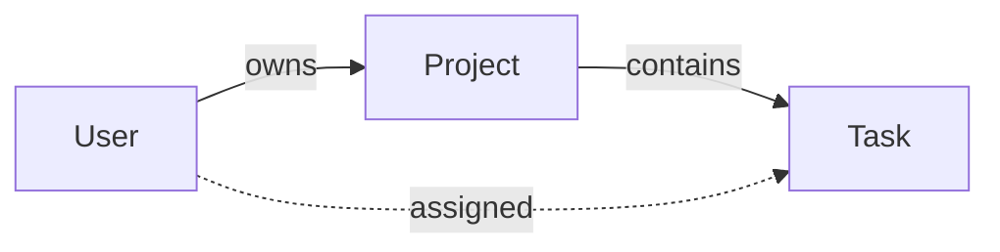
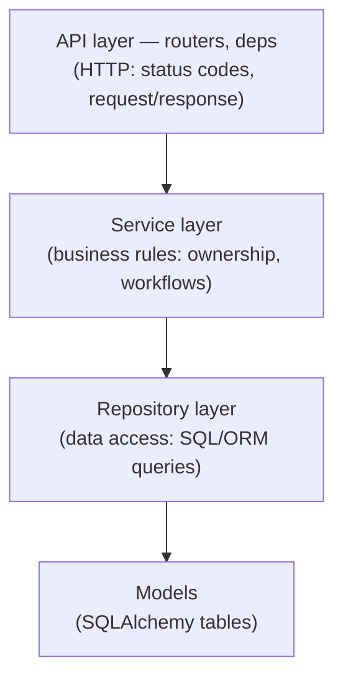

# 00 · Introduction

> **Level:** Intermediate · **Prerequisites:** Python; basic FastAPI (routes, Pydantic, `async def`).
> **Time:** 20 min · **Verified:** 2026-07-27 (concepts; the app is verified across the course)

A FastAPI "hello world" is 10 lines. A FastAPI *service you'd put in production* is a different thing entirely — it has structure, a database, migrations, authentication, tests, caching, observability, and a deploy story. This course builds that, end to end, as one real application you can run, test, and ship.

---

## Why this matters

Most tutorials stop at "here's a route that returns JSON." Real backend jobs start where those stop: *How do you organize 50 endpoints? Where does business logic live? How do you not leak your password hashes? How do you evolve the database without downtime? How do you know it works? How do you deploy it?* This course answers all of that by building one service properly — the difference between "I've used FastAPI" and "I can ship a FastAPI service."

---

## What we build: TaskFlow

A **task & project management API** — users own projects, projects contain tasks. It's deliberately mundane in domain so the *engineering* is the star: it exercises auth, relationships, ownership rules, pagination, filtering, background work, and caching without you fighting business complexity.



By the end you'll have a service with:
- **Register / login / refresh** (JWT), protected routes, roles, per-owner isolation.
- **CRUD** for projects and tasks with pagination and status filtering.
- **Migrations** (Alembic), **tests** (13 passing), **caching & rate limiting** (Redis), **background jobs** (arq).
- **Structured logs, metrics, health probes**, and a **Docker Compose** stack (API + Postgres + Redis + worker).

---

## The architecture: layers

The single most important idea in the course is **separation into layers**, each with one job:



- **API** knows HTTP (and nothing about SQL).
- **Services** know business rules (and nothing about HTTP).
- **Repositories** know the database (and nothing about business rules).
- **Schemas** (Pydantic) are the contract at the edges; **models** (SQLAlchemy) are the database.

> **Analogy — a restaurant.** The **waiter** (API) takes orders and returns plates but doesn't cook. The **chef** (service) decides how the dish is made. The **pantry** (repository) fetches ingredients. Keeping these separate is why a busy kitchen doesn't collapse — and why you can change the menu (API) without re-plumbing the pantry (database).

Why bother? Because each layer is **testable and swappable in isolation**: you can unit-test a service without HTTP, swap SQLite for Postgres without touching business logic, and change an endpoint without risking your data access.

---

## The file structure (a tour)

You'll build exactly this — "all the file structure" a real service has:

```
app/
├── main.py            # app factory: config, middleware, routers, handlers
├── core/              # config (settings), security (hashing/JWT), logging, exceptions
├── db/                # engine, session, declarative base
├── models/            # SQLAlchemy tables: user, project, task
├── schemas/           # Pydantic request/response models + pagination
├── repositories/      # data access (one per aggregate)
├── services/          # business logic (auth, project, task)
├── api/               # deps + versioned routers (api/v1/…)
├── integrations/      # Redis cache, rate limit, arq jobs
└── observability/     # logging middleware, Prometheus metrics
migrations/            # Alembic
tests/                 # pytest + httpx + test DB
Dockerfile · docker-compose.yml · alembic.ini · requirements.txt
```

Each section of the course builds a slice of this and explains *why it lives where it does*.

---

## How to follow along

The finished app is in **[`99_project_taskflow/`](99_project_taskflow/)**. Two ways to use the course:

1. **Read + run:** open the capstone, `pip install -r requirements.txt`, `pytest -q`, `uvicorn app.main:app --reload`, and explore `/docs`. Each lesson points at the file it's teaching.
2. **Build-along:** start empty and create each file as its section introduces it.

Everything runs **offline on SQLite**; Postgres and Redis come in via Docker when you want the real thing.

---

## Recap & next

- ✅ We build **TaskFlow**, a real task/project API, to learn how to *structure and ship* a FastAPI backend.
- ✅ The backbone is **layered architecture**: API → services → repositories → models, with Pydantic schemas at the edges.
- ✅ It includes DB + migrations, auth, tests, caching, jobs, observability, and Docker — the full production picture.
- ✅ Self-check: in the restaurant analogy, which layer decides *whether a user is allowed to delete a project* — the waiter, the chef, or the pantry?

→ Next: **[01 · Foundations & structure](01_foundations_and_structure/README.md)**
