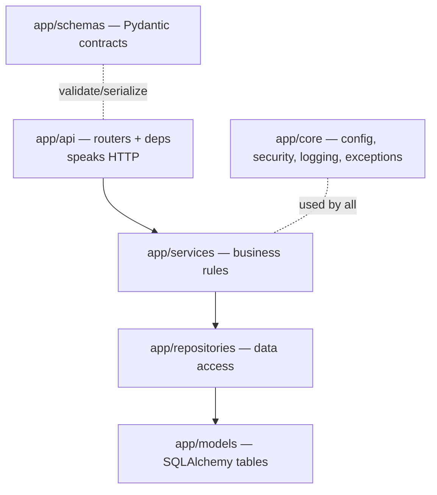

# 01-1 · Project layout

> **Level:** Intermediate · **Prerequisites:** [00 · Introduction](../00_introduction.md)
> **Time:** 30 min · **Verified:** 2026-07-27 (structure of the verified TaskFlow app)

## Why this matters

The single most common way FastAPI projects rot is "everything in `main.py`": routes, SQL, business logic, and config in one 2,000-line file. It works for a demo and collapses for a product. A **layered layout** — each concern in its own place — is what keeps a service testable and changeable as it grows. This is the structure you'll build.

---

## The layers



| Directory | Responsibility | Knows about | Must NOT know about |
|-----------|----------------|-------------|---------------------|
| `api/` | HTTP: routes, status codes, deps | services, schemas | SQL |
| `services/` | business rules (ownership, workflows) | repositories, models | HTTP / FastAPI |
| `repositories/` | data access (queries) | models, the session | business rules |
| `models/` | database tables | SQLAlchemy | anything above |
| `schemas/` | request/response shapes | Pydantic | the ORM internals |
| `core/` | config, security, logging, exceptions | — | domain specifics |

The golden rule: **dependencies point downward only.** A router calls a service; a service calls a repository; nothing calls back up. That one constraint is what makes each layer independently testable.

---

## The full tree

```
99_project_taskflow/
├── app/
│   ├── main.py                 # the app factory (01-3)
│   ├── core/
│   │   ├── config.py           # settings (01-2)
│   │   ├── security.py         # hashing + JWT (Section 04)
│   │   ├── logging.py          # structured logs (Section 08)
│   │   └── exceptions.py       # domain errors + handlers (Section 05)
│   ├── db/
│   │   ├── base.py             # DeclarativeBase + mixins
│   │   └── session.py          # async engine + get_db
│   ├── models/                 # user.py, project.py, task.py, enums.py
│   ├── schemas/                # user.py, project.py, task.py, token.py, common.py
│   ├── repositories/           # base.py, user.py, project.py, task.py
│   ├── services/               # auth.py, project.py, task.py
│   ├── api/
│   │   ├── deps.py             # shared dependencies
│   │   └── v1/                 # auth.py, projects.py, tasks.py, health.py, router.py
│   ├── integrations/           # cache.py, ratelimit.py, tasks.py (arq)
│   └── observability/          # middleware.py, metrics.py
├── migrations/                 # Alembic
├── tests/                      # pytest + httpx
├── alembic.ini · requirements.txt · Dockerfile · docker-compose.yml
```

> **Tip — "screaming architecture."** You can tell what this app *does* from its folders: users, projects, tasks. The framework (FastAPI) is a detail tucked inside `api/` and `main.py`. Aim for structure that shouts the domain, not the framework.

---

## Why not a "flat" or "by-type-only" layout?

Two common alternatives and why layers win:

- **Everything in `main.py`:** fast to start, impossible to test in isolation, merge-conflict magnet. Fine for a script, not a service.
- **Only "by type" (all routes together, all models together) with no service/repository split:** better, but business logic ends up *inside route functions* — untestable without HTTP, and duplicated across endpoints. The service/repository split is what fixes that.

Our layout is "by type" **plus** the service/repository seam — the combination that scales.

---

## An import-order sanity rule

Because dependencies point downward, imports do too:

```python
# ✅ allowed
# api/v1/projects.py      imports  services/project.py
# services/project.py     imports  repositories/project.py, models/project.py
# repositories/project.py imports  models/project.py

# ❌ a smell — a lower layer importing an upper one
# repositories/project.py imports  api/... or services/...
```

If you ever find a repository importing from `api/`, a layer boundary has leaked — stop and move the logic.

---

## Recap & next

- ✅ Layer the app: **api → services → repositories → models**, with **schemas** at the edges and **core** shared.
- ✅ Dependencies point **downward only** — that's what makes layers testable and swappable.
- ✅ The structure should *scream the domain* (users/projects/tasks), not the framework.
- ✅ Self-check: a new rule says "only a project's owner can add tasks." Which layer enforces it?

→ Next: **[01-2 · Config & settings](02_config_and_settings.md)**

## Exercises

1. For each of these, name the layer it belongs in: (a) `SELECT * FROM tasks WHERE project_id=?`, (b) "reject if the caller isn't the owner", (c) "return 404 as JSON", (d) `hashed_password: Mapped[str]`.

<details>
<summary>Solution</summary>

(a) repository, (b) service, (c) api (via an exception handler), (d) model. If you put (b) in the router or (a) in the service, you've crossed a boundary — the tell-tale sign of a layout drifting back toward one big file.
</details>
