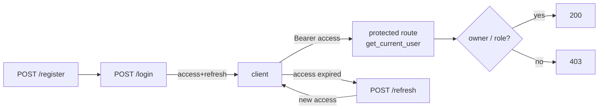

# 04-3 · OAuth2, current user & roles

> **Level:** Intermediate · **Prerequisites:** [04-2 · JWT tokens](02_jwt_tokens.md)
> **Time:** 40 min · **Verified:** 2026-07-27 (fastapi 0.140.8; from the TaskFlow test suite)

## Why this matters

Two tokens are useless until routes actually *require* them. This lesson closes the loop: the **OAuth2 login** endpoint, a **`get_current_user`** dependency that turns a token into a user (protecting any route it's added to), and **authorization** — roles and ownership — which is a different question from authentication.

> **Authentication** = *who are you?* (the token). **Authorization** = *are you allowed to do this?* (roles/ownership). You need both.

---

## The OAuth2 login endpoint

FastAPI's `OAuth2PasswordRequestForm` gives you the standard token endpoint (and makes `/docs` "Authorize" work):

```python
# app/api/v1/auth.py
@router.post("/login", response_model=TokenPair)
async def login(form: Annotated[OAuth2PasswordRequestForm, Depends()], db: DbSession):
    service = AuthService(db)
    user = await service.authenticate(form.username, form.password)   # username == email
    return service.issue_tokens(user)
```

The client POSTs form fields `username` + `password`; on success it gets the access+refresh pair.

---

## `get_current_user` — the gate

This dependency extracts the bearer token, validates it, and loads the user. Add it to any route and that route is now protected:

```python
# app/api/deps.py
oauth2_scheme = OAuth2PasswordBearer(tokenUrl="/api/v1/auth/login")

async def get_current_user(token: Annotated[str, Depends(oauth2_scheme)], db: DbSession) -> User:
    try:
        payload = security.decode_token(token)
    except jwt.PyJWTError:
        raise AuthError("Could not validate credentials.")
    if payload.get("type") != "access":                 # refresh tokens can't access routes
        raise AuthError("Not an access token.")
    user = await UserRepository(db).get(int(payload["sub"]))
    if user is None or not user.is_active:
        raise AuthError("User not found or inactive.")
    return user

CurrentUser = Annotated[User, Depends(get_current_user)]
```

Now protecting an endpoint is just declaring the dependency:

```python
@router.get("/me", response_model=UserRead)
async def me(user: CurrentUser):        # ← unauthenticated requests get 401 automatically
    return user
```

**Output (real run, from the test suite):**
```
GET /api/v1/auth/me           without a token  ->  401
GET /api/v1/auth/me           with a token     ->  200  {"email": "..."}
```

`OAuth2PasswordBearer` also powers the **Authorize** button in `/docs`, so you can log in and try protected routes interactively.

---

## Authorization: roles & ownership

A valid token says *who* you are; it doesn't say what you may do. Two mechanisms:

**Roles** — a dependency that requires admin:

```python
async def require_admin(user: CurrentUser) -> User:
    if user.role != Role.admin:
        raise PermissionDeniedError("Admin privileges required.")
    return user
# use on a route: dependencies=[Depends(require_admin)]
```

**Ownership** — enforced in the service (from [03-2](../03_schemas_and_crud/02_repository_service_pattern.md)): a user may only touch *their own* projects (admins may touch any). The test suite proves the isolation:

**Output (real run, user B trying user A's project):**
```
GET /api/v1/projects/{A's id}   as B  ->  403
GET /api/v1/projects            as B  ->  total: 0     (B sees none of A's)
```

Ownership lives in the **service**, not the route, because it's a business rule and it's reused across get/update/delete/tasks. Roles are a **dependency** because they're a cross-cutting gate. Different tools for different authorization shapes.

> **Tip — 401 vs 403.** `401 Unauthorized` = "I don't know who you are" (missing/invalid token). `403 Forbidden` = "I know who you are, and you're not allowed." Returning the right one is both correct and a debugging kindness.

---

## The full flow



---

## Recap & next

- ✅ `OAuth2PasswordRequestForm` gives the standard login; `OAuth2PasswordBearer` extracts the token and powers `/docs` auth.
- ✅ `get_current_user` validates the access token and loads the user — add it to protect any route (auto **401**).
- ✅ **Authorization ≠ authentication:** roles via a dependency, ownership in the service; return **403** (not 401) when known-but-forbidden.
- ✅ Self-check: a logged-in non-admin tries to delete someone else's project — which status code, and which layer decides?

→ Next: **[05 · API design & robustness](../05_api_design_and_robustness/README.md)**

## Exercises

1. Add an admin-only `GET /api/v1/admin/users` that lists all users, guarded by `Depends(require_admin)`. Verify a member gets 403 and an admin gets 200.

<details>
<summary>Solution</summary>

A router with `dependencies=[Depends(require_admin)]` (or on the route) calling a `UserRepository.list`. A member's token → `require_admin` raises `PermissionDeniedError` → 403; an admin's → 200. (Promote a user to admin directly in the DB or via a seeded admin to test.)
</details>
