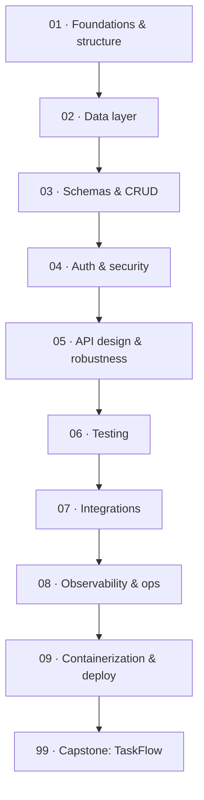

# 🏭 Production FastAPI Backend — build a real service, the right way

> **What you build:** **TaskFlow**, a complete task/project-management REST API — layered architecture, async **SQLAlchemy 2.0 + Alembic** on Postgres, **JWT/OAuth2** auth with roles, pagination & filtering, consistent error handling, a full **pytest** suite, **Redis** caching + rate limiting, **arq** background jobs, structured logging + Prometheus metrics + health probes, and a **Docker Compose** stack. This is the "how do you actually structure and ship a backend" course.

> **Verified:** 2026-07-27 · Python 3.10 · **fastapi 0.140.8** · **SQLAlchemy 2.0.51** · **alembic 1.18.5** · **pydantic 2.13.4** / pydantic-settings 2.14.2 · **PyJWT 2.13.0** · pwdlib 0.3.0 (bcrypt) · asyncpg 0.31.0 · redis 5.3.1 · arq 0.28.0. The whole TaskFlow app was actually run: **13 tests pass**, Alembic autogenerates + applies migrations, the Docker image **builds and runs** (migrates on boot, health checks green), and Redis caching/rate-limiting is verified against a real Redis. Runs offline on SQLite; Postgres/Redis via Docker.

This course is the counterpart to the **[FastAPI · Async · WebSockets](../fastapi_async_websockets/)** course. That one teaches async, WebSockets, streaming AI, and Redis/OpenTofu scaling. **This one** teaches the thing every backend job actually needs: a well-structured, database-backed, authenticated, tested, deployable service. We don't re-explain async — we *use* it to build something real.

## Who this is for

You know Python and the basics of FastAPI (routes, Pydantic, `async def`) — or you've done **[FastAPI Fundamentals](../fastapi_fundamentals/)** (the 0→1 starting point) or the [async/WebSockets course](../fastapi_async_websockets/). You want to learn how professionals **structure** a FastAPI project and wire in the integrations a production service needs. No prior database, auth, or DevOps background required — all built from scratch.

## What you'll be able to do

- Lay out a FastAPI project in **layers** (API → services → repositories → models) that scales and tests cleanly.
- Model data with **async SQLAlchemy 2.0** and evolve the schema with **Alembic** migrations.
- Build validated CRUD with **Pydantic v2** schemas, pagination, and filtering.
- Implement **JWT/OAuth2** auth: password hashing, access/refresh tokens, current-user dependency, roles, ownership.
- Design robust APIs: versioned routers, consistent error handling, middleware, CORS.
- **Test** it properly: pytest + httpx + an isolated test database.
- Add production integrations: **Redis** caching & rate limiting, **arq** background jobs.
- Operate it: structured logging, **Prometheus metrics**, health/readiness probes.
- Ship it: multi-stage **Dockerfile**, **docker-compose** (API + Postgres + Redis + worker), migrations on deploy.

## The stack we use (and why)

| Concern | We use | Why |
|---------|--------|-----|
| Framework | **FastAPI** | async, typed, OpenAPI out of the box |
| ORM | **SQLAlchemy 2.0 (async)** | the standard; typed `Mapped[...]` models |
| Migrations | **Alembic** | version-controlled schema changes |
| DB | **Postgres** (prod) / **SQLite** (local, tests) | real DB; zero-setup offline |
| Validation/settings | **Pydantic v2** / pydantic-settings | one model for API + config |
| Auth | **PyJWT** + **pwdlib (bcrypt)** | standard JWT; modern password hashing |
| Cache/limits/jobs | **Redis** + **arq** | shared cache, rate limits, async jobs |
| Observability | **stdlib logging (JSON)** + **prometheus-client** | structured logs + scrapable metrics |
| Packaging | **Docker** + **docker-compose** | reproducible, deployable |

> **Why SQLite *and* Postgres?** So every lesson and the whole test suite run **offline with zero setup** (SQLite), while the app targets **Postgres** for production — one `DATABASE_URL` switches between them. Alembic and SQLAlchemy work with both.

## Prerequisites

```bash
python -m venv .venv && source .venv/bin/activate
cd 99_project_taskflow && pip install -r requirements.txt
pytest -q                 # 13 passed (offline, SQLite)
uvicorn app.main:app --reload   # http://127.0.0.1:8000/docs
```

## Learning path



## Course map

| # | Section | Modules | You'll be able to… | Time |
|---|---------|---------|--------------------|------|
| 01 | [Foundations & structure](01_foundations_and_structure/) | 3 | Lay out a layered FastAPI project; config with pydantic-settings; app factory | ~2 h |
| 02 | [Data layer](02_data_layer/) | 3 | Async SQLAlchemy 2.0 models, sessions, Alembic migrations | ~3 h |
| 03 | [Schemas & CRUD](03_schemas_and_crud/) | 3 | Pydantic schemas, repository/service pattern, CRUD + pagination | ~3 h |
| 04 | [Auth & security](04_auth_and_security/) | 3 | Password hashing, JWT access/refresh, OAuth2, current-user, roles | ~3 h |
| 05 | [API design & robustness](05_api_design_and_robustness/) | 3 | Versioned routers, error handling, middleware & CORS | ~2 h |
| 06 | [Testing](06_testing/) | 2 | pytest + httpx + a test database; write API tests | ~2 h |
| 07 | [Integrations](07_integrations/) | 3 | Redis caching & rate limiting, arq background jobs | ~2 h |
| 08 | [Observability & ops](08_observability_and_ops/) | 3 | Structured logging, health probes, Prometheus metrics | ~2 h |
| 09 | [Containerization & deploy](09_containerization_and_deploy/) | 3 | Dockerfile, docker-compose, deployment checklist | ~2 h |
| 99 | [Capstone: TaskFlow](99_project_taskflow/) | project | The complete, tested, deployable service | — |

**Total:** ~21–24 hours. Prerequisites: Python + basic FastAPI (or the [async/WebSockets course](../fastapi_async_websockets/)).

## Related guides

- **[FastAPI · Async · WebSockets](../fastapi_async_websockets/)** — async internals, WebSockets, streaming AI, and Redis/OpenTofu scaling. Companion to this course.
- **[Docker](../docker/)** · **[Kubernetes](../kubernetes/)** · **[CI/CD with GitHub Actions](../cicd_github_actions/)** — take the container this course produces further.
- **[OpenTofu / IaC](../opentofu_iac/)** — provision the Postgres/Redis this app needs as code.

→ Start here: **[00 · Introduction](00_introduction.md)**
