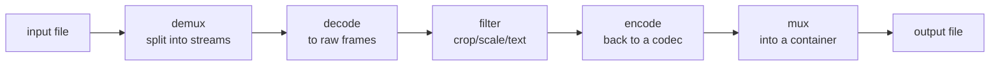

# 00 · Introduction

> **Level:** Beginner → Intermediate · **Prerequisites:** Python basics, a terminal
> **Time:** 20 min · **Verified:** 2026-08-07 · ffmpeg 4.4.2

## The thing nobody tells you about video software

Open a video editor's `package.json`, or `ldd` its binary, or read the licence screen buried in its About dialog. You will find ffmpeg. It is in CapCut, in Descript, in Opus Clip, in VLC, in Plex, in Chrome, in the pipeline that encoded the last YouTube video you watched.

This is unusual. Most software categories have five competing engines. Video has essentially one, and it's free, and it's a command-line tool from 2000.

The practical consequence for you: **the hard part of building a video product is not the video.** It's the product. ffmpeg already does the cutting, scaling, encoding, and captioning. What separates a demo from a business is knowing which ffmpeg commands to run, in what order, without re-encoding six times and destroying the quality.

That's what this course teaches.

---

## What we're building

By the last section you'll have `mediakit`, a Python package that does this:

```bash
python -m mediakit clip talk.mp4 out/ --target 6
```

**Output (real run):**
```
note: faster-whisper not installed — using placeholder captions with real timings.
{
  "source": "/tmp/demo/talk.mp4",
  "window": [0.0, 6.0],
  "cues": 1,
  "srt": "/tmp/demo/out/captions.srt",
  "final": "/tmp/demo/out/final.mp4"
}
```

**Output (real run, `ls out/`):**
```
    44  captions.srt
 78910  clip.mp4
188427  clip_vertical.mp4
214024  final.mp4
```

One command took a landscape video and produced a **1080×1920 captioned clip** ready for Shorts, Reels, or TikTok. Along the way it transcribed the audio, chose a segment, cut it accurately, reframed it, generated an SRT, and burned the captions into the pixels.

Every one of those steps is a lesson in this course.

---

## The mental model: ffmpeg is a pipe

Almost every ffmpeg confusion dissolves once you internalise this shape:



Read a command left to right and you're describing that pipe:

```bash
ffmpeg -i input.mp4 -vf "scale=1280:720" -c:v libx264 -crf 23 output.mp4
#      └─ demux+decode  └─ filter          └─ encode          └─ mux
```

Two shortcuts through the pipe matter enormously, and they're the source of most "why is this so slow?" questions:

| Path | What it skips | Speed |
|------|---------------|-------|
| **Stream copy** (`-c copy`) | decode, filter, encode | ~instant |
| **Transcode** | nothing | seconds to hours |

Copying streams between containers (MP4 → MKV) is a file-format operation — it doesn't touch the video data at all. Applying a filter forces a full decode/encode round trip. **Knowing which one you're triggering is most of ffmpeg competence**, and [02-1](02_core_operations/01_converting.md) proves the difference with real timings.

---

## Why this course exists in *this* collection

You've got courses here on [FastAPI](../fastapi_production_backend/), [LangGraph](../langgraph/), [RAG](../langchain_rag/), and [evals](../llm_evals_observability/). Those cover the AI half of an AI video product. This course covers the half that actually touches pixels.

Concretely, the [Faceless YouTube Agent](../faceless_youtube_agent/) course already renders video — it shells out to ffmpeg in `media.py`. This course is the missing explanation of *what those commands do and why those flags*. And `mediakit` adds the six operations that course doesn't have:

| Operation | Why an AI video tool needs it | Lesson |
|-----------|-------------------------------|--------|
| `extract_audio` | speech-to-text wants 16 kHz mono WAV | [02-4](02_core_operations/04_extracting_audio.md) |
| `transcribe` | timestamps are what make everything else possible | [06-4](06_python_automation/04_transcription.md) |
| `detect_silence` | free, fast cut-point detection with no model | [06-3](06_python_automation/03_analysis.md) |
| `cut_clip` | extract the interesting part, frame-accurately | [02-2](02_core_operations/02_trimming_and_cutting.md) |
| `to_vertical` | 9:16 is where short-form video lives | [03-2](03_filters/02_scale_crop_vertical.md) |
| `burn_captions` | most viewers watch muted | [04-2](04_subtitles/02_burning_captions.md) |

---

## Install and verify

```bash
sudo apt install ffmpeg          # Debian/Ubuntu
brew install ffmpeg              # macOS
```

```bash
ffmpeg -version | head -1
```

**Output (real run):**
```
ffmpeg version 4.4.2-0ubuntu0.22.04.1 Copyright (c) 2000-2021 the FFmpeg developers
```

Any 4.x or newer is fine for this course. Check that the encoders we need are present:

```bash
ffmpeg -hide_banner -encoders | grep -E " (libx264|libx265|aac|libmp3lame) "
```

**Output (real run):**
```
 V....D libx264              libx264 H.264 / AVC / MPEG-4 AVC / MPEG-4 part 10
 V....D libx265              libx265 H.265 / HEVC
 A....D aac                  AAC (Advanced Audio Coding)
 A....D libmp3lame           libmp3lame MP3 (MPEG audio layer 3)
```

> ⚠️ **If `libx264` is missing**, you have a minimal build (common in slim Docker images and some corporate distributions). Install the full package — `ffmpeg` from your distro, or `jrottenberg/ffmpeg` in Docker. Without it you can only produce `mpeg4`, which is roughly twice the file size at the same quality.

### Make a test video

You don't need to find a video to work with. ffmpeg can generate one, deterministically:

```bash
ffmpeg -f lavfi -i "testsrc=size=640x360:rate=25:duration=10" \
       -f lavfi -i "sine=frequency=440:duration=10" \
       -c:v libx264 -pix_fmt yuv420p -c:a aac -shortest sample.mp4
```

**Output (real run):**
```
sample.mp4: 159525 bytes, 640x360, 25 fps, h264 + aac, 10.0s
```

`lavfi` is ffmpeg's synthetic input device — `testsrc` draws a test pattern, `sine` generates a tone. Every command in this course works against this file, so you can follow along with zero setup.

> **Tip:** `-shortest` ends the output when the shortest input ends. Without it, a mismatched video and audio duration produces a file with a silent tail or a frozen frame — a surprisingly common bug in generated video.

---

## How to work through this

Run every command. Media programming has an unusually high ratio of "looks right in theory, wrong in the file" — and `ffprobe` will tell you immediately. The habit this course wants to build is: **make a change, probe the result, believe the probe.**

Each lesson pairs commands with their real captured output. If your output differs, that's information — usually a version difference, sometimes a missing encoder.

---

## Recap & next

- ✅ ffmpeg is the engine under essentially every video product; the hard part of video software is the product, not the video.
- ✅ The model is a **pipe**: demux → decode → filter → encode → mux.
- ✅ **Stream copy skips the middle** and is ~instant; any filter forces a full transcode. Knowing which you triggered is most of ffmpeg competence.
- ✅ Generate test media with `lavfi` — deterministic, no downloads.
- ✅ Self-check: why does converting MP4 → MKV take a fraction of a second while adding a text overlay takes much longer?

→ Next: **[01 · Foundations](01_foundations/README.md)**
