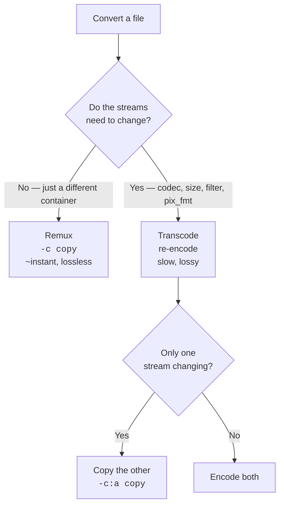

# 02-1 · Converting & remuxing

> **Level:** Beginner · **Prerequisites:** [01-2 · Containers, codecs & streams](../01_foundations/02_containers_and_codecs.md)
> **Time:** 35 min · **Verified:** 2026-08-07 · ffmpeg 4.4.2

## Why this matters

"Convert this video" is the most common media request, and it hides a decision that changes runtime by an order of magnitude and quality permanently. Getting it right is mostly about asking one question: **does the pixel data actually need to change?**

---

## The decision



That middle branch — copying the stream you aren't touching — is the most-missed easy win in media pipelines.

---

## Remuxing: change the box

```bash
ffmpeg -y -i sample.mp4 -c copy out.mkv
```

**Output (real run):**
```
  remux (-c copy)   : 0.05s
  transcode         : 0.41s
```

Nothing was decoded. The H.264 and AAC streams were lifted out of the MP4 structure and written into an MKV structure, byte-for-byte.

**When remuxing is the answer:**

| Task | Command |
|------|---------|
| MP4 → MKV (or back) | `-c copy` |
| Drop the audio track | `-an -c:v copy` |
| Extract one stream | `-map 0:a:0 -c copy` |
| Fix web playback (move the index) | `-c copy -movflags +faststart` |
| Change metadata | `-c copy -metadata title="..."` |

> ⚠️ **Remuxing can fail on codec/container mismatches.** Not every container accepts every codec — MP4 can't hold most subtitle formats, and WebM only takes VP8/VP9/AV1 + Vorbis/Opus. `ffmpeg -i in.mkv -c copy out.webm` on an H.264 file fails with *"Only VP8 or VP9 or AV1 video and Vorbis or Opus audio... are supported for WebM"*. That's a genuine constraint, not a bug — you need a transcode.

### `+faststart`, the flag worth knowing

```bash
ffmpeg -y -i sample.mp4 -c copy -movflags +faststart web.mp4
```

MP4 stores its index (the `moov` atom) at the **end** of the file by default. A browser streaming that file must download the whole thing before it can play a single frame. `+faststart` does a second pass to move the index to the front.

**Any MP4 you serve over HTTP should have this.** It's free — the operation is still a stream copy — and it's the difference between "starts instantly" and "spinner for 30 seconds".

---

## Transcoding: change the contents

```bash
ffmpeg -y -i sample.mp4 -c:v libx264 -crf 23 -pix_fmt yuv420p -c:a aac -b:a 128k out.mp4
```

The flags that should be in essentially every delivery transcode:

| Flag | Why |
|------|-----|
| `-c:v libx264` | universal playback ([01-2](../01_foundations/02_containers_and_codecs.md)) |
| `-crf 23` | target a quality level, not a bitrate ([05-1](../05_encoding/01_codecs_and_crf.md)) |
| `-pix_fmt yuv420p` | or it may not play on phones |
| `-c:a aac -b:a 128k` | transparent for speech, small |
| `-movflags +faststart` | for anything served over HTTP |

---

## Generation loss: why you avoid re-encoding

Lossy codecs discard information. Decoding and re-encoding discards *more* — every time, permanently, with no way back. Here's the same file re-encoded five times at the same CRF:

**Output (real run, PSNR vs the original — higher is more similar):**
```
  gen1 vs gen0:  average 56.80 dB
  gen3 vs gen0:  average 53.17 dB
  gen5 vs gen0:  average 51.08 dB
```

**Output (real run, file sizes):**
```
  gen0: 159525 bytes
  gen1: 157063 bytes
  gen3: 156678 bytes
  gen5: 156930 bytes
```

Look at those two blocks together. **Quality falls monotonically while the file size stays flat.** Nothing in the file's metadata warns you. There is no "times re-encoded" field. The only evidence is the pixels, and by then the original is gone.

> **Honest caveat:** 51 dB is still visually excellent — `testsrc` is a synthetic pattern that compresses cleanly, so this understates the damage. On real camera footage with noise and motion, five generations at CRF 23 produces obvious blocking and colour smearing. The *trend* here is real and measured; the *magnitude* is a best case.

**The rules that follow from this:**

1. **Keep the original.** Always. Storage is cheaper than a reshoot.
2. **Do all edits in one command.** Chained filters in a single ffmpeg run decode once and encode once ([03-1](../03_filters/01_filtergraphs.md)) — three separate commands means three generations.
3. **Copy streams you aren't changing.** Cropping the video? `-c:a copy`.
4. **If you must work in stages, use a near-lossless intermediate.** `-c:v libx264 -crf 15` or ProRes. Big files, negligible loss.

That third rule is why the capstone's `to_vertical()` passes `-c:a copy` — the crop can't affect the audio, so re-encoding it would be pure loss for no benefit.

---

## Batch conversion

```bash
for f in *.mov; do
  ffmpeg -hide_banner -loglevel error -y -i "$f" \
    -c:v libx264 -crf 23 -pix_fmt yuv420p -c:a aac -movflags +faststart \
    "${f%.mov}.mp4"
done
```

Note `"$f"` quoted — media filenames contain spaces roughly always. The Python version with proper error handling is [06-1](../06_python_automation/01_subprocess_basics.md).

---

## Recap & next

- ✅ Ask first: **do the streams need to change?** If not, `-c copy` and you're done in milliseconds.
- ✅ Remux for container swaps, stream drops, metadata, and `+faststart`.
- ✅ **`-movflags +faststart` on every MP4 you serve over HTTP** — free, and it's the difference between instant playback and a spinner.
- ✅ Delivery transcode = `libx264` + `crf` + **`-pix_fmt yuv420p`** + `aac`.
- ✅ **Generation loss is measured and monotonic** (56.8 → 51.1 dB) while file size gives no warning at all.
- ✅ Keep originals; do edits in **one** command; **copy the streams you aren't touching**.
- ✅ Self-check: you need to crop a video and change its container. How many encodes should that take?

→ Next: **[02-2 · Trimming & cutting](02_trimming_and_cutting.md)**

## Exercises

1. Convert `sample.mp4` to MKV *and* replace its audio with MP3, without re-encoding the video.

<details>
<summary>Solution</summary>

```bash
ffmpeg -y -i sample.mp4 -c:v copy -c:a libmp3lame -q:a 2 out.mkv
```
The video is copied (no generation loss, near-instant), only the audio is re-encoded. MKV accepts both, so the container swap is free.
</details>

2. Why can't you fix a `yuv444p` file with `-c copy -pix_fmt yuv420p`?

<details>
<summary>Solution</summary>

Because pixel format is a property of the **encoded** video data, not container metadata. `-c copy` never decodes, so there is nothing for `-pix_fmt` to act on — ffmpeg ignores it. Changing pixel format necessarily means decode → convert → re-encode, and one generation of loss. It's the cost of not passing `-pix_fmt yuv420p` the first time.
</details>
