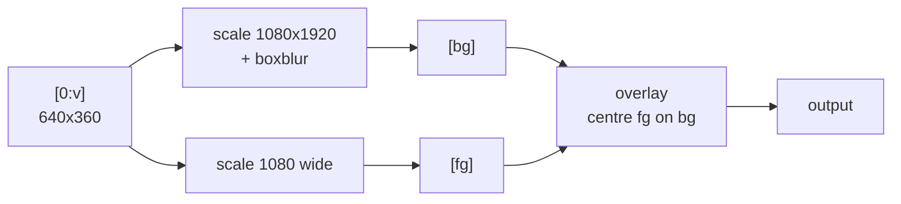

# 03-1 · Filtergraph syntax

> **Level:** Intermediate · **Prerequisites:** [02 · Core operations](../02_core_operations/README.md)
> **Time:** 50 min · **Verified:** 2026-08-07 · ffmpeg 4.4.2

## Why this matters

Everything ffmpeg does to pixels or samples is a filter, and filters compose into graphs. Learn the four punctuation marks that make up the syntax and every ffmpeg example you'll ever read becomes parseable — including the terrifying one-liners on Stack Overflow.

---

## The punctuation

That's genuinely the whole syntax:

| Symbol | Meaning |
|--------|---------|
| `=` | separates a filter from its arguments — `scale=1280:720` |
| `:` | separates arguments within one filter — `crop=640:360:0:0` |
| `,` | **chain**: output of the left filter feeds the right — `scale=...,crop=...` |
| `;` | **separate chain**: an independent branch, joined via labels |
| `[name]` | a named stream — an input to or output from a chain |

Read a chain left to right as a pipeline:

```
scale=1280:720,crop=640:360,drawtext=text='hi'
   scale it   → then crop it → then draw on it
```

> **Analogy:** `,` is a Unix pipe (`|`) — data flows straight through. `;` is a newline between commands, where `[labels]` are the named variables letting one line's output become another's input.

---

## `-vf` — the simple case

One video input, one output, one chain:

```bash
ffmpeg -y -i sample.mp4 -vf "scale=320:-2" -an out.mp4
```

**Output (real run):**
```
  scale=320:-2  -> 320x180
```

`-af` is the audio equivalent. `-vf` is shorthand for a `-filter_complex` with the input and output implied — use it whenever the job fits.

---

## `-filter_complex` — multiple inputs or outputs

When you have two inputs, or one input feeding two branches, you need explicit labels:

```bash
ffmpeg -y -i sample.mp4 -filter_complex \
  "[0:v]scale=1080:1920,boxblur=40[bg];\
   [0:v]scale=1080:-2[fg];\
   [bg][fg]overlay=(W-w)/2:(H-h)/2" -an out.mp4
```

**Output (real run):**
```
  blurred backdrop -> 1080x1920
```

Traced through:



The same source is used **twice** — once blurred and stretched to fill the frame, once at its natural aspect on top. That's the blurred-background look used by essentially every social video app, and it's three filters.

Note `(W-w)/2:(H-h)/2` — filters accept expressions, where uppercase is the background and lowercase the overlaid image. That's "centre it", written generically enough to work at any resolution.

---

## Labels

- `[0:v]` — video from input 0. Numbering follows `-i` order.
- `[0:a]` — audio from input 0.
- `[name]` — a label **you** invent for an intermediate result.
- No trailing label — the chain's output becomes the default output stream.

> ⚠️ **A filtergraph output must be consumed exactly once.** Reuse a label twice and ffmpeg fails with *"Filter has an unconnected output"* or *"Cannot find a matching stream"*. If you need a stream in two places, duplicate it explicitly with the `split` filter: `[0:v]split=2[a][b]`. In the example above the *input* `[0:v]` is used twice, which is fine — ffmpeg splits source streams automatically; it's the intermediate labels that must be single-use.

When you produce labelled outputs, select them with `-map`:

```bash
-filter_complex "[0:v]...[v];[0:a]...[a]" -map "[v]" -map "[a]"
```

---

## Chain everything into one command

This is the [02-1](../02_core_operations/01_converting.md) generation-loss rule expressed as a habit:

```bash
# BAD — three encodes, three generations of loss
ffmpeg -y -i in.mp4 -vf "scale=1080:1920" tmp1.mp4
ffmpeg -y -i tmp1.mp4 -vf "drawtext=text='Title':x=20:y=20" tmp2.mp4
ffmpeg -y -i tmp2.mp4 -vf "fade=in:0:25" out.mp4

# GOOD — one decode, one encode
ffmpeg -y -i in.mp4 -vf "scale=1080:1920,drawtext=text='Title':x=20:y=20,fade=in:0:25" out.mp4
```

Faster **and** higher quality. Filters within a chain operate on raw decoded frames, so intermediate steps cost nothing extra — the expense is entirely in the decode and encode at the ends.

---

## Escaping — where the real pain lives

Filter arguments have their own parser layered under the shell's, and the two disagree about the same characters. The rules that actually matter:

| Character | Problem | Fix |
|-----------|---------|-----|
| `:` | separates filter arguments | escape as `\:` inside the value |
| `,` | separates filters in a chain | escape as `\,` |
| `'` | quotes a filter value | escape as `\'` |
| `[` `]` | label delimiters | escape as `\[` `\]` |

Paths hit this constantly — Windows paths contain `C:`, and timestamped filenames contain `:` too. The capstone handles it in one function:

```python
def _escape_filter_path(path) -> str:
    p = str(path).replace("\\", "/")
    p = p.replace("'", r"\'").replace(":", r"\:").replace(",", r"\,")
    return f"'{p}'"
```

**Output (real run, from the test suite):**
```
"C:/a/b.srt"  ->  'C\:/a/b.srt'
"a,b.srt"     ->  'a\,b.srt'
```

> **Tip:** When a filtergraph mysteriously fails on one file and works on another, check the filename for `:`, `,`, `'`, or `[`. It's the cause far more often than anything about the video. Building filter strings by hand-formatting user-supplied paths is how this bug reaches production.

---

## Filters worth knowing exist

| Filter | Does |
|--------|------|
| `scale` | resize ([03-2](02_scale_crop_vertical.md)) |
| `crop` | cut a rectangle out |
| `pad` | add borders |
| `overlay` | composite one video on another |
| `drawtext` | burn text ([03-3](03_drawtext_overlays.md)) |
| `subtitles` / `ass` | burn captions ([04-2](../04_subtitles/02_burning_captions.md)) |
| `fps` | change frame rate |
| `setpts` | change speed — `setpts=0.5*PTS` is 2× |
| `atempo` | change audio speed without changing pitch |
| `fade` / `afade` | fade video / audio |
| `boxblur`, `gblur` | blur |
| `eq` | brightness/contrast/saturation |
| `silencedetect` | find silence ([06-3](../06_python_automation/03_analysis.md)) |
| `cropdetect` | find the real content area of a letterboxed video |
| `loudnorm` | normalise loudness |
| `showwavespic` | render a waveform image |

`ffmpeg -filters` lists all ~450. You'll use fifteen.

> ⚠️ **Speed changes need both filters.** `setpts=0.5*PTS` doubles video speed and leaves audio untouched — you get a video that finishes while the audio is still talking. The audio half is `atempo=2.0`, and `atempo` only accepts 0.5–2.0 per instance, so 4× speed is `atempo=2.0,atempo=2.0`.

---

## Recap & next

- ✅ The syntax is four marks: `=` args, `:` between args, `,` chain, `;` separate chain, `[label]` names.
- ✅ **`-vf` for one-in-one-out**, `-filter_complex` when you have multiple inputs, outputs, or branches.
- ✅ Expressions like `(W-w)/2` make graphs resolution-independent.
- ✅ **Intermediate labels must be consumed exactly once** — use `split` to duplicate.
- ✅ **Chain filters into one command** — one decode, one encode, no extra generation loss.
- ✅ Escaping `:` `,` `'` in filter arguments is a real production bug; wrap it in a function once.
- ✅ Speed changes need **`setpts` and `atempo` together**, or audio drifts out of sync.
- ✅ Self-check: why is a 3-filter chain barely slower than a 1-filter chain, but 3 separate commands much slower?

→ Next: **[03-2 · Scale, crop & vertical video](02_scale_crop_vertical.md)**

## Exercises

1. Produce a 320-wide, greyscale, 2×-speed version of `sample.mp4` — video and audio — in one command.

<details>
<summary>Solution</summary>

```bash
ffmpeg -y -i sample.mp4 \
  -vf "scale=320:-2,hue=s=0,setpts=0.5*PTS" \
  -af "atempo=2.0" out.mp4
```
`hue=s=0` removes saturation. Both speed filters are required — `setpts` alone desynchronises the audio, which is the single most common ffmpeg speed-change bug.
</details>

2. Why does `[0:v]scale=640:360[a];[a]crop=320:180[b];[a]hue=s=0[c]` fail?

<details>
<summary>Solution</summary>

`[a]` is consumed twice. Intermediate labels are single-use. Fix with `split`:
```
[0:v]scale=640:360,split=2[a1][a2];[a1]crop=320:180[b];[a2]hue=s=0[c]
```
`split` is explicit about the duplication, which is also why it's cheap — ffmpeg knows to reference the same frames rather than decode twice.
</details>
