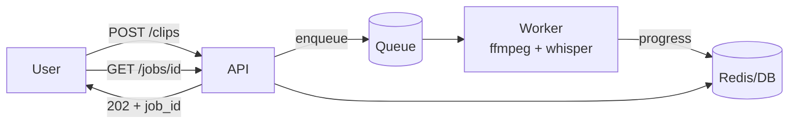

# 06-2 · Progress & long jobs

> **Level:** Intermediate → Advanced · **Prerequisites:** [06-1 · Running ffmpeg from Python](01_subprocess_basics.md)
> **Time:** 45 min · **Verified:** 2026-08-07 · Python 3.10, ffmpeg 4.4.2

## Why this matters

`subprocess.run()` blocks until ffmpeg finishes. That's fine for a 3-second clip and completely unacceptable for a 40-minute transcode in a web request. Video work needs progress reporting, timeouts, cancellation, and somewhere to run that isn't the request thread.

---

## Machine-readable progress

ffmpeg's default progress line is designed for a terminal — it uses carriage returns to overwrite itself, which makes it awkward to parse. `-progress` emits clean key-value pairs instead:

```bash
ffmpeg -progress pipe:1 -y -i in.mp4 -c:v libx264 -crf 28 -an out.mp4
```

**Output (real run):**
```
frame=1
out_time_ms=0
speed=   0x
progress=continue
frame=138
out_time_ms=2433398
speed= 4.6x
progress=continue
frame=180
out_time_ms=5900065
speed=7.19x
progress=end
```

| Key | Meaning |
|-----|---------|
| `frame` | frames encoded so far |
| `out_time_ms` | **microseconds** of output written (despite the name) |
| `speed` | multiple of realtime |
| `progress` | `continue` while running, `end` when done |

> ⚠️ **`out_time_ms` is in microseconds, not milliseconds.** The field name is wrong and has been for years. `5900065` above is 5.9 seconds, not 5900 seconds. Dividing by 1000 gives you a progress bar that reaches 100% almost instantly and then sits there, which is a confusing bug to chase.

---

## Reading it from Python

```python
import subprocess

def run_with_progress(args, total_seconds, on_progress):
    """Stream ffmpeg progress to a callback. on_progress(fraction) where 0.0-1.0."""
    proc = subprocess.Popen(
        ["ffmpeg", "-hide_banner", "-loglevel", "error",
         "-progress", "pipe:1", "-y", *args],
        stdout=subprocess.PIPE, stderr=subprocess.PIPE, text=True,
    )
    for line in proc.stdout:
        key, _, value = line.strip().partition("=")
        if key == "out_time_ms" and value.isdigit():
            on_progress(min(1.0, int(value) / 1_000_000 / total_seconds))
    proc.wait()
    if proc.returncode != 0:
        raise FFmpegError(proc.stderr.read().strip())
    on_progress(1.0)
```

`Popen` instead of `run` so you can read output while it's still running. `total_seconds` comes from `duration()` — ffmpeg reports how much output it has produced, not how much is left, so you supply the denominator.

> **Tip:** Report progress by **output duration**, not frame count. Frame counts are unreliable when the container's metadata is missing ([01-3](../01_foundations/03_inspecting_with_ffprobe.md)) or when a filter changes the frame rate. Duration is always known up front and always meaningful.

---

## Timeouts

An ffmpeg process can hang — a malformed input, a network source that stalls, a filter in a pathological state. Without a timeout that's a permanently occupied worker slot:

```python
try:
    proc = subprocess.run(cmd, capture_output=True, text=True, timeout=600)
except subprocess.TimeoutExpired:
    raise FFmpegError("ffmpeg timed out after 600s")
```

`subprocess.run(timeout=...)` kills the process on expiry. Size the timeout from the input: something like `max(60, duration * 5)` scales with the work instead of failing every long video or waiting an hour on a short one.

---

## Cancellation

Users close tabs and cancel jobs. Terminate cleanly:

```python
proc.terminate()          # SIGTERM — ffmpeg finalises the output file
try:
    proc.wait(timeout=5)
except subprocess.TimeoutExpired:
    proc.kill()           # SIGKILL — last resort
```

`terminate()` first matters: ffmpeg handles SIGTERM by writing the container index and closing the file, leaving a valid (if short) video. `kill()` leaves a truncated file with no `moov` atom — exactly the unreadable state from [01-3](../01_foundations/03_inspecting_with_ffprobe.md).

---

## Video work belongs in a worker



> ⚠️ **Never run a transcode inside an HTTP request.** Gunicorn's default timeout is 30 seconds; nginx's is 60. A 5-minute encode is killed mid-write, the worker is blocked the whole time, and a retry starts it over. The request should validate the input, enqueue a job, and return `202 Accepted` with a job ID.

The [Production FastAPI Backend](../../fastapi_production_backend/) course covers the queue side (arq + Redis); this is the video-specific part of what runs in the worker:

```python
async def process_clip_job(ctx, job_id: str, src: str):
    await set_status(job_id, "probing")
    info = probe(src)                                 # fail fast on bad input

    await set_status(job_id, "transcribing")          # the slow part
    cues = transcribe(src)

    await set_status(job_id, "rendering")
    result = make_clip(src, outdir=f"/data/{job_id}")

    await set_status(job_id, "done", result=result)
```

Three practical rules from running this shape:

1. **Probe before enqueuing.** It costs milliseconds and rejects garbage before it occupies a worker for minutes.
2. **Status strings that name the stage.** "processing" for four minutes feels broken; "transcribing (2:15 of 8:00)" feels like it's working.
3. **Make jobs idempotent.** Queues retry. Writing to `/data/{job_id}/` means a retry overwrites its own output instead of duplicating or colliding.

---

## Concurrency

Video work is CPU-bound, so the usual async advice inverts:

| Approach | Suitable |
|----------|----------|
| `asyncio` alone | **no** — ffmpeg is a subprocess, not awaitable I/O |
| `asyncio.create_subprocess_exec` | yes — non-blocking process management |
| Process pool / separate workers | **yes — the standard answer** |
| Threads | only for waiting on subprocesses |

And from [05-2](../05_encoding/02_speed_and_tradeoffs.md): set `-threads` to `cores ÷ concurrent_jobs`, or your workers fight each other and total throughput falls as you add them.

```python
proc = await asyncio.create_subprocess_exec(
    "ffmpeg", *args, stdout=asyncio.subprocess.PIPE, stderr=asyncio.subprocess.PIPE
)
stdout, stderr = await proc.communicate()
```

That's the async-native form — worth using in an async worker so one stalled encode doesn't block the event loop handling the others.

---

## Recap & next

- ✅ **`-progress pipe:1`** gives parseable key-value progress instead of terminal-formatted output.
- ✅ **`out_time_ms` is microseconds**, despite the name.
- ✅ Report progress by **output duration**, not frames — frame counts are unreliable.
- ✅ **Always set a timeout**, scaled to input duration, or a hung job holds a worker forever.
- ✅ Cancel with **`terminate()` before `kill()`** so ffmpeg finalises a valid file.
- ✅ **Never transcode in an HTTP request** — enqueue and return `202`.
- ✅ **Probe before enqueuing**, name the stage in status, make jobs **idempotent**.
- ✅ CPU-bound work needs **processes**, and `-threads` divided by concurrency.
- ✅ Self-check: your progress bar jumps to 100% immediately and then stalls. Which field did you misread?

→ Next: **[06-3 · Analysis: silence & scenes](03_analysis.md)**

## Exercises

1. Add a timeout to `run()` that scales with the input's duration.

<details>
<summary>Solution</summary>

```python
def run(args, *, binary="ffmpeg", timeout=None):
    try:
        proc = subprocess.run([_which(binary), *args],
                              capture_output=True, text=True, timeout=timeout)
    except subprocess.TimeoutExpired:
        raise FFmpegError(f"{binary} timed out after {timeout}s")
    ...

# caller:
run(args, timeout=max(60, duration(src) * 5))
```
The floor of 60s matters — a 2-second clip would otherwise get a 10-second timeout, which cold-start and disk contention can genuinely exceed.
</details>

2. Why terminate rather than kill, given both stop the process?

<details>
<summary>Solution</summary>

SIGTERM lets ffmpeg finalise the container — write the index, close the file — leaving a valid shorter video. SIGKILL leaves a truncated file with no `moov` atom, which is completely unreadable rather than partially readable ([01-3](../01_foundations/03_inspecting_with_ffprobe.md)). If a user cancels at 80%, the graceful path can still hand them 80% of a usable video.
</details>
