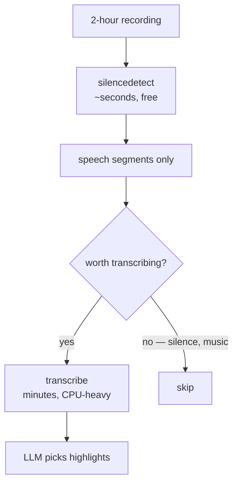

# 06-3 · Analysis: silence & scenes

> **Level:** Intermediate → Advanced · **Prerequisites:** [06-1 · Running ffmpeg from Python](01_subprocess_basics.md)
> **Time:** 45 min · **Verified:** 2026-08-07 · ffmpeg 4.4.2

## Why this matters

Before you reach for a model, ffmpeg can already tell you a great deal about a video's structure: where the speech pauses are, where the camera cut, how loud it is, where the black frames sit. These analyses are fast, free, deterministic, and need no GPU — and they solve a surprising share of "AI video editing" problems on their own.

---

## Silence detection

The `silencedetect` filter reports quiet stretches. Combined with a null output, nothing is written — you're running ffmpeg purely for its log:

```bash
ffmpeg -i talk.mp4 -af silencedetect=noise=-35dB:d=0.5 -f null -
```

**Output (real run, on a file with sound 0–4s, silence 4–8s, sound 8–12s):**
```
[silencedetect @ 0x...] silence_start: 3.99998
[silencedetect @ 0x...] silence_end: 8.00002 | silence_duration: 4.00004
```

It found the gap to within 0.00002 seconds. Two parameters:

| Parameter | Meaning |
|-----------|---------|
| `noise=-35dB` | the threshold below which audio counts as silence |
| `d=0.5` | minimum duration to report (seconds) |

> **Tip:** `-35dB` is a reasonable default for clean recordings. Noisy audio — room tone, air conditioning, a laptop fan — never gets that quiet, so nothing is detected; raise the threshold toward `-25dB`. Studio-quiet audio can use `-45dB`. If detection finds nothing, the threshold is almost always the reason, and it's worth exposing as a tunable rather than a constant.

### Parsing it

```python
_SILENCE_START = re.compile(r"silence_start:\s*([\d.]+)")
_SILENCE_END = re.compile(r"silence_end:\s*([\d.]+)")

def detect_silence(src, *, noise_db=-35, min_dur=0.5):
    proc = subprocess.run(
        [_which("ffmpeg"), "-hide_banner", "-i", str(src),
         "-af", f"silencedetect=noise={noise_db}dB:d={min_dur}", "-f", "null", "-"],
        capture_output=True, text=True,
    )
    starts = [float(m) for m in _SILENCE_START.findall(proc.stderr)]
    ends = [float(m) for m in _SILENCE_END.findall(proc.stderr)]
    if len(starts) > len(ends):
        ends.append(duration(src))      # trailing silence logs no end
    return list(zip(starts, ends))
```

Two details that are easy to get wrong:

- **Read `stderr`, not stdout.** Filter logs go to stderr. Reading stdout returns an empty string and you conclude there's no silence.
- **A silence running to the end of the file logs a `start` with no `end`.** Zipping the lists without handling that silently drops the final silence — and it's the most likely one to exist, since recordings usually end with a pause.

**Output (real run, `python -m mediakit silence talk.mp4`):**
```
   4.000 ->    8.000  (4.000s)
```

---

## Inverting it: where the speech is

Silence is rarely what you want — the speech between it is:

```python
def speech_segments(src, **kwargs):
    total = duration(src)
    segments, cursor = [], 0.0
    for start, end in detect_silence(src, **kwargs):
        if start - cursor > 0.05:
            segments.append((round(cursor, 3), round(start, 3)))
        cursor = end
    if total - cursor > 0.05:
        segments.append((round(cursor, 3), round(total, 3)))
    return segments
```

**Output (real run, verified by the test suite):**
```
segments[0]  starts at 0.0
segments[-1] ends at 12.0
2+ segments found
```

The `> 0.05` guard discards sub-50ms slivers between adjacent silences, which are artefacts of the detector rather than real speech.

This gives you, for free and with no model:

- **Remove dead air** — cut to the speech segments and concat ([02-3](../02_core_operations/03_concatenating.md)). This alone is a shippable product feature; it's what Descript's "remove gaps" does.
- **Sensible cut points** — cut on silence and you never clip a word in half.
- **A speech-density signal** — the ratio of speech to silence is a decent proxy for "is anything happening here".

---

## Scene detection

The `select` filter with the `scene` variable scores how different each frame is from the previous one:

```bash
ffmpeg -i scenes.mp4 -vf "select='gt(scene,0.3)',showinfo" -f null -
```

**Output (real run, on a video built from three 2-second clips of different colours):**
```
pts_time:2
pts_time:4
```

Both cuts found, exactly. The threshold is 0–1:

| Threshold | Detects |
|-----------|---------|
| `0.1` | subtle transitions, but many false positives from motion |
| **`0.3`** | **hard cuts — a good default** |
| `0.5` | only dramatic changes |

Uses: splitting a recording into shots, picking thumbnail candidates (the first frame of each scene), and skipping title cards.

Extract a frame per scene:

```bash
ffmpeg -y -i in.mp4 -vf "select='gt(scene,0.3)'" -vsync vfr scene_%03d.jpg
```

`-vsync vfr` is required — without it ffmpeg pads the output to a constant frame rate and you get thousands of duplicate images instead of one per scene.

---

## Other analyses worth knowing

```bash
# loudness measurement (broadcast standard)
ffmpeg -i in.mp4 -af ebur128 -f null -

# black frames — find title cards and gaps
ffmpeg -i in.mp4 -vf blackdetect=d=0.5:pic_th=0.98 -f null -

# freeze frames — detect a stalled screen recording
ffmpeg -i in.mp4 -vf freezedetect=n=-60dB:d=2 -f null -

# letterbox bars (03-2)
ffmpeg -i in.mp4 -vf cropdetect=24:16:0 -frames:v 100 -f null -
```

All the same shape: a filter that logs to stderr, `-f null -` so nothing is written, regex out the results.

---

## Cheap analysis before expensive models

This is the design point of the whole lesson. A pipeline that runs a transcription model over an entire 2-hour recording to find highlights is paying for a lot of silence.



Silence detection on a 2-hour file takes seconds. If 30% of it is dead air, you've cut nearly a third off the slowest stage of your pipeline before it starts. Scene detection similarly narrows *where* to look before anything expensive runs.

> **Tip:** The general principle beyond video: **run the cheap deterministic analysis first and let it narrow the input to the expensive probabilistic one.** It's faster, it's cheaper, and the deterministic step is far easier to debug when the output is wrong.

---

## Recap & next

- ✅ `silencedetect` found a gap to within **0.00002s** — fast, free, deterministic.
- ✅ **Read stderr**, not stdout; filter logs go there.
- ✅ **A trailing silence logs no `silence_end`** — handle it or you drop the most likely silence in the file.
- ✅ Tune `noise` to the recording: `-25dB` noisy, `-35dB` default, `-45dB` studio.
- ✅ Inverting silence gives **speech segments** — dead-air removal is a shippable feature with no model.
- ✅ `select='gt(scene,0.3)'` finds hard cuts; **`-vsync vfr`** when extracting scene frames.
- ✅ **Run cheap analysis first to narrow input for the expensive model.**
- ✅ Self-check: `detect_silence` returns `[]` on a real recording that clearly has pauses. What do you change first?

→ Next: **[06-4 · Transcription with faster-whisper](04_transcription.md)**

## Exercises

1. Write a function that removes all silence from a video.

<details>
<summary>Solution</summary>

```python
def remove_silence(src, dst, workdir):
    parts = []
    for i, (start, end) in enumerate(speech_segments(src)):
        parts.append(cut_clip(src, Path(workdir) / f"p{i}.mp4", start, end))
    return concat(parts, dst)
```
Accurate cuts (so no word is clipped) then a stream-copy concat — the parts share a codec because you produced them all. Worth padding each segment by ~0.1s at each end in practice: cutting exactly at the detected boundary clips the quiet start of the next word and sounds abrupt.
</details>

2. Why is `-vsync vfr` required when extracting one frame per scene?

<details>
<summary>Solution</summary>

`select` passes through only the frames that match, but by default ffmpeg maintains a constant output frame rate — so it duplicates the selected frames to fill the gaps, producing thousands of near-identical images. `-vsync vfr` (variable frame rate) tells it to write each passed frame once and keep the original timestamps.
</details>
