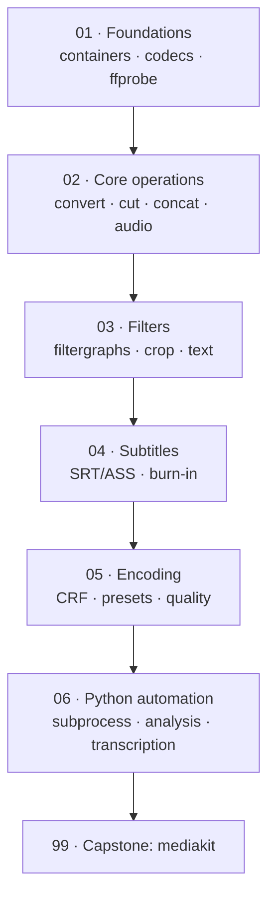

# 🎬 ffmpeg & Media Processing — the engine under every video product

> **What you build:** **mediakit**, a Python toolkit that turns a long video into a captioned vertical clip — probe, extract audio for speech-to-text, cut accurately, reframe to 9:16, generate and burn subtitles, detect silence to find cut points, and run the whole pipeline from one command.

> **Verified:** 2026-08-07 · ffmpeg 4.4.2 · Python 3.10 · stdlib-only toolkit · pytest 9.1.1. Everything below was actually run: **23 tests pass** against real generated media, the CLI produces a **1080×1920 captioned MP4** end-to-end, and every benchmark in the lessons (cut accuracy, CRF sizes, preset timings, silence detection) is captured output, not an estimate. No API key, no network, no paid service.

Every video product you can name — CapCut, Descript, Opus Clip, YouTube itself — is a user interface wrapped around ffmpeg. It is the one dependency they all share. Learn it once and the "how do I actually *do* that to a video?" question stops being a blocker for the rest of your career.

## Who this is for

You can write Python and you've shelled out to a subprocess before. You do **not** need any prior media, codec, or DSP knowledge — the course assumes you don't know what a container is and builds from there.

## What you'll be able to do

- Read a media file's real structure with **ffprobe** and know what every field means.
- Explain **container vs codec** — and why remuxing is instant while transcoding is slow.
- **Cut** clips accurately, and know precisely when the fast stream-copy cut will betray you.
- **Concatenate**, **extract audio**, and **grab frames** without re-encoding what doesn't need it.
- Build **filtergraphs**: scale, crop to 9:16, overlay text, chain filters correctly.
- Generate **SRT subtitles** from a transcript and **burn them in** so they survive any platform.
- Choose **codec, CRF, and preset** deliberately, with real size/time numbers behind the choice.
- Drive all of it from **Python** — with error handling that surfaces ffmpeg's actual complaint.
- Transcribe speech **free and offline** with faster-whisper, and know when to pay for an API instead.

## The stack (and why)

| Concern | Course uses | Why |
|---|---|---|
| Media engine | **ffmpeg 4.4.2** (CLI) | Universal, stable, on every server. The library bindings (PyAV) are for later. |
| Inspection | **ffprobe** with `-print_format json` | Machine-readable; the only sane way to inspect from code. |
| Process control | **`subprocess`** (stdlib) | No wrapper library. You'll read wrappers' source anyway when they break. |
| Video codec | **libx264** | Plays everywhere. H.265/AV1 are smaller but not universally supported. |
| Speech-to-text | **faster-whisper** (optional) | MIT-licensed, models included, runs on CPU. Genuinely free — see [06-4](06_python_automation/04_transcription.md). |

> **Why the CLI and not a Python binding?** Because every ffmpeg answer you'll ever find — Stack Overflow, the docs, a colleague — is a command line. Learning the CLI means the entire body of existing knowledge is available to you. `ffmpeg-python` and PyAV are thin layers over these same flags; once you know the flags, you can pick one up in an hour or skip it entirely, which is what this course does.

> **Why generate the test media instead of committing a video?** So the repo stays text-only and every number is reproducible. ffmpeg's `testsrc` and `sine` sources are deterministic — the sample video is byte-identical on your machine and mine.

## Prerequisites

```bash
# Debian/Ubuntu
sudo apt install ffmpeg
# macOS
brew install ffmpeg

ffmpeg -version | head -1        # ffmpeg version 4.4.2 or newer

cd 99_project_mediakit
python -m venv .venv && source .venv/bin/activate
pip install -r requirements.txt   # just pytest — the toolkit is stdlib
pytest -q                         # 23 passed
```

## Learning path



## Course map

| # | Section | Modules | You'll be able to… | Time |
|---|---------|---------|--------------------|------|
| 01 | [Foundations](01_foundations/) | 3 | Read any media file and explain its structure | ~2 h |
| 02 | [Core operations](02_core_operations/) | 4 | Convert, cut, join, and extract audio correctly | ~2.5 h |
| 03 | [Filters](03_filters/) | 3 | Build filtergraphs; reframe and overlay | ~2.5 h |
| 04 | [Subtitles & captions](04_subtitles/) | 2 | Generate and burn in captions | ~1.5 h |
| 05 | [Encoding & quality](05_encoding/) | 2 | Choose codec/CRF/preset with real numbers | ~2 h |
| 06 | [Python automation](06_python_automation/) | 4 | Drive ffmpeg from code, safely | ~3 h |
| 99 | [Capstone: mediakit](99_project_mediakit/) | project | The complete toolkit | — |

**Total:** ~14 hours.

## Related guides

- **[Faceless YouTube Agent](../faceless_youtube_agent/)** — the LangGraph pipeline that renders video; this course explains the ffmpeg it calls.
- **[Production FastAPI Backend](../fastapi_production_backend/)** — serve these operations as an API; video work belongs in a background worker, not a request.
- **[LLM Evals & Observability](../llm_evals_observability/)** — once an LLM picks your clips, this is how you measure whether the picks are good.
- **[Docker](../docker/)** — ffmpeg in a container is how this ships.

→ Start here: **[00 · Introduction](00_introduction.md)**
