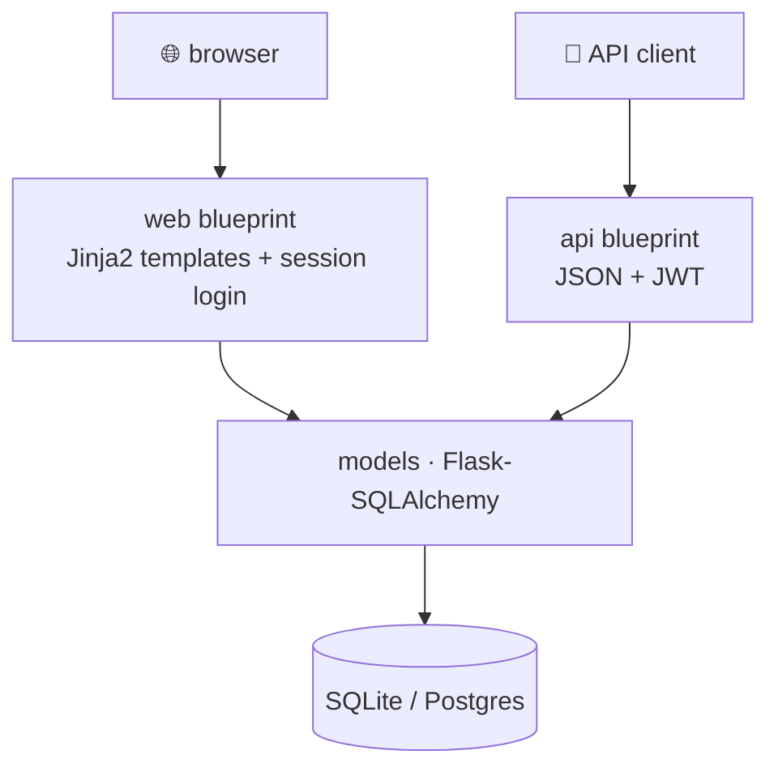

# 00 · Introduction

> **Level:** Beginner · **Prerequisites:** Python (functions, classes, dicts, decorators).
> **Time:** 20 min · **Verified:** 2026-07-29 (Flask 3.1.3, Python 3.10)

**Flask** is a Python **micro-framework** for the web. "Micro" doesn't mean small-scale — Netflix, Reddit, and Airbnb have all run Flask — it means Flask ships a deliberately small core (routing, templating, request/response) and leaves the rest of the architecture to you. This course teaches both halves: the framework, and the structure that keeps it from turning into one enormous file.

---

## Why this matters

Flask's minimalism is a double-edged sword. Nothing forces you into a good layout, so a huge amount of real-world Flask is a 2,000-line `app.py` nobody wants to touch. The teams that succeed with Flask adopt a small set of conventions — **application factory**, **blueprints**, config classes, the `init_app()` extension pattern — which happen to be exactly what this course builds. Learn those and Flask scales beautifully.

> **Analogy — a kit car vs a sedan.** FastAPI hands you a finished car with the safety features bolted on (validation, docs). Flask hands you an excellent chassis, an engine, and a well-stocked parts catalogue. You choose the seats. That's more freedom and more responsibility — and it's why knowing *which* parts to pick (this course's real subject) matters so much.

---

## What we build: FlaskNotes

One app with **two faces** sharing a codebase — which is Flask's sweet spot:

- **A web UI** — server-rendered Jinja2 pages, session login, a form with an **image upload**.
- **A JSON API** — token (JWT) authenticated, paginated, with CRUD on notes.



By the end it has: an application factory, three blueprints, migrations, hashed passwords, session **and** token auth, validated uploads, central error handling (HTML *or* JSON depending on the caller), logging, **20 passing tests**, gunicorn, and a Dockerfile.

---

## The three ideas that define Flask

**1. The request context.** Flask gives you globals like `request`, `session`, `g`, and `current_app` that magically refer to *the current request*. They're not really globals — Flask swaps them per request, which is what lets you write simple code without threading a request object through every function.

**2. Decorator routing.** A route is a function with a decorator: `@app.get("/")`. That's the whole mental model.

**3. Extensions.** Flask's core is small; everything else (database, login, migrations) is an **extension** you add. Modern extensions follow the `init_app()` pattern so they work with the application factory — the single most important convention in this course.

---

## Install & first run

```bash
python -m venv .venv && source .venv/bin/activate
pip install Flask
```

```python
# app.py
from flask import Flask

app = Flask(__name__)

@app.get("/")
def index():
    return "Hello, Flask!"
```

```bash
flask --app app run --debug
```

**Output (real run):**
```
 * Serving Flask app 'app'
 * Debug mode: on
 * Running on http://127.0.0.1:5000
```

Visit `http://127.0.0.1:5000` and you'll see `Hello, Flask!`. That's a complete Flask application — three lines of substance.

> ⚠️ **`flask run` is a development server only.** It's single-threaded-ish, not hardened, and Flask itself warns you in production. Real deployments use **gunicorn** (or uWSGI) behind Nginx — [Section 09](09_production/README.md). This is the #1 Flask production mistake.

---

## WSGI, briefly

Flask is a **WSGI** application — the long-standing Python standard for synchronous web apps. Your app is essentially a callable that a server (gunicorn) invokes for each request. That's why deployment is "point gunicorn at `wsgi:app`" and why Flask works with a huge ecosystem of servers and middleware. (FastAPI uses the newer **ASGI** standard, which adds async and WebSockets.) Flask 3 does support `async def` views, but its heart is synchronous.

---

## Recap & next

- ✅ Flask is a **micro-framework**: small core (routing, templates, request/response), everything else is an extension.
- ✅ Its freedom is a trap without conventions — **app factory + blueprints** are what this course drills.
- ✅ Key ideas: the **request context** (`request`/`g`/`current_app`), decorator routing, `init_app()` extensions.
- ✅ `flask run` is for development only; production uses **gunicorn** (WSGI).
- ✅ Self-check: in the kit-car analogy, what does "choosing the parts" correspond to in a Flask project?

→ Next: **[01 · Foundations](01_foundations/README.md)**
