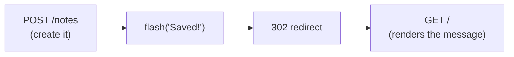

# 02-2 · Static files & flash messages

> **Level:** Beginner · **Prerequisites:** [02-1 · Jinja2 templates](01_jinja_templates.md)
> **Time:** 35 min · **Verified:** 2026-07-29 (Flask 3.1.3)

## Why this matters

Two small things every server-rendered app needs: a way to serve **CSS/JS/images**, and a way to tell the user *"Saved!"* or *"That email is taken"* after a redirect. Flask has both built in — `static/` and **flash messages**.

---

## Static files

Put assets in a **`static/`** folder; Flask serves them at `/static/...` with no configuration:

```
static/
├── style.css
└── logo.png
```

Always reference them with `url_for` rather than a hard-coded path:

```jinja
<link rel="stylesheet" href="{{ url_for('static', filename='style.css') }}">

```

**Output (real run):**
```html
<a href="/static/style.css">css</a>
```

> **Tip — why `url_for` for static too?** It survives your app being mounted under a prefix (`/myapp/static/…`), and it's where cache-busting hooks in. Hard-coded `/static/style.css` breaks the moment the app isn't at the domain root.

---

## Flash messages

The problem: after a successful POST you **redirect** (so a refresh doesn't re-submit) — but the new request knows nothing about what just happened. `flash()` stores a message in the session for exactly one subsequent request.

```python
from flask import flash, redirect, url_for

@app.post("/notes")
def create():
    ...
    flash("Note saved!", "success")            # message, category
    return redirect(url_for("web.index"))
```

Render them in `base.html` so every page shows them:

```jinja

  
    <ul class="flashes">
    
      <li class="{{ category }}">{{ message }}</li>
    
    </ul>
  

```

**Output (real run, after `flash("Saved!", "success")`):**
```
[('success', 'Saved!')]
```

The category (`success`, `error`, `warning`) becomes a CSS class so you can style them differently. Reading them **consumes** them — refresh and they're gone, which is exactly what you want.

> ⚠️ **Flash needs a `SECRET_KEY`.** Messages live in the signed session cookie, so without `app.secret_key` you get *"The session is unavailable because no secret key was set."* Set it from config ([04-3](../04_app_structure/03_config_and_env.md)) — and never commit the production value.

---

## The Post/Redirect/Get pattern

Flash exists to serve this pattern, which every form-based app should follow:



Redirecting after a successful POST means the browser's final URL is a GET — so a refresh re-runs a harmless read instead of creating a second note. The flash carries the confirmation across the redirect.

---

## Recap & next

- ✅ `static/` is served at `/static/...`; link with `url_for('static', filename=...)`.
- ✅ `flash(msg, category)` + `get_flashed_messages(with_categories=true)` shows one-off messages.
- ✅ Flash requires a **`SECRET_KEY`** (it rides in the signed session cookie) and clears after being read.
- ✅ Use **Post/Redirect/Get** so a refresh doesn't re-submit the form.
- ✅ Self-check: why redirect after a successful POST instead of just rendering the page?

→ Next: **[03 · Request handling](../03_request_handling/README.md)**

## Exercises

1. Add a flash on a failed login (category `error`) and style `.error` red in `style.css`. Confirm it appears once and vanishes on refresh.

<details>
<summary>Solution</summary>

`flash("Incorrect email or password.", "error")` then re-render (or redirect). The `<li class="error">` picks up your CSS. Refreshing shows nothing — `get_flashed_messages` consumed it, which is why flash is right for transient notices and wrong for persistent state.
</details>
