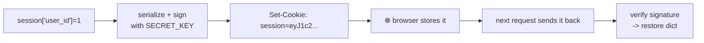

# 06-1 · Sessions & cookies

> **Level:** Intermediate · **Prerequisites:** [04-3 · Config & environments](../04_app_structure/03_config_and_env.md)
> **Time:** 45 min · **Verified:** 2026-07-29 (Flask 3.1.3)

## Why this matters

HTTP is stateless — the server forgets you between requests. **Sessions** are how a web app remembers "this browser is logged in as Ada". Flask's session is a *signed cookie*, which is elegant and has one property you must understand or you'll leak data.

---

## Using the session

`session` is a dict-like context local:

```python
from flask import session

@app.post("/login")
def login():
    session["user_id"] = 1
    session["email"] = "ada@example.com"
    return {"ok": True}

@app.get("/me")
def me():
    return {"user_id": session.get("user_id"), "email": session.get("email")}

@app.post("/logout")
def logout():
    session.clear()
    return {"ok": True}
```

**Output (real run):**
```
after login:   {'user_id': 1, 'email': 'ada@example.com'}
after logout:  {'user_id': None, 'email': None}
```

The value survived a *separate* request because Flask serialized it into a cookie the browser sent back. `session.clear()` is logout.

---

## How it actually works: signed, not encrypted

Flask serializes the session dict, **signs** it with your `SECRET_KEY`, and stores it in a cookie. On the next request it verifies the signature and restores the dict.



The signature means a user **cannot tamper** with it — change one byte and Flask rejects the whole cookie.

> ⚠️ **Signed ≠ encrypted. The contents are readable by anyone holding the cookie.** It's base64, not ciphertext — the user (or anyone reading their browser storage) can decode it. So **never put secrets in the session**: no passwords, no API keys, no private data. Store an **id** and look the rest up server-side, which is exactly what `session["user_id"]` does.

And because the signature depends on `SECRET_KEY`: leak it and anyone can forge a session for any user ([04-3](../04_app_structure/03_config_and_env.md)); rotate it and every user is logged out (usually the correct trade after a leak).

---

## Cookie security flags

For production, harden the session cookie:

```python
app.config.update(
    SESSION_COOKIE_HTTPONLY=True,     # JavaScript can't read it (blocks XSS theft) — default True
    SESSION_COOKIE_SECURE=True,       # HTTPS only — set True in production
    SESSION_COOKIE_SAMESITE="Lax",    # mitigates CSRF
    PERMANENT_SESSION_LIFETIME=timedelta(days=7),
)
```

`Secure=True` on a local HTTP dev server would stop the cookie working — that's why it belongs in `ProductionConfig`, not the base.

---

## Client-side vs server-side sessions

| | Flask's default (client-side) | Server-side (e.g. Flask-Session) |
|---|---|---|
| Stored | in the cookie | in Redis/DB; cookie holds only an id |
| Size limit | ~4 KB | large |
| Revocable | ❌ not until it expires | ✅ delete it server-side |
| Setup | none | needs a store |

The default is perfect for "user_id + a flash message". Move to server-side sessions when you need instant revocation (force-logout) or bigger payloads.

---

## Recap & next

- ✅ `session` is a dict-like signed cookie; `session.clear()` logs out.
- ✅ **Signed, not encrypted** — never store secrets; store an id and look up server-side.
- ✅ `SECRET_KEY` protects it: leaking = forgeable sessions, rotating = mass logout.
- ✅ Harden with `HTTPONLY` / `SECURE` / `SAMESITE`; `SECURE` only in production.
- ✅ Self-check: a user base64-decodes their session cookie and reads it. Is that a bug in Flask? What *would* be a bug in your app?

→ Next: **[06-2 · Passwords & Flask-Login](02_passwords_login.md)**

## Exercises

1. Store a `visit_count` in the session, increment it per request, and confirm it persists — then clear it.

<details>
<summary>Solution</summary>

```python
@app.get("/count")
def count():
    session["visits"] = session.get("visits", 0) + 1
    return {"visits": session["visits"]}
```
It climbs per request because the browser returns the cookie each time — the whole session mechanism in four lines. (Mutating a *nested* structure needs `session.modified = True`, since Flask can't detect in-place changes.)
</details>
