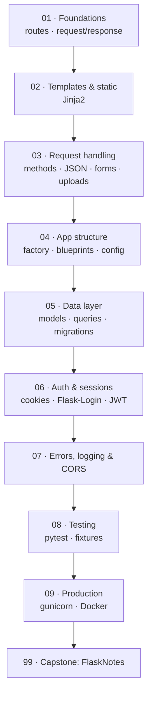

# 🧪 Flask — from first route to production

> **What you build:** **FlaskNotes**, a complete Flask application — a Jinja2 web UI *and* a JSON API sharing one codebase: application factory, blueprints, Flask-SQLAlchemy models with Flask-Migrate migrations, session auth (Flask-Login) plus JWT for the API, image uploads, error handling, logging, a 20-test pytest suite, gunicorn, and Docker.

> **Verified:** 2026-07-29 · Python 3.10 · **Flask 3.1.3** · **Flask-SQLAlchemy 3.1.1** · **Flask-Migrate 4.1.0** · Flask-Login 0.6.3 · SQLAlchemy 2.0.51 · Werkzeug 3.1.8 · Jinja2 3.1.6 · PyJWT 2.13.0 · gunicorn 26.0.0 · pytest 9.1.1. The whole app was actually run: **20 tests pass**, `flask db migrate/upgrade` creates the schema, **gunicorn serves it** (HTML pages *and* JSON, with correct 401/404 content negotiation), and `docker compose config` validates.

> **Industry-standard by design.** The stack and patterns here follow current (2026) Flask practice: the **application factory** (`create_app`), **blueprints** for modularity, the **`init_app()`** extension pattern, config classes + `from_prefixed_env()`, `current_app`/`g` context, **Flask-SQLAlchemy 3.1 + Flask-Migrate 4** for data, and **gunicorn behind a proxy** for serving — never the dev server.

Flask is a **micro-framework**: it gives you routing, templating, and a request/response cycle, then gets out of your way. That minimalism is its strength and its trap — Flask won't stop you from putting a 2,000-line app in one file. This course teaches the framework *and* the structure that keeps it maintainable.

## Who this is for

You know Python (functions, classes, dicts, decorators) and want to build web apps and APIs. No web, HTML, or database background needed — all built from scratch. If you've done the [FastAPI](../fastapi_fundamentals/) courses, you'll find the concepts familiar and the idioms different; both are worth knowing.

## What you'll be able to do

- Route requests, render **Jinja2** templates, and serve static files.
- Handle every payload: query strings, forms, **JSON**, and **file/image uploads** (validated).
- Structure a real app with the **application factory**, **blueprints**, and config classes.
- Model data with **Flask-SQLAlchemy** and evolve the schema with **Flask-Migrate**.
- Implement **session auth** (Flask-Login) for the web and **JWT** for the API, with hashed passwords.
- Handle errors centrally (HTML *or* JSON), log properly, and enable CORS.
- **Test** with pytest: app-factory fixtures, an in-memory DB, and a test client.
- Deploy with **gunicorn** + Docker, and run through a production checklist.

## The stack (and why)

| Concern | We use | Why |
|---------|--------|-----|
| Framework | **Flask 3.1** | the current stable line; minimal core, huge ecosystem |
| Templates | **Jinja2** | Flask's built-in templating — inheritance, autoescaping |
| ORM | **Flask-SQLAlchemy 3.1** | SQLAlchemy 2.0 with Flask session/context wiring |
| Migrations | **Flask-Migrate 4** (Alembic) | version-controlled schema changes |
| Web auth | **Flask-Login** | the standard session/user-loader extension |
| API auth | **PyJWT** | stateless tokens for the JSON API |
| Passwords | **Werkzeug** `generate_password_hash` | salted scrypt, ships with Flask |
| Tests | **pytest** | app-factory fixtures + `test_client()` |
| Serving | **gunicorn** | production WSGI server (never `flask run`) |

> **Why SQLite locally and Postgres in Docker?** So every lesson and the whole test suite run **offline with zero setup**, while the app targets a real database in production. One `DATABASE_URL` switches between them.

## Prerequisites

```bash
python -m venv .venv && source .venv/bin/activate     # Windows: .venv\Scripts\activate
cd 99_project_flasknotes && pip install -r requirements.txt
pytest -q                    # 20 passed
flask --app wsgi run --debug # http://127.0.0.1:5000
```

## Learning path



## Course map

| # | Section | Modules | You'll be able to… | Time |
|---|---------|---------|--------------------|------|
| 01 | [Foundations](01_foundations/) | 3 | Run an app, route requests, read the request & shape the response | ~2 h |
| 02 | [Templates & static](02_templates_and_static/) | 2 | Render Jinja2 templates with inheritance; serve static files | ~1.5 h |
| 03 | [Request handling](03_request_handling/) | 3 | Methods & status codes, JSON APIs with validation, forms & image uploads | ~2.5 h |
| 04 | [App structure](04_app_structure/) | 3 | Application factory, blueprints, config classes & env | ~2.5 h |
| 05 | [Data layer](05_data_layer/) | 3 | Models, queries & relationships, Flask-Migrate migrations | ~3 h |
| 06 | [Auth & sessions](06_auth_and_sessions/) | 3 | Sessions/cookies, password hashing + Flask-Login, JWT for APIs | ~3 h |
| 07 | [Errors, logging & CORS](07_errors_logging_cors/) | 3 | Central error handlers (HTML/JSON), logging, CORS & middleware | ~2 h |
| 08 | [Testing](08_testing/) | 2 | pytest fixtures on the app factory; testing views, API & DB | ~2 h |
| 09 | [Production](09_production/) | 3 | gunicorn/WSGI, Docker, and a production checklist | ~2 h |
| 99 | [Capstone: FlaskNotes](99_project_flasknotes/) | project | The complete, tested, deployable app | — |

**Total:** ~20–22 hours.

## Flask or FastAPI?

Both are excellent; they optimize for different things.

| | **Flask** | **FastAPI** |
|---|---|---|
| Style | WSGI, sync-first (async supported) | ASGI, async-first |
| Strength | HTML apps + APIs, huge ecosystem, ubiquitous in existing codebases | typed APIs, automatic docs & validation, WebSockets/streaming |
| Validation/docs | you add it (marshmallow / pydantic / flask-smorest) | built in via type hints |
| Reach for it when | server-rendered pages, an established team/codebase, gradual adoption | new JSON APIs, async I/O, real-time |

Learn Flask because an enormous amount of production Python runs on it — and because its explicitness teaches you what frameworks actually do.

## Related guides

- **[FastAPI Fundamentals](../fastapi_fundamentals/)** · **[Production FastAPI Backend](../fastapi_production_backend/)** — the async, typed counterpart.
- **[Python — From Scratch to FastAPI](../python_complete/)** — if the Python here feels shaky.
- **[Docker](../docker/)** · **[CI/CD](../cicd_github_actions/)** — ship the container this course builds.

→ Start here: **[00 · Introduction](00_introduction.md)**
