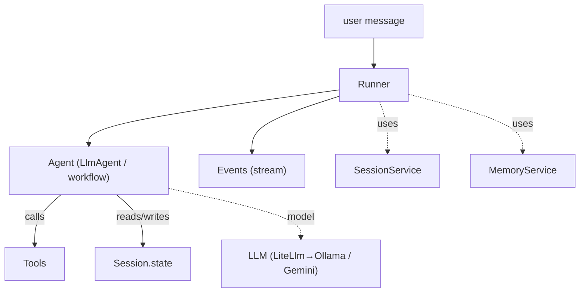

# 01-1 · Architecture & primitives

> **Level:** Beginner · **Prerequisites:** [00 · Introduction](../00_introduction.md)
> **Time:** 25 min · **Verified:** 2026-07-21 (google-adk 2.5.0)

## Why this matters

ADK has more moving parts than "call an LLM" — but they're a small, fixed set, and every ADK app is the same seven objects in the same relationship. Learn them once here and the rest of the course is just filling in details.

---

## The seven primitives

| Primitive | What it is |
|-----------|-----------|
| **Agent** | the unit of behavior — an `LlmAgent` (reasons, calls tools) or a workflow agent (`Sequential`/`Parallel`/`Loop`) that orchestrates sub-agents |
| **Tool** | a capability an agent can invoke — a Python function, OpenAPI op, or MCP tool |
| **Session** | one conversation; holds **state** (a dict) and the **event** history |
| **Runner** | drives an agent over a session and **yields events** |
| **Event** | one atomic thing that happened — a model message, a tool call, a tool result |
| **SessionService** | stores/loads sessions (`InMemory`, database, Vertex) |
| **MemoryService** | long-term memory across sessions (searchable) |

---

## How a request flows

1. You hand the **Runner** a user message and a `session_id`.
2. The Runner loads that **Session** (via the `SessionService`) and invokes the **Agent**.
3. The agent calls its **LLM** and maybe **Tools**, reading/writing **Session.state** as it goes.
4. Each step is emitted as an **Event**; the Runner yields them to you as an async stream.
5. The final event carries the answer; the session (state + events) is persisted for next time.

That's the whole loop. Workflow agents add structure *above* it (run these sub-agents in order / in parallel / in a loop), but each sub-agent still runs through this same cycle.

---

## Agents vs workflow agents

ADK splits "thinking" from "orchestration":

- **`LlmAgent`** — the only kind that calls a model. It reasons, decides, and calls tools.
- **Workflow agents** (`SequentialAgent`, `ParallelAgent`, `LoopAgent`) — **deterministic** orchestrators with *no* LLM of their own. They just decide *which sub-agents run and when*.

This separation is ADK's signature: you get predictable control flow (workflow agents) wrapped around unpredictable reasoning (`LlmAgent`s), instead of hoping one big LLM prompt does the orchestration.

> **Tip:** `Agent` is an alias for `LlmAgent` — you'll see both in docs. This course uses `LlmAgent` for clarity.

---

## Recap & next

- ✅ Seven primitives: Agent, Tool, Session, Runner, Event, SessionService, MemoryService.
- ✅ Flow: Runner → Agent (→ LLM/Tools, ↔ state) → Events → persisted Session.
- ✅ `LlmAgent`s reason; workflow agents orchestrate deterministically without a model.
- ✅ Self-check: which primitive holds conversation state, and which yields the response stream?

→ Next: **[01-2 · LangGraph vs ADK](02_langgraph_vs_adk.md)**

## Exercises

1. For the first-agent program in [00](../00_introduction.md), name which line corresponds to each of the seven primitives.

Solution

`LlmAgent(...)` = Agent (+ its `model` = LLM); `InMemoryRunner(...)` = Runner (bundles an in-memory SessionService + MemoryService); `create_session(...)` = Session via SessionService; `run_async(...)` yields Events. No Tools in that minimal example.

