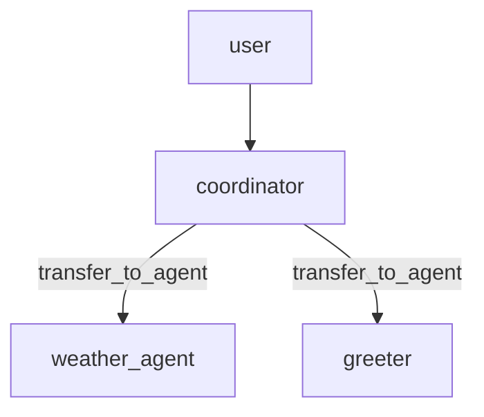

# 05-1 · Delegation & transfer

> **Level:** Intermediate · **Prerequisites:** [02-1 · LlmAgent](../02_agents_and_workflows/01_llm_agent.md)
> **Time:** 30 min · **Verified:** 2026-07-21 (google-adk 2.5.0)

## Why this matters

Give an agent `sub_agents` and it becomes a **coordinator**: its LLM can *transfer* control to whichever specialist fits the request, using a built-in `transfer_to_agent` tool ADK adds automatically. This is ADK's core multi-agent mechanism — the equivalent of a LangGraph supervisor's routing.

---

## How transfer works

- You attach specialists as `sub_agents=[...]` on a coordinator `LlmAgent`.
- ADK gives the coordinator a built-in `transfer_to_agent(agent_name)` tool.
- Each specialist's **`description`** tells the coordinator's LLM what it's for.
- The LLM calls `transfer_to_agent` with the chosen name; control moves there.



---

## Deterministic delegation (offline)

Whether a *real* model transfers correctly depends on the model (small ones often don't). To show the mechanism deterministically, we script the coordinator's model to emit the transfer call and the specialist's model to answer:

```python
import asyncio
from google.adk.agents import LlmAgent
from google.adk.models.base_llm import BaseLlm
from google.adk.models.llm_response import LlmResponse
from google.adk.runners import InMemoryRunner
from google.genai import types

class Fake(BaseLlm):
    mode: str = "answer"
    async def generate_content_async(self, llm_request, stream=False):
        if self.mode == "transfer":
            yield LlmResponse(content=types.Content(role="model", parts=[types.Part(
                function_call=types.FunctionCall(name="transfer_to_agent",
                                                 args={"agent_name": "weather_agent"}))]))
        else:
            yield LlmResponse(content=types.Content(role="model",
                              parts=[types.Part(text="It's 22C and sunny.")]))

weather = LlmAgent(name="weather_agent", model=Fake(model="f", mode="answer"),
                   description="Answers weather questions.", instruction="report weather")
coordinator = LlmAgent(name="coordinator", model=Fake(model="f", mode="transfer"),
                       instruction="Route to the right specialist.", sub_agents=[weather])

async def main():
    runner = InMemoryRunner(agent=coordinator, app_name="a")
    s = await runner.session_service.create_session(app_name="a", user_id="u")
    msg = types.Content(role="user", parts=[types.Part(text="weather?")])
    async for e in runner.run_async(user_id="u", session_id=s.id, new_message=msg):
        for p in (e.content.parts if e.content else []):
            if p.function_call: print(f"[{e.author}] transfer -> {p.function_call.args['agent_name']}")
            if p.text:          print(f"[{e.author}] {p.text}")

asyncio.run(main())
```

**Output (real run):**
```
[coordinator] transfer -> weather_agent
[weather_agent] It's 22C and sunny.
```

The coordinator transferred; the `weather_agent` then produced the answer as *its own* event (note the `author` changes). That author change is the signature of a real handoff — control moved, it didn't just call a function.

> **Note:** with a real model, you'd just write good `description`s and an instruction like "route weather questions to weather_agent", and the model calls `transfer_to_agent` itself. Larger models (Gemini, `qwen2:7b`) do this reliably; `qwen2.5:0.5b` often won't — which is why the *mechanism* is shown deterministically here.

---

## Transfer vs AgentTool

| | Transfer (`sub_agents`) | `AgentTool` (03-2) |
|---|---|---|
| Control | **moves** to the specialist | **stays** with the caller |
| Specialist output | becomes the conversation's new driver | returned to the caller as a tool result |
| Use for | "hand this off entirely" | "consult and continue" |

Pick transfer when the specialist should *take over* (a booking flow moving to the payment agent); pick `AgentTool` when the caller needs the result and keeps steering.

---

## Recap & next

- ✅ `sub_agents=[...]` makes an `LlmAgent` a coordinator with a built-in `transfer_to_agent` tool.
- ✅ Specialists' `description`s drive the coordinator's routing choice.
- ✅ A transfer *moves control* (author changes); `AgentTool` keeps control with the caller.
- ✅ Self-check: how do you tell from the events that a transfer happened rather than a tool call?

→ Next: **[05-2 · Coordinator patterns](02_coordinator_patterns.md)**

## Exercises

1. Add a `greeter` sub-agent and a second fake coordinator mode that transfers to it for "hello".

<details>
<summary>Solution</summary>

Add `greeter = LlmAgent(name="greeter", ..., description="Handles greetings.")` to `sub_agents`, and a coordinator whose fake emits `transfer_to_agent(agent_name="greeter")`. The greeter then answers as its own author.
</details>
