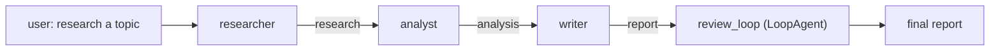

# 99 · Capstone — ADK Research Assistant

> **Level:** Intermediate · **Prerequisites:** Sections 01–08
> **Time:** 2–3 h · **Verified:** 2026-07-21 (google-adk 2.5.0, Python 3.10)

A complete, **offline**, tested multi-agent research assistant built with ADK — and a deliberate mirror of the [LangGraph capstone](../../langgraph/99_project_research_assistant/) so you can compare the two frameworks on the same task.



## Concepts it combines

| Feature | Section |
|---------|---------|
| `LlmAgent` with instruction, `output_key`, `description` | [02-1](../02_agents_and_workflows/01_llm_agent.md) |
| `SequentialAgent` pipeline threading state | [02-2](../02_agents_and_workflows/02_sequential_agent.md) |
| `LoopAgent` reviewer | [02-4](../02_agents_and_workflows/04_loop_agent.md) |
| A function tool (offline search) | [03-1](../03_tools/01_function_tools.md) |
| Session state + `output_key` passing | [04-1](../04_state_sessions_memory/01_sessions_and_state.md) |
| A safety callback (`before_model_callback`) | [04-4](../04_state_sessions_memory/04_callbacks.md) |
| Runner + events | [06-1](../06_runtime_events_streaming/01_runners_and_events.md) |
| An eval set for `adk eval` | [07-1](../07_evaluation_and_quality/01_evaluation.md) |
| Offline model (fake ↔ Ollama) | [01-3](../01_foundations/03_environment_and_offline_models.md) |

## Layout

```
99_project_adk_research_assistant/
├── requirements.txt · .env.example
├── adk_research_assistant/
│   ├── __init__.py      # exposes root_agent for the adk CLIs
│   ├── models.py        # get_model(): fake (default) or Ollama; FakeAdkModel
│   ├── tools.py         # offline search tool
│   ├── callbacks.py     # safety guardrail
│   ├── agent.py         # build_root_agent(): the pipeline
│   └── run.py           # CLI entry point
├── eval/
│   └── research.evalset.json    # a case for `adk eval`
└── tests/
    └── test_agent.py    # 3 offline tests
```

## Run it (offline, no API key)

```bash
python -m venv .venv && source .venv/bin/activate
pip install -r requirements.txt
python -m adk_research_assistant.run "LangGraph"
```

**Output (real run):**
```
· researcher: Gathered sources on the topic.
· analyst: Key insight: the topic centers on stateful agents.
· writer: Report: stateful agents, grounded in the research.
· reviewer: Looks good.

Final report: Report: stateful agents, grounded in the research.
```

Four agents ran in sequence, each reading the previous one's output from `session.state` — `researcher → analyst → writer → reviewer` (the reviewer wrapped in a `LoopAgent`). The `author` on each line is which agent produced it.

## Test & evaluate

```bash
pytest -q                                          # offline unit tests
adk eval adk_research_assistant eval/research.evalset.json    # score against the eval set
```

**`pytest` output (real run):**
```
3 passed, 13 warnings in 1.72s
```

The tests assert every agent ran, that state was threaded through all four `output_key`s, and that a report was produced — all offline with the fake model. (`adk eval` scores the same pipeline against the recorded case; meaningful response-match needs a capable model.)

## Serve it

```bash
adk web .            # chat + trace UI
adk api_server .     # REST API (see Section 06-3)
```

## Go live

Set `ADK_LLM=ollama` (after `ollama pull qwen2.5:0.5b`) to run the pipeline on a real local model — the agents, tool, callback, and pipeline are unchanged.

## Compare with LangGraph

This capstone mirrors [`langgraph/99_project_research_assistant`](../../langgraph/99_project_research_assistant/): the same research → analyze/evaluate → write → review shape. Run both and see the difference in *code shape* — ADK **composes agents** (`SequentialAgent(sub_agents=[...])`); LangGraph **wires a graph** (`add_node`/`add_edge`). Same job, two philosophies ([01-2](../01_foundations/02_langgraph_vs_adk.md)).

## Extend it

- Make `researcher` actually call `search_sources` (Ollama) instead of a canned response.
- Have the `reviewer` escalate to loop the writer until quality passes ([02-4](../02_agents_and_workflows/04_loop_agent.md)).
- Add long-term memory ([04-2](../04_state_sessions_memory/02_memory_service.md)) so it remembers past topics.
- Expose the `writer` over **A2A** ([08-3](../08_deployment_and_a2a/03_a2a_protocol.md)) for another app — even a LangGraph one — to consume.
