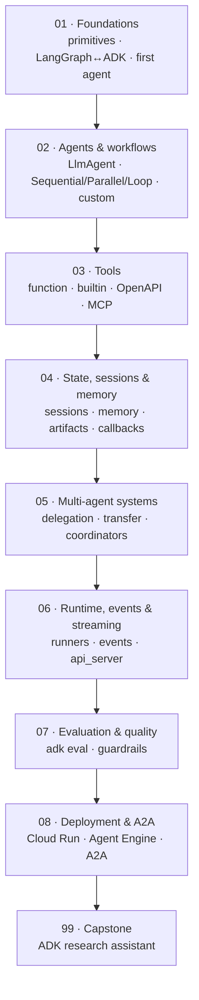

# 🧩 Google ADK — the Agent Development Kit

> **What you build:** multi-agent systems with Google's ADK — LLM agents, `Sequential`/`Parallel`/`Loop` workflows, tools, sessions/memory, callbacks, evaluation, and an A2A hand-off — culminating in an offline **research-assistant** capstone that mirrors the [LangGraph one](../langgraph/99_project_research_assistant/) for side-by-side comparison.

> **Verified:** 2026-07-21 against **Python 3.10**, **google-adk 2.5.0**, **litellm 1.93.0**, **google-genai 2.12.1**. Every code sample was actually run. Everything runs **offline** — no Gemini/Vertex API key — using a local **Ollama** model (`qwen2.5:0.5b`) via LiteLLM, plus a deterministic **fake model** for tests. Real output is shown under each sample.

> ⚠️ **ADK moves fast.** This course pins `google-adk==2.5.0`. Class and import names shift between releases — if something differs, check `pip show google-adk` and the [official docs](https://adk.dev/).

Google's **Agent Development Kit (ADK)** is an open-source, code-first Python toolkit for building, evaluating, and deploying AI agents. Where [LangGraph](../langgraph/) has you *draw a graph*, ADK has you *compose agents*: an `LlmAgent` for reasoning, `SequentialAgent`/`ParallelAgent`/`LoopAgent` for orchestration, tools for capabilities, and a runtime (sessions, events, runners) that ties it together. It's model-agnostic (first-class Gemini, anything else via LiteLLM) and deploys natively to Google Cloud.

## Who this is for

You know basic Python and have seen an LLM API. Prior LangGraph experience helps (this course cross-links a LangGraph↔ADK bridge in [Section 01](01_foundations/02_langgraph_vs_adk.md)) but isn't required.

## What you'll be able to do

- Build `LlmAgent`s and compose them with `Sequential`/`Parallel`/`Loop`/custom agents.
- Give agents **tools** — Python functions, OpenAPI, and MCP.
- Manage **sessions, state, memory, and artifacts**; add **callbacks** as guardrails.
- Build **multi-agent** systems with delegation and transfer.
- Drive agents with **runners** (`adk run`/`adk web`/`adk api_server`), understand **events**, and stream.
- **Evaluate** agents with `adk eval`, and **deploy** to Cloud Run / Agent Engine; expose an agent over **A2A**.

## The stack we use (and why)

| Piece | We use | Why | Swap to (production) |
|---|---|---|---|
| Framework | **google-adk 2.5.x** | The subject of the course | — |
| Model (offline) | **Ollama** `qwen2.5:0.5b` via **LiteLlm** | Local, free, no key — real generation | Gemini / Vertex / any LiteLLM provider |
| Model (tests) | a **fake `BaseLlm`** | Deterministic, zero-dependency — keeps samples *verified* | — |
| Session / memory / artifacts | **`InMemory*` services** | No infra to run | Vertex / database-backed services |

> **Why offline?** ADK shines on Google Cloud, but you shouldn't need a billing account to *learn* it. LiteLLM's `ollama_chat/` provider runs any local model behind ADK's model interface — so every lesson here runs on your laptop, and the Gemini/Vertex/Cloud paths are called out as clearly-labelled upgrades.

## Prerequisites

```bash
python -m venv .venv && source .venv/bin/activate
pip install "google-adk==2.5.0" "litellm==1.93.0"
# offline model (real generation):
#   install Ollama, then: ollama pull qwen2.5:0.5b
```

## Learning path



## Course map

| # | Section | Modules | You'll be able to… | Time |
|---|---------|---------|--------------------|------|
| 01 | [Foundations](01_foundations/) | 4 | Understand ADK's primitives, compare to LangGraph, run your first agent offline | 90 min |
| 02 | [Agents & workflows](02_agents_and_workflows/) | 5 | Build LLM agents and Sequential/Parallel/Loop/custom orchestration | 2 h |
| 03 | [Tools](03_tools/) | 4 | Add function, built-in, OpenAPI, and MCP tools | 90 min |
| 04 | [State, sessions & memory](04_state_sessions_memory/) | 4 | Manage sessions/state/memory/artifacts and add callbacks | 2 h |
| 05 | [Multi-agent systems](05_multi_agent_systems/) | 3 | Delegate and transfer between specialized agents | 90 min |
| 06 | [Runtime, events & streaming](06_runtime_events_streaming/) | 3 | Drive agents with runners, read events, serve an API | 90 min |
| 07 | [Evaluation & quality](07_evaluation_and_quality/) | 2 | Evaluate agents and add safety guardrails | 60 min |
| 08 | [Deployment & A2A](08_deployment_and_a2a/) | 3 | Deploy to Cloud Run / Agent Engine and expose A2A | 90 min |
| 99 | [Capstone](99_project_adk_research_assistant/) | project | Build an offline multi-agent research assistant | 2–3 h |

**Total:** ~13–16 hours. Prerequisites: basic Python.

## Related guides

- **[LangGraph](../langgraph/)** — the peer agent framework; [Section 01-2](01_foundations/02_langgraph_vs_adk.md) is a direct bridge, and the capstones mirror each other.
- **[LangChain & RAG](../langchain_rag/)** — LLM building blocks that apply to agents in any framework.
- **[Faceless YouTube Studio](../faceless_youtube_agent/)** — includes a LangGraph-vs-ADK comparison from a project angle.

→ Start here: **[00 · Introduction to Google ADK](00_introduction.md)**
