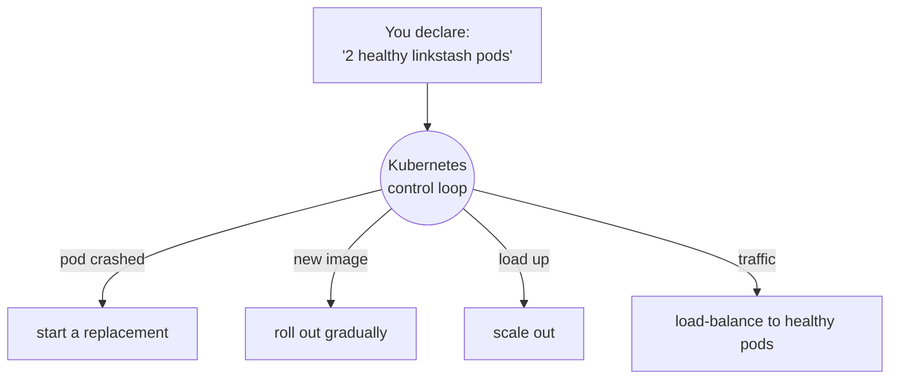

# 00 · Introduction

> **Level:** Intermediate · **Time:** 15 min · **Verified:** 2026-07-16 (kind, kubectl, Helm)

You can build a container (Docker) and ship it (CI/CD). Kubernetes is what *runs*
it in production: many copies, across many machines, staying up on their own.
This course takes the `linkstash` app you already containerized and deploys it to a
real cluster on your laptop.

---

## What you'll build

```bash
make cluster image load deploy verify
```

```
namespace/linkstash created
configmap/linkstash-config created
deployment.apps/linkstash created
service/linkstash created
deployment "linkstash" successfully rolled out

$ curl .../health
{"status":"ok","version":"1.2.0"}
```

> ☝️ Real output from a **kind** cluster in this course's verified environment —
> two pods behind a Service, serving the linkstash app. `POST /shorten` returned a
> real slug through the same Service.

---

## The problem Kubernetes solves

Running one container by hand, you personally handle: restarts when it crashes,
starting more copies under load, replacing them on deploy without downtime,
routing traffic to healthy ones, and injecting config/secrets. Kubernetes does all
of that **declaratively** — you describe the desired state, it maintains it.



It's the same **declarative, self-healing** idea as OpenTofu — but for *running
workloads* rather than *provisioned infrastructure*.

---

## The mental model (five nouns)

| Object | Is | You'll meet it in |
|---|---|---|
| **Pod** | one (or a few) containers running together — the smallest unit | [01-3](01_foundations/03_pods_and_deployments.md) |
| **Deployment** | "keep N identical pods running, and roll out changes safely" | [01-3](01_foundations/03_pods_and_deployments.md) |
| **Service** | a stable address + DNS + load-balancing for a set of pods | [01-4](01_foundations/04_services_and_networking.md) |
| **ConfigMap / Secret** | config & secrets injected into pods | [02-1](02_config_health_scaling/01_configmaps_and_secrets.md) |
| **Namespace** | a scope to group and isolate resources | throughout |

Learn these five and you can read almost any Kubernetes manifest.

---

## Why kind (local, throwaway)

You'll run a real cluster with **kind** (Kubernetes-IN-Docker) — a full cluster
inside a container. It's free, starts in a minute, needs no cloud account, and you
delete it with one command. The manifests you write are identical to what you'd
apply to EKS/GKE/AKS in production; only the cluster differs. Learn the workflow
here, run it anywhere.

---

## What you need

- The **[Docker course](../docker/)** (or equivalent) — you should be comfortable
  with images and containers.
- **Docker** running, plus **kind** and **kubectl** ([01-2](01_foundations/02_setup_kind_kubectl.md) installs them).
- No cloud account.

---

**Next → [01-1 · What is Kubernetes?](01_foundations/01_what_is_kubernetes.md)**
