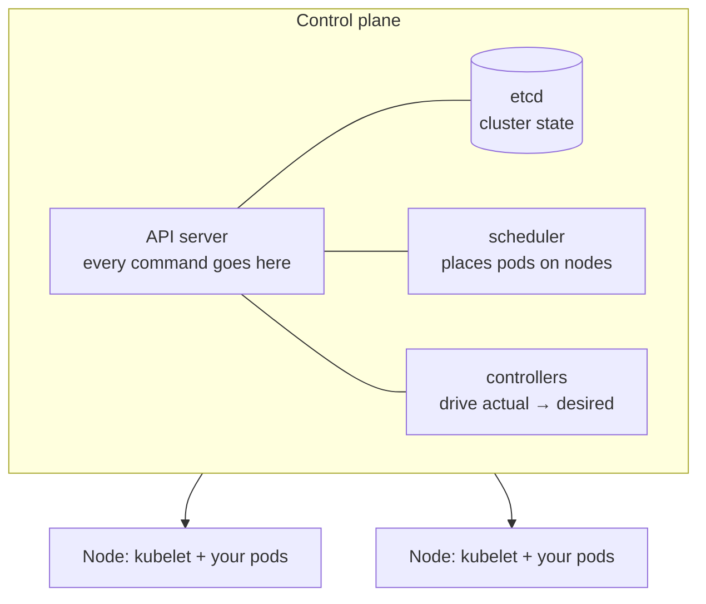
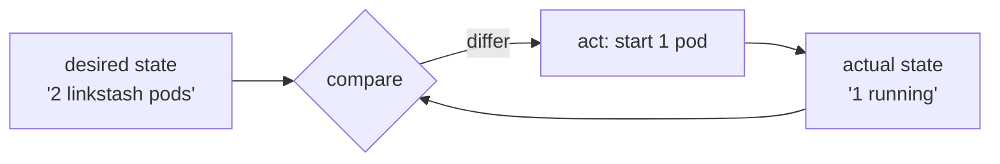

# 01-1 · What is Kubernetes?

> **Level:** Intermediate · **Prerequisites:** [00 Introduction](../00_introduction.md)
> **Time:** 20 min · **Verified:** 2026-07-16

Kubernetes (K8s) is a **container orchestrator**: you declare the workloads you
want, and it makes the cluster match — scheduling containers onto machines,
restarting failures, scaling, and routing traffic. This module is the map before
you touch `kubectl`.

---

## Cluster architecture

A cluster is a **control plane** (the brain) plus **worker nodes** (where your
containers run).

| Piece | Job |
|---|---|
| **API server** | the single front door — `kubectl` and everything else talk to it |
| **etcd** | the database of record: desired + actual state |
| **scheduler** | decides which node a new pod runs on |
| **controllers** | control loops that reconcile actual state toward desired |
| **kubelet** | the agent on each node that runs and reports on pods |

---

## The control loop is the whole idea

Every controller runs the same loop, forever:

You never say "start a pod." You say "**2 pods should exist**," and the Deployment
controller keeps making it true — after a crash, a node failure, or a deploy. This
is why K8s is called **declarative** and **self-healing**, and it's the same
reconcile-to-desired principle as OpenTofu ([opentofu course](../../opentofu_iac/)).

---

## The core objects

You'll compose these (each is a YAML manifest sent to the API server):

| Object | "Keeps true…" |
|---|---|
| **Pod** | one running unit of 1+ containers sharing a network/storage |
| **ReplicaSet** | N identical pods (you rarely write these directly) |
| **Deployment** | a ReplicaSet + safe rollouts/rollbacks (what you *do* write) |
| **Service** | a stable virtual IP + DNS load-balancing to matching pods |
| **ConfigMap / Secret** | config / secrets mounted or injected as env |
| **Namespace** | a grouping/isolation boundary for all the above |

Pods are cattle, not pets — they're disposable and get recreated with new IPs,
which is exactly why you need a **Service** in front of them (their IPs change; the
Service's doesn't).

---

## Managed vs local

You'll learn on **kind** (local). In production you'd use a managed control plane —
**EKS** (AWS), **GKE** (Google), **AKS** (Azure) — so you don't run etcd yourself.
The **manifests are identical**; only how the cluster is created differs. (And
you'd create that cluster with IaC — OpenTofu has an `eks` module.)

---

## Recap & next

- ✅ K8s = a **control plane** (API server, etcd, scheduler, controllers) + **worker
  nodes** (kubelet + pods).
- ✅ Everything is a **control loop**: declare desired state, controllers reconcile
  actual toward it — self-healing, declarative.
- ✅ Core objects: **Pod → Deployment → Service**, plus **ConfigMap/Secret** and
  **Namespace**. Pods are disposable; the Service is their stable front.

**Self-check:** A node dies and takes two linkstash pods with it. What happens, and
which component makes it happen?

Answer

The **Deployment controller** notices actual (0–1 pods) ≠ desired (2) and creates
replacement pods; the **scheduler** places them on surviving nodes. No human acts —
the control loop reconciles back to the declared 2 replicas. (The Service
automatically starts routing to the new pods once they're ready.)

**→ Next: [01-2 · Setup: kind & kubectl](02_setup_kind_kubectl.md)**
