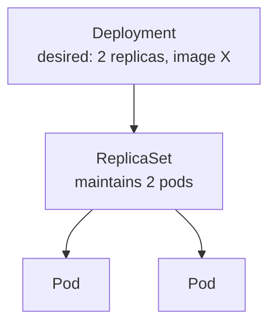

# 01-3 · Pods & Deployments

> **Level:** Intermediate · **Prerequisites:** [01-2 Setup: kind & kubectl](02_setup_kind_kubectl.md)
> **Time:** 25 min · **Verified:** 2026-07-16

The **Pod** is what runs your container; the **Deployment** keeps the right number
of pods alive and rolls out changes safely. You almost never create pods
directly — you create a Deployment and let it manage them.

---

## Pod → ReplicaSet → Deployment



- A **Pod** wraps one (or a few tightly-coupled) containers with a shared network.
  It's disposable — if it dies, it's gone (its replacement is a *new* pod with a
  new IP).
- A **Deployment** declares "N pods of this template," creates a ReplicaSet to hold
  them, and handles **rolling updates** and **rollbacks** when you change the
  template. This is the object you write.

---

## A Deployment manifest

From the capstone ([`manifests/20-deployment.yaml`](../99_project_linkstash_k8s/manifests/20-deployment.yaml)),
trimmed to the essentials:

```yaml
apiVersion: apps/v1
kind: Deployment
metadata:
  name: linkstash
  namespace: linkstash
spec:
  replicas: 2                    # desired pod count → self-healing target
  selector:
    matchLabels: { app: linkstash }   # which pods this Deployment owns
  template:                       # the pod spec to stamp out
    metadata:
      labels: { app: linkstash }  # MUST match the selector above
    spec:
      containers:
        - name: linkstash
          image: linkstash:local
          ports:
            - containerPort: 8000
```

The **selector ↔ template labels** link is the one beginners trip on: the
Deployment finds and manages pods by label, so `selector.matchLabels` must match
`template.metadata.labels`, or the API rejects it.

---

## Apply and watch self-healing

```bash
kubectl apply -f manifests/20-deployment.yaml
kubectl -n linkstash get pods
```

Verified:

```
NAME                         READY   STATUS    RESTARTS   AGE
linkstash-6795fdd8dc-fpmzw   1/1     Running   0          17s
linkstash-6795fdd8dc-q2hkr   1/1     Running   0          17s
```

Now delete one pod and watch it come back:

```bash
kubectl -n linkstash delete pod linkstash-6795fdd8dc-fpmzw
kubectl -n linkstash get pods       # a new pod is already being created
```

You declared "2 pods"; the Deployment enforces it. You didn't ask for a
replacement — the control loop made one. That's self-healing in action.

---

## Labels & selectors run everything

Those `app: linkstash` labels aren't cosmetic — they're how Kubernetes wires
objects together. The Deployment selects its pods by label; the **Service**
(next module) selects the *same* pods by the *same* label to route traffic. Get the
labels right and things connect; get them wrong and a Service silently routes to
nothing.

---

## Recap & next

- ✅ **Pods** are disposable units of containers; you manage them through a
  **Deployment** (via a ReplicaSet), not directly.
- ✅ `replicas` is a **self-healing target** — delete a pod and the Deployment
  recreates it.
- ✅ **`selector.matchLabels` must match `template` labels**; labels are how
  Deployments and Services find pods.

## Exercise

Change `replicas: 2` to `3`, `kubectl apply`, and watch. Then remove a label from
the pod template's `metadata.labels` (but not the selector) and apply — what error
do you get, and why?

<details>
<summary>Solution</summary>

Scaling to 3 makes the Deployment create a third pod (verified: `pod count: 3`).
Breaking the label match makes the API reject the apply with a
`selector does not match template labels` error — the Deployment must be able to
select the very pods its template creates, or it couldn't manage them.

</details>

**→ Next: [01-4 · Services & networking](04_services_and_networking.md)**
