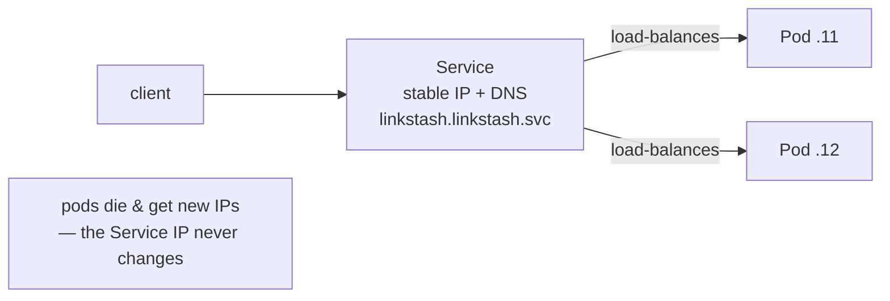

# 01-4 · Services & networking

> **Level:** Intermediate · **Prerequisites:** [01-3 Pods & Deployments](03_pods_and_deployments.md)
> **Time:** 25 min · **Verified:** 2026-07-16

Pods come and go with changing IPs, so you never talk to a pod directly. A
**Service** gives a stable address, a DNS name, and load-balancing across whichever
pods currently match its selector.

---

## Why a Service



The Service watches the pods matching its `selector` and keeps a live list of
healthy endpoints. Pods can be replaced, scaled, or moved — clients keep hitting
the same Service name.

---

## The manifest

From the capstone ([`manifests/30-service.yaml`](../99_project_linkstash_k8s/manifests/30-service.yaml)):

```yaml
apiVersion: v1
kind: Service
metadata:
  name: linkstash
  namespace: linkstash
spec:
  type: ClusterIP
  selector:
    app: linkstash        # ← same label the Deployment's pods carry
  ports:
    - port: 80            # the Service port
      targetPort: 8000    # the container port
```

`selector: app: linkstash` is the link — the Service sends traffic to exactly the
pods the Deployment created. `port` → `targetPort` maps the Service's port 80 to
the container's 8000.

Verified:

```
$ kubectl -n linkstash get svc
NAME        TYPE        CLUSTER-IP     PORT(S)   AGE
linkstash   ClusterIP   10.96.104.99   80/TCP    17s
```

---

## The three Service types

| Type | Reachable from | Use |
|---|---|---|
| **ClusterIP** (default) | inside the cluster only | service-to-service (most Services) |
| **NodePort** | a port on every node's IP | quick external access, dev |
| **LoadBalancer** | an external cloud LB | public entry on EKS/GKE/AKS |

For real HTTP apps you usually put an **Ingress** (an HTTP router: host/path →
Service) in front of ClusterIP services rather than exposing many LoadBalancers.

---

## DNS: services find each other by name

Kubernetes runs cluster DNS, so a Service is reachable at
`<service>.<namespace>.svc.cluster.local` (usually just `<service>` within the same
namespace). Your pods reach the database at `postgres.data.svc`, not an IP — names,
not addresses, which is what makes pods disposable.

---

## Reaching it from your laptop: port-forward

ClusterIP isn't exposed outside the cluster, so for local testing use
`port-forward` (verified):

```bash
kubectl -n linkstash port-forward svc/linkstash 18899:80
# Forwarding from 127.0.0.1:18899 -> 8000
curl http://127.0.0.1:18899/health
# {"status":"ok","version":"1.2.0"}
```

`POST /shorten` through the same forward returned `{"slug":"3kcnj0", ...}` — traffic
went laptop → Service → a pod. (Pick a free local port; a busy one makes the
forward fail and your curl hits the wrong thing — a real mistake caught while
verifying this course.)

---

## Recap & next

- ✅ A **Service** gives pods a **stable IP + DNS name + load-balancing**; it tracks
  pods by **selector** (same label as the Deployment).
- ✅ Types: **ClusterIP** (internal, default), **NodePort**, **LoadBalancer**;
  **Ingress** routes external HTTP to ClusterIP services.
- ✅ Services find each other by **DNS name**; `port-forward` reaches a ClusterIP
  from your laptop.

## Exercise

You create a Service with `selector: app: linkstash-api` but your pods are labelled
`app: linkstash`. The Service has a ClusterIP but curling it times out. Why?

<details>
<summary>Answer</summary>

The selector matches **no pods**, so the Service has **zero endpoints** — it exists
and has an IP, but there's nothing to route to, hence the timeout. Fix the selector
to match the pods' actual label (`app: linkstash`). Check with
`kubectl -n linkstash get endpoints linkstash` — an empty list means a selector
mismatch.

</details>

**→ Next: [02-1 · ConfigMaps & Secrets](../02_config_health_scaling/01_configmaps_and_secrets.md)**
