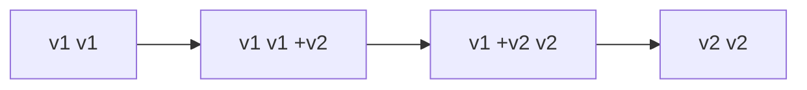

# 02-3 · Scaling & rollouts

> **Level:** Intermediate · **Prerequisites:** [02-2 Health probes & resources](02_probes_and_resources.md)
> **Time:** 25 min · **Verified:** 2026-07-16

Two everyday operations that Deployments make safe: **scaling** (more/fewer pods)
and **rollouts** (shipping a new version without downtime — and undoing it).

---

## Scaling

Change the replica count — declaratively (edit `replicas:` and `apply`) or
imperatively:

```bash
kubectl -n linkstash scale deploy/linkstash --replicas=3
```

Verified:

```
deployment.apps/linkstash scaled
pod count: 3
```

The Deployment creates the extra pod; the Service immediately starts
load-balancing across all three (once each passes its readiness probe). Scale back
to 2 and one is removed. For *automatic* scaling on CPU/memory or custom metrics,
add a **HorizontalPodAutoscaler**:

```yaml
apiVersion: autoscaling/v2
kind: HorizontalPodAutoscaler
metadata: { name: linkstash, namespace: linkstash }
spec:
  scaleTargetRef: { apiVersion: apps/v1, kind: Deployment, name: linkstash }
  minReplicas: 2
  maxReplicas: 10
  metrics:
    - type: Resource
      resource: { name: cpu, target: { type: Utilization, averageUtilization: 70 } }
```

(HPA needs a metrics-server in the cluster; the manual `scale` above always works.)

---

## Rolling updates

Change the pod template (a new image tag, say) and `apply` — the Deployment
replaces pods **gradually**: bring up new ones, wait for readiness, then retire old
ones, so there's always capacity serving.



Watch it happen with a rolling restart (same mechanism, same image — verified):

```bash
kubectl -n linkstash rollout restart deploy/linkstash
kubectl -n linkstash rollout status deploy/linkstash
# deployment "linkstash" successfully rolled out
```

The pace is controlled by `strategy.rollingUpdate` (`maxUnavailable`, `maxSurge`).
Because readiness gates each new pod, traffic only shifts to healthy ones — the
zero-downtime deploy from the [CI/CD course](../../cicd_github_actions/04_delivery_and_deployment/02_deployment_strategies.md),
now built into the platform.

---

## Rollback

If a new version is bad, undo it — Kubernetes keeps rollout history:

```bash
kubectl -n linkstash rollout history deploy/linkstash
kubectl -n linkstash rollout undo deploy/linkstash            # to the previous revision
kubectl -n linkstash rollout undo deploy/linkstash --to-revision=3
```

This is the "time to restore" DORA metric made trivial — one command back to a
known-good version. (For instant switchover you'd use blue-green; rolling +
`undo` covers most cases.)

---

## Recap & next

- ✅ **Scale** by changing `replicas` (or an **HPA** for auto-scaling on metrics);
  the Service load-balances across all ready pods.
- ✅ **Rolling updates** replace pods gradually, gated by readiness → zero-downtime;
  paced by `maxUnavailable`/`maxSurge`.
- ✅ **`rollout undo`** reverts to a previous revision — one-command rollback.

## Exercise

You `apply` a new image that crashes on boot. Thanks to your probes, what does the
rollout do — and how do you get back to the working version?

<details>
<summary>Answer</summary>

The new pods fail their **readiness/liveness** probes, so the rollout **stalls**:
Kubernetes won't retire the old healthy pods while the new ones aren't ready, so
your app keeps serving on the old version (the rollout just reports "waiting").
Fix forward, or `kubectl rollout undo` to revert to the last good revision. Probes
are what turn a bad deploy into a stalled rollout instead of an outage.

</details>

**→ Next: [03-1 · The manifests](../03_deploying_linkstash/01_the_manifests.md)**
