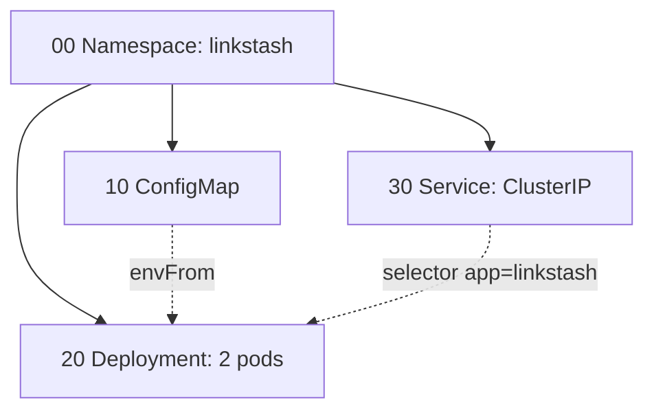

# 03-1 · The manifests

> **Level:** Intermediate · **Prerequisites:** [02-3 Scaling & rollouts](../02_config_health_scaling/03_scaling_and_rollouts.md)
> **Time:** 20 min · **Verified:** 2026-07-16

The capstone's [`manifests/`](../99_project_linkstash_k8s/manifests/) folder is the
whole app described declaratively — four files, applied in order.

---

## Ordered by filename

```
manifests/
├── 00-namespace.yaml    # the linkstash namespace (must exist first)
├── 10-configmap.yaml    # HOST / PORT config
├── 20-deployment.yaml   # 2 replicas + probes + resources
└── 30-service.yaml      # ClusterIP fronting the pods
```

**Why the number prefixes?** `kubectl apply -f manifests/` processes files
**alphabetically**, and everything lives *in* the namespace — so the namespace must
be created first. Without ordering, `configmap`/`deployment` sort before
`namespace` and fail with `namespaces "linkstash" not found` (a real error hit
while building this course). Numeric prefixes make the order explicit and correct.

---

## How the four connect



- The **Namespace** scopes everything.
- The **ConfigMap** feeds env vars into the Deployment's pods (`envFrom`).
- The **Service** selects the Deployment's pods by the `app: linkstash` label and
  load-balances to them.

Two invisible-but-critical links: **ConfigMap name** (`linkstash-config`) referenced
in the Deployment's `envFrom`, and the **label** (`app: linkstash`) shared by the
Deployment's pod template and the Service's selector. Break either and the app
still "deploys" but misbehaves (no config, or a Service with no endpoints).

---

## The Deployment, annotated

The heart of it (from [02](../02_config_health_scaling/), now assembled):

```yaml
spec:
  replicas: 2                              # self-healing target
  selector: { matchLabels: { app: linkstash } }
  template:
    metadata: { labels: { app: linkstash } }   # ← matches Service selector
    spec:
      containers:
        - name: linkstash
          image: linkstash:local
          imagePullPolicy: IfNotPresent        # use the locally-loaded image
          envFrom: [ { configMapRef: { name: linkstash-config } } ]
          resources: { requests: {...}, limits: {...} }
          readinessProbe: { httpGet: { path: /health, port: 8000 } }
          livenessProbe:  { httpGet: { path: /health, port: 8000 } }
```

`imagePullPolicy: IfNotPresent` matters for kind: the image is **loaded into the
cluster** (next module), not pulled from a registry, so K8s must use the local copy
rather than trying to pull `linkstash:local` from Docker Hub (which would fail).

---

## Recap & next

- ✅ The app is **four ordered manifests**: Namespace → ConfigMap → Deployment →
  Service; number prefixes guarantee the namespace applies first.
- ✅ The pieces link by **name** (ConfigMap in `envFrom`) and **label**
  (`app: linkstash` on pods ↔ Service selector).
- ✅ `imagePullPolicy: IfNotPresent` uses the **locally-loaded** image (kind has no
  registry).

**Self-check:** Why do the manifests use `00-`/`10-`/… prefixes instead of plain
names like `deployment.yaml`?

<details>
<summary>Answer</summary>

`kubectl apply -f <dir>` applies files in **alphabetical order**, and every resource
lives inside the `linkstash` namespace. Plain names would sort `configmap` and
`deployment` *before* `namespace`, so they'd be created before the namespace exists
and fail. Numeric prefixes force Namespace-first ordering.

</details>

**→ Next: [03-2 · Apply & verify](02_apply_and_verify.md)**
